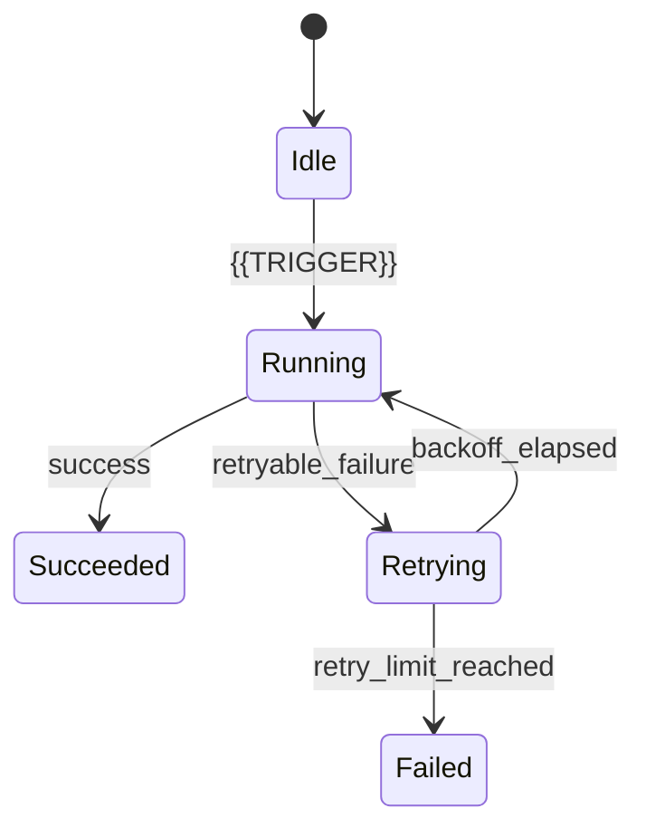
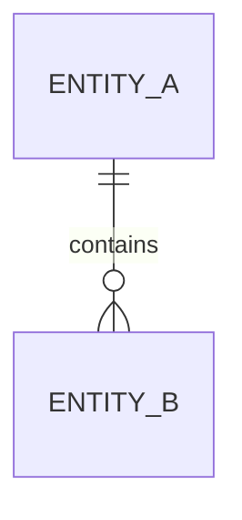
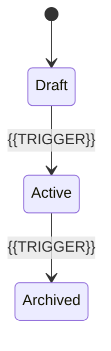
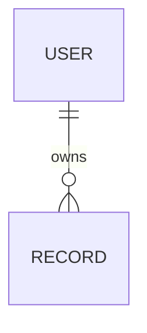
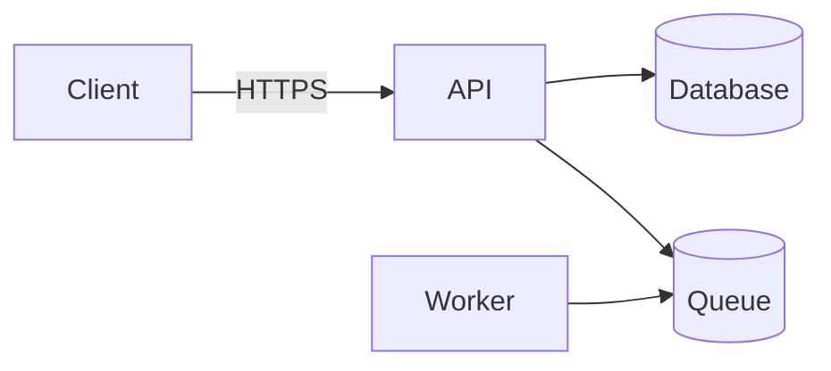
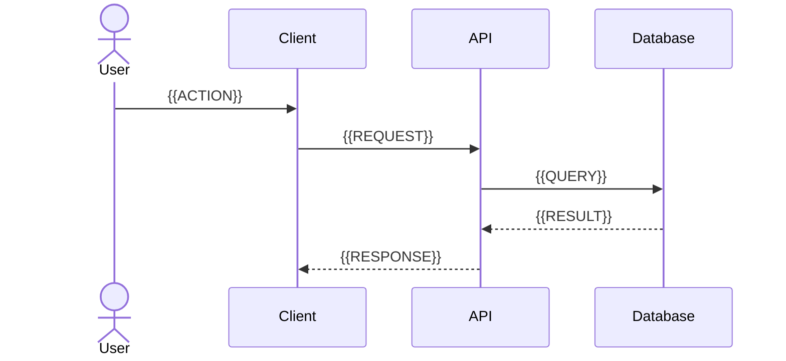
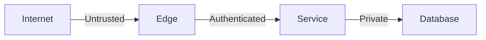
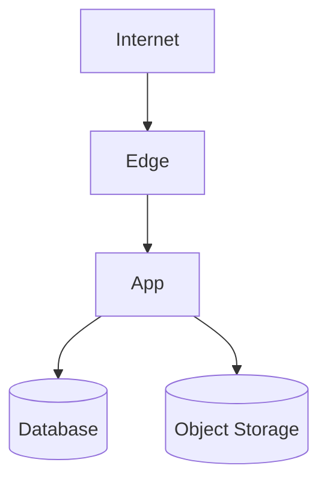
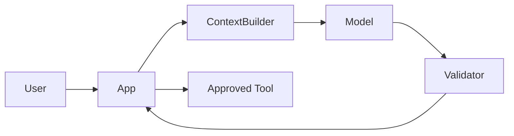

# All Project Specification Templates
This combined file mirrors the individual Markdown files in the template pack.


---

# File: `PROJECT-INTAKE.md`

---
title: "Project Intake Questionnaire"
status: "draft"
owner: "Matheus"
reviewers:
  - "Matheus"
version: "0.1.0"
last_reviewed: "2026-07-10"
review_cycle: "quarterly"
applies_to: "0.1.0"
source_of_truth: true
related: []
supersedes: null
---

# Project intake questionnaire

Complete this before filling the detailed specifications.

## Identity

- Project name:
- Repository:
- Product owner:
- Technical owner:
- Target release:
- Team size and roles:

## Product

- Who is the primary user?
- What problem are they trying to solve?
- What outcome proves the product is useful?
- What are the three must-have capabilities?
- What is explicitly out of scope?
- What are the measurable success and guardrail metrics?

## Behavior

- What are the critical workflows?
- Which actions are destructive or irreversible?
- What happens offline or when a dependency fails?
- Which operations retry automatically?
- Which actions require human approval?
- What are the main state machines?

## Technology

- Target platforms:
- Frontend/runtime:
- Backend/runtime:
- Database:
- API/event protocols:
- External integrations:
- Deployment target:
- Hard technical constraints:

## Quality

- Performance targets:
- Availability/SLO target:
- RTO and RPO:
- Accessibility target:
- Security baseline:
- Privacy/regulatory obligations:
- Expected scale:

## Delivery

- Environments:
- CI/CD platform:
- Release cadence:
- Deployment strategy:
- Rollback constraints:
- Observability stack:

## AI, if applicable

- AI capabilities:
- Providers/models:
- Data allowed to leave the system:
- Tool permissions:
- Human approval boundaries:
- Evaluation targets:
- Cost limits:


---

# File: `README.md`

# Project Specification Template Pack

A fill-in-the-blanks specification system for software projects. Replace every
`{{PLACEHOLDER}}`, remove irrelevant sections, and link instead of duplicating facts.

## Start here

1. Complete `docs/00-project/PROJECT-INDEX.md`.
2. Define product intent in `docs/01-product/PRODUCT.md`.
3. Lock scope and non-goals in `docs/00-project/SCOPE.md`.
4. Define domain language and behavior.
5. Complete system, frontend, backend, database, API, security, and testing specs.
6. Add production and governance specs before release.
7. Record important choices as ADRs.

## Suggested adoption levels

- **Foundation:** Project index, context, scope, product, requirements, domain, behavior.
- **Implementation:** System design, frontend, backend, database, API, design system, testing, security.
- **Production:** Accessibility, privacy, performance, reliability, observability, deployment, rollback, runbooks.
- **Governance:** Ownership, dependency policy, supply chain, risk register, technical debt.
- **AI-enabled projects:** AI system, model policy, prompts, tool permissions, evaluations, safety, and cost budgets.

## Placeholder convention

- `{{VALUE}}`: required project-specific value.
- `{{ENUM: OPTION_A|OPTION_B}}`: select one.
- `[ ]`: unresolved decision or required action.
- `TBD`: intentionally unresolved; assign an owner and due date.
- `N/A — reason`: section does not apply; explain why.

## Source-of-truth rules

1. One fact has one authoritative home.
2. Link to authoritative material instead of copying it.
3. Executable contracts override prose:
   - migrations override copied database schemas;
   - OpenAPI/AsyncAPI override endpoint tables;
   - design-token files override literal design values;
   - automated tests verify acceptance criteria.
4. ADRs explain decisions; current architecture documents describe the resulting system.
5. Every requirement receives a stable ID and verification method.
6. Every document has an owner, status, review date, and applicability version.

## Included contract placeholders

- `contracts/openapi.template.yaml`
- `contracts/asyncapi.template.yaml`
- `contracts/json-schema.template.json`
- `design/tokens.template.json`


---

# File: `SOURCES.md`

# Standards and references used to shape this pack

This template is original project scaffolding informed by the following public standards
and documentation. Always verify the currently applicable version for your project.

- C4 Model: system context, container, component, dynamic, and deployment views.
- arc42: goals, constraints, runtime, deployment, cross-cutting concepts, quality, risks, and decisions.
- OpenAPI Specification: machine-readable HTTP API contracts.
- AsyncAPI Specification: machine-readable event/message contracts.
- JSON Schema: reusable data validation contracts.
- OWASP ASVS: application-security requirements and verification.
- NIST Secure Software Development Framework (SSDF): secure SDLC practices.
- WCAG 2.2: web accessibility requirements.
- Design Tokens Community Group format: portable design-token representation.
- OpenTelemetry concepts: logs, metrics, traces, context, and baggage.
- SLSA and SBOM guidance: software supply-chain integrity and transparency.

Project-specific legal, regulatory, safety, and industry requirements must be added separately.


---

# File: `docs/00-project/CONTEXT.md`

---
title: "Project Context"
status: "draft"
owner: "Matheus"
reviewers:
  - "Matheus"
version: "0.1.0"
last_reviewed: "2026-07-10"
review_cycle: "quarterly"
applies_to: "0.1.0"
source_of_truth: true
related: []
supersedes: null
---

# PostInstallHUB Context

## One-paragraph summary

{{Describe what the system is, who uses it, and the primary outcome it produces.}}

## Current state

- Phase: {{PHASE}}
- Implemented: {{IMPLEMENTED_CAPABILITIES}}
- In progress: {{ACTIVE_WORK}}
- Known gaps: {{KNOWN_GAPS}}
- Next milestone: {{NEXT_MILESTONE}}

## Hard constraints

| ID | Constraint | Rationale | Consequence |
|---|---|---|---|
| CON-001 | {{CONSTRAINT}} | {{RATIONALE}} | {{CONSEQUENCE}} |

## Technology baseline

| Layer | Choice | Version/policy | Authority |
|---|---|---|---|
| Client | {{TECH}} | {{VERSION}} | FRONTEND.md |
| Server | {{TECH}} | {{VERSION}} | BACKEND.md |
| Database | {{TECH}} | {{VERSION}} | DATABASE.md |
| Infrastructure | {{TECH}} | {{VERSION}} | INFRASTRUCTURE.md |

## Stable decisions

- {{DECISION_OR_LINK_TO_ADR}}
- {{DECISION_OR_LINK_TO_ADR}}

## Rules for contributors and AI agents

1. Read `PROJECT-INDEX.md` and this file before changing code.
2. Do not contradict accepted specs; propose an ADR when a decision must change.
3. Do not invent missing requirements. Mark them `TBD` with owner and impact.
4. Keep contracts, migrations, tests, and documentation synchronized.
5. Prefer the smallest implementation satisfying accepted requirements.
6. Preserve backward compatibility according to `RELEASE.md`.
7. Never expose secrets, personal data, or production credentials.

## Frequently needed links

- Product: [PRODUCT.md](../01-product/PRODUCT.md)
- Architecture: [SYSTEM-DESIGN.md](../03-architecture/SYSTEM-DESIGN.md)
- Security: [SECURITY.md](../04-quality/SECURITY.md)
- Testing: [TESTING.md](../04-quality/TESTING.md)


---

# File: `docs/00-project/GLOSSARY.md`

---
title: "Glossary"
status: "draft"
owner: "Matheus"
reviewers:
  - "Matheus"
version: "0.1.0"
last_reviewed: "2026-07-10"
review_cycle: "quarterly"
applies_to: "0.1.0"
source_of_truth: true
related: []
supersedes: null
---

# Glossary

| Term | Definition | Do not confuse with | Source |
|---|---|---|---|
| {{TERM}} | {{PRECISE_DEFINITION}} | {{RELATED_TERM}} | {{SPEC_OR_DOMAIN_OWNER}} |

## Acronyms

| Acronym | Expansion | Meaning in this project |
|---|---|---|
| {{ACRONYM}} | {{EXPANSION}} | {{MEANING}} |

## Naming rules

- UI label: `{{USER_FACING_NAME}}`
- Domain type: `{{PascalCaseName}}`
- API resource: `{{kebab-case-resource}}`
- Database table: `{{snake_case_table}}`
- Event: `{{domain.entity.action.v1}}`


---

# File: `docs/00-project/PROJECT-INDEX.md`

---
title: "Project Specification Index"
status: "draft"
owner: "Matheus"
reviewers:
  - "Matheus"
version: "0.1.0"
last_reviewed: "2026-07-10"
review_cycle: "quarterly"
applies_to: "0.1.0"
source_of_truth: true
related: []
supersedes: null
---

# PostInstallHUB — Specification Index

## Project identity

| Field | Value |
|---|---|
| Repository | `TBD` |
| Product owner | Matheus |
| Technical owner | Matheus |
| Current phase | {{ENUM: DISCOVERY|MVP|BETA|GA|MAINTENANCE}} |
| Target release | {{TARGET_RELEASE}} |
| Last architecture review | {{DATE}} |

## Reading order

1. [Context](CONTEXT.md)
2. [Scope](SCOPE.md)
3. [Product](../01-product/PRODUCT.md)
4. [Requirements](../01-product/REQUIREMENTS.md)
5. [Domain](../01-product/DOMAIN.md)
6. [Behavior](../01-product/BEHAVIOR.md)
7. [System design](../03-architecture/SYSTEM-DESIGN.md)
8. [Frontend](../03-architecture/FRONTEND.md)
9. [Backend](../03-architecture/BACKEND.md)
10. [Database](../03-architecture/DATABASE.md)
11. [API](../03-architecture/API.md)
12. [Security](../04-quality/SECURITY.md)
13. [Testing](../04-quality/TESTING.md)

## Specification registry

| Document | Required by | Status | Owner | Source of truth |
|---|---|---:|---|---|
| CONTEXT.md | Foundation | {{STATUS}} | Matheus | Yes |
| SCOPE.md | Foundation | {{STATUS}} | Matheus | Yes |
| PRODUCT.md | Foundation | {{STATUS}} | Matheus | Yes |
| REQUIREMENTS.md | Foundation | {{STATUS}} | Matheus | Yes |
| DOMAIN.md | Foundation | {{STATUS}} | Matheus | Yes |
| BEHAVIOR.md | Foundation | {{STATUS}} | Matheus | Yes |
| SYSTEM-DESIGN.md | Implementation | {{STATUS}} | Matheus | Yes |
| FRONTEND.md | Implementation | {{STATUS}} | Matheus | Yes |
| BACKEND.md | Implementation | {{STATUS}} | Matheus | Yes |
| DATABASE.md | Implementation | {{STATUS}} | Matheus | Yes |
| API.md | Implementation | {{STATUS}} | Matheus | Narrative only |
| openapi.template.yaml | Implementation | {{STATUS}} | Matheus | HTTP contract |
| asyncapi.template.yaml | Conditional | {{STATUS}} | Matheus | Event contract |
| SECURITY.md | Implementation | {{STATUS}} | Matheus | Yes |
| TESTING.md | Implementation | {{STATUS}} | Matheus | Yes |
| Production documents | Production | {{STATUS}} | Matheus | Per document |
| AI documents | Conditional | {{STATUS}} | Matheus | Per document |

## Decision log

| ADR | Decision | Status | Date |
|---|---|---|---|
| [ADR-0001](../03-architecture/decisions/ADR-TEMPLATE.md) | {{DECISION}} | {{STATUS}} | {{DATE}} |

## Unresolved blockers

| ID | Blocker | Owner | Due | Impact |
|---|---|---|---|---|
| BLK-001 | {{BLOCKER}} | Matheus | {{DATE}} | {{IMPACT}} |


---

# File: `docs/00-project/PROJECT-STATUS.md`

---
title: "Project Status"
status: "draft"
owner: "Matheus"
reviewers:
  - "Matheus"
version: "0.1.0"
last_reviewed: "2026-07-10"
review_cycle: "quarterly"
applies_to: "0.1.0"
source_of_truth: true
related: []
supersedes: null
---

# Project Status

## Snapshot

- Build: {{ENUM: PASSING|FAILING|UNKNOWN}}
- Release readiness: {{ENUM: NOT_READY|AT_RISK|READY}}
- Security review: {{STATUS}}
- Migration readiness: {{STATUS}}
- Documentation completeness: {{PERCENT}}%
- Last updated by: Matheus

## Workstreams

| Workstream | Status | Current task | Blocker | Owner |
|---|---|---|---|---|
| Product | {{STATUS}} | {{TASK}} | {{BLOCKER}} | Matheus |
| Frontend | {{STATUS}} | {{TASK}} | {{BLOCKER}} | Matheus |
| Backend | {{STATUS}} | {{TASK}} | {{BLOCKER}} | Matheus |
| Data | {{STATUS}} | {{TASK}} | {{BLOCKER}} | Matheus |
| Security | {{STATUS}} | {{TASK}} | {{BLOCKER}} | Matheus |

## Recent decisions

- {{DATE}} — {{DECISION}} — [ADR link]({{LINK}})

## Immediate risks

- {{RISK_AND_REQUIRED_ACTION}}


---

# File: `docs/00-project/ROADMAP.md`

---
title: "Roadmap"
status: "draft"
owner: "Matheus"
reviewers:
  - "Matheus"
version: "0.1.0"
last_reviewed: "2026-07-10"
review_cycle: "quarterly"
applies_to: "0.1.0"
source_of_truth: true
related: []
supersedes: null
---

# Roadmap

## Outcome-based milestones

| Milestone | Target | User outcome | Exit criteria | Dependencies |
|---|---|---|---|---|
| {{MILESTONE}} | {{DATE}} | {{OUTCOME}} | {{CRITERIA}} | {{DEPENDENCIES}} |

## Now

- [ ] {{CURRENT_PRIORITY}}

## Next

- [ ] {{NEXT_PRIORITY}}

## Later

- [ ] {{DEFERRED_ITEM}}

## Explicitly not scheduled

- {{UNCOMMITTED_IDEA}}

## Roadmap risks

| Risk | Probability | Impact | Mitigation |
|---|---:|---:|---|
| {{RISK}} | {{ENUM: LOW|MEDIUM|HIGH}} | {{ENUM: LOW|MEDIUM|HIGH}} | {{MITIGATION}} |


---

# File: `docs/00-project/SCOPE.md`

---
title: "Scope and Non-Goals"
status: "draft"
owner: "Matheus"
reviewers:
  - "Matheus"
version: "0.1.0"
last_reviewed: "2026-07-10"
review_cycle: "quarterly"
applies_to: "0.1.0"
source_of_truth: true
related: []
supersedes: null
---

# Scope

## Problem boundary

{{Describe the exact problem this project owns.}}

## In scope

| ID | Capability | Release | Notes |
|---|---|---|---|
| SCP-001 | {{CAPABILITY}} | {{RELEASE}} | {{NOTES}} |

## Out of scope

| ID | Excluded capability | Reason | Reconsider when |
|---|---|---|---|
| OOS-001 | {{CAPABILITY}} | {{REASON}} | {{CONDITION}} |

## Non-goals

- The system will not {{NON_GOAL}}.
- The initial release is not intended to {{NON_GOAL}}.

## Assumptions

| ID | Assumption | Validation method | Owner | Due |
|---|---|---|---|---|
| ASM-001 | {{ASSUMPTION}} | {{VALIDATION}} | Matheus | {{DATE}} |

## Constraints

- Budget: {{BUDGET}}
- Schedule: {{SCHEDULE}}
- Supported platforms: {{PLATFORMS}}
- Regulatory: {{REGULATIONS}}
- Team capacity: {{CAPACITY}}
- Required integrations: {{INTEGRATIONS}}

## Scope-change process

1. Submit the proposed change with user value, cost, risks, and affected requirements.
2. Update this document and relevant specs.
3. Create an ADR for architectural changes.
4. Obtain approval from {{APPROVER}}.


---

# File: `docs/01-product/ACCEPTANCE-CRITERIA.md`

---
title: "Acceptance Criteria"
status: "draft"
owner: "Matheus"
reviewers:
  - "Matheus"
version: "0.1.0"
last_reviewed: "2026-07-10"
review_cycle: "quarterly"
applies_to: "0.1.0"
source_of_truth: true
related: []
supersedes: null
---

# Acceptance criteria

## AC-001 — {{FEATURE_OR_REQUIREMENT}}

**Given** {{INITIAL_CONTEXT}}  
**And** {{ADDITIONAL_CONTEXT}}  
**When** {{ACTION}}  
**Then** {{OBSERVABLE_RESULT}}  
**And** {{SECOND_RESULT}}

## Negative scenario

**Given** {{INVALID_OR_UNAUTHORIZED_CONTEXT}}  
**When** {{ACTION}}  
**Then** {{SAFE_FAILURE_RESULT}}  
**And** no {{FORBIDDEN_SIDE_EFFECT}} occurs.

## Quality scenario

- Environment: {{ENVIRONMENT}}
- Load/data size: {{LOAD}}
- Action: {{ACTION}}
- Measure: {{METRIC}}
- Passing threshold: {{THRESHOLD}}
- Measurement tool: {{TOOL}}

## Release acceptance checklist

- [ ] All `MUST` requirements are verified.
- [ ] Security requirements are verified.
- [ ] Migrations and rollback are tested.
- [ ] Accessibility target is met.
- [ ] Performance budgets are met.
- [ ] Known deviations are approved and documented.


---

# File: `docs/01-product/BEHAVIOR.md`

---
title: "Behavior Specification"
status: "draft"
owner: "Matheus"
reviewers:
  - "Matheus"
version: "0.1.0"
last_reviewed: "2026-07-10"
review_cycle: "quarterly"
applies_to: "0.1.0"
source_of_truth: true
related: []
supersedes: null
---

# Behavior specification

## Global behavior rules

- Commands that can be retried must be idempotent.
- Destructive actions require {{CONFIRMATION_POLICY}}.
- Long-running operations expose progress, cancellation, and final status.
- Partial failure must not be presented as complete success.
- User-facing errors provide recovery actions and a diagnostic identifier.

## Workflow: {{WORKFLOW_NAME}}



### Preconditions

- {{PRECONDITION}}

### Happy path

1. {{ACTION}}
2. {{SYSTEM_RESPONSE}}
3. {{OUTCOME}}

### Error behavior

| Failure | User message | System action | Retry | Final state |
|---|---|---|---|---|
| {{FAILURE}} | {{MESSAGE}} | {{ACTION}} | {{POLICY}} | {{STATE}} |

### Loading, empty, and stale states

- Initial loading: {{BEHAVIOR}}
- Background refresh: {{BEHAVIOR}}
- Empty result: {{BEHAVIOR}}
- Stale data: {{BEHAVIOR}}
- Offline: {{BEHAVIOR}}

### Concurrency and idempotency

- Conflict unit: {{RESOURCE}}
- Conflict behavior: {{ENUM: REJECT|MERGE|LAST_WRITE|PROMPT}}
- Idempotency key scope: {{SCOPE}}
- Duplicate request result: {{RESULT}}

### Retry policy

- Retryable failures: {{FAILURES}}
- Maximum attempts: {{COUNT}}
- Backoff: {{STRATEGY}}
- Jitter: {{ENUM: YES|NO}}
- User notification: {{POLICY}}


---

# File: `docs/01-product/DOMAIN.md`

---
title: "Domain Model"
status: "draft"
owner: "Matheus"
reviewers:
  - "Matheus"
version: "0.1.0"
last_reviewed: "2026-07-10"
review_cycle: "quarterly"
applies_to: "0.1.0"
source_of_truth: true
related: []
supersedes: null
---

# Domain model

## Domain overview

{{Explain the business domain without implementation terminology.}}

## Bounded contexts or modules

| Context | Responsibility | Owns | Does not own |
|---|---|---|---|
| {{CONTEXT}} | {{RESPONSIBILITY}} | {{ENTITIES}} | {{EXCLUSIONS}} |

## Entities

### {{ENTITY_NAME}}

- Identity: {{IDENTIFIER}}
- Purpose: {{PURPOSE}}
- Owner/context: Matheus
- Lifecycle: {{LIFECYCLE}}
- Invariants:
  - {{INVARIANT}}
- Mutable fields:
  - {{FIELD}}
- Immutable fields:
  - {{FIELD}}

## Value objects

| Value object | Fields | Validation | Equality |
|---|---|---|---|
| {{NAME}} | {{FIELDS}} | {{RULES}} | {{SEMANTICS}} |

## Relationships



## Domain events

| Event | Producer | Trigger | Consumers | Version |
|---|---|---|---|---|
| {{event.name.v1}} | {{PRODUCER}} | {{TRIGGER}} | {{CONSUMERS}} | 1 |

## State machines



## Cross-context rules

- {{RULE}}


---

# File: `docs/01-product/PERSONAS.md`

---
title: "Personas and Roles"
status: "draft"
owner: "Matheus"
reviewers:
  - "Matheus"
version: "0.1.0"
last_reviewed: "2026-07-10"
review_cycle: "quarterly"
applies_to: "0.1.0"
source_of_truth: true
related: []
supersedes: null
---

# Personas and roles

## Persona: {{PERSONA_NAME}}

- Role: {{ROLE}}
- Context: {{CONTEXT}}
- Goals: {{GOALS}}
- Pain points: {{PAIN_POINTS}}
- Technical proficiency: {{LEVEL}}
- Accessibility considerations: {{NEEDS}}
- Typical environment: {{DEVICE_NETWORK_LOCATION}}
- Success condition: {{SUCCESS}}

## System roles

| Role | Description | Can access | Cannot access |
|---|---|---|---|
| {{ROLE}} | {{DESCRIPTION}} | {{RESOURCES}} | {{RESTRICTIONS}} |

## Permission matrix

| Action | Anonymous | User | Manager | Admin |
|---|---:|---:|---:|---:|
| {{ACTION}} | {{Y/N}} | {{Y/N}} | {{Y/N}} | {{Y/N}} |

## Role lifecycle

- Provisioning: {{PROCESS}}
- Permission changes: {{PROCESS}}
- Suspension: {{PROCESS}}
- Deletion: {{PROCESS}}


---

# File: `docs/01-product/PRODUCT.md`

---
title: "Product Specification"
status: "draft"
owner: "Matheus"
reviewers:
  - "Matheus"
version: "0.1.0"
last_reviewed: "2026-07-10"
review_cycle: "quarterly"
applies_to: "0.1.0"
source_of_truth: true
related: []
supersedes: null
---

# Product specification

## Vision

{{One sentence describing the future state created by the product.}}

## Problem statement

- User: {{TARGET_USER}}
- Situation: {{CONTEXT}}
- Problem: {{PAIN}}
- Current alternative: {{CURRENT_ALTERNATIVE}}
- Cost of the problem: {{IMPACT}}

## Value proposition

{{Why this product is materially better than the current alternative.}}

## Target users

| Segment | Primary need | Frequency | Priority |
|---|---|---:|---:|
| {{SEGMENT}} | {{NEED}} | {{FREQUENCY}} | {{ENUM: P0|P1|P2}} |

## Product principles

1. {{PRINCIPLE}}
2. {{PRINCIPLE}}
3. {{PRINCIPLE}}

## Core capabilities

| ID | Capability | User value | Priority |
|---|---|---|---|
| CAP-001 | {{CAPABILITY}} | {{VALUE}} | {{ENUM: MUST|SHOULD|COULD}} |

## Success metrics

| Metric | Baseline | Target | Window | Source |
|---|---:|---:|---|---|
| {{METRIC}} | {{VALUE}} | {{VALUE}} | {{PERIOD}} | {{SOURCE}} |

## Guardrail metrics

| Metric | Maximum/minimum | Why |
|---|---:|---|
| {{METRIC}} | {{LIMIT}} | {{RATIONALE}} |

## Product risks

- {{RISK}}
- {{RISK}}

## Open questions

| Question | Owner | Due | Blocking |
|---|---|---|---|
| {{QUESTION}} | Matheus | {{DATE}} | {{ENUM: YES|NO}} |


---

# File: `docs/01-product/REQUIREMENTS.md`

---
title: "Requirements"
status: "draft"
owner: "Matheus"
reviewers:
  - "Matheus"
version: "0.1.0"
last_reviewed: "2026-07-10"
review_cycle: "quarterly"
applies_to: "0.1.0"
source_of_truth: true
related: []
supersedes: null
---

# Requirements

## Requirement format

Each requirement must be atomic, testable, unambiguous, and assigned a stable ID.

## Functional requirements

| ID | Requirement | Priority | Acceptance reference | Owner |
|---|---|---:|---|---|
| FR-001 | The system shall {{BEHAVIOR}}. | {{ENUM: MUST|SHOULD|COULD}} | AC-001 | Matheus |

## Quality requirements

Use measurable scenarios rather than adjectives such as “fast” or “secure.”

| ID | Context and trigger | Expected response | Measure |
|---|---|---|---|
| QR-001 | When {{TRIGGER}} under {{CONDITIONS}} | The system shall {{RESPONSE}} | {{METRIC_AND_LIMIT}} |

## Security requirements

| ID | Requirement | Threat/control source | Verification |
|---|---|---|---|
| SEC-001 | {{REQUIREMENT}} | {{ENUM: OWASP_ASVS|THREAT_MODEL|POLICY}} | {{TEST_OR_REVIEW}} |

## Data requirements

| ID | Requirement | Classification | Retention |
|---|---|---|---|
| DATA-001 | {{REQUIREMENT}} | {{ENUM: PUBLIC|INTERNAL|CONFIDENTIAL|RESTRICTED}} | {{PERIOD}} |

## Compliance requirements

| ID | Obligation | Applicability | Evidence |
|---|---|---|---|
| CMP-001 | {{OBLIGATION}} | {{SCOPE}} | {{EVIDENCE}} |

## Traceability

| Requirement | Design | Implementation | Verification | Release |
|---|---|---|---|---|
| FR-001 | {{SPEC_LINK}} | {{CODE_LINK}} | {{TEST_LINK}} | {{VERSION}} |


---

# File: `docs/01-product/USE-CASES.md`

---
title: "Use Cases"
status: "draft"
owner: "Matheus"
reviewers:
  - "Matheus"
version: "0.1.0"
last_reviewed: "2026-07-10"
review_cycle: "quarterly"
applies_to: "0.1.0"
source_of_truth: true
related: []
supersedes: null
---

# Use cases

## UC-001 — {{USE_CASE_NAME}}

- Primary actor: {{ACTOR}}
- Goal: {{GOAL}}
- Trigger: {{TRIGGER}}
- Preconditions:
  - {{PRECONDITION}}
- Success outcome:
  - {{POSTCONDITION}}
- Failure outcomes:
  - {{FAILURE}}

### Main flow

1. {{STEP}}
2. {{STEP}}
3. {{STEP}}

### Alternative flows

- A1 — {{CONDITION}}:
  1. {{STEP}}
  2. {{RESULT}}

### Business rules

- {{RULE_ID}} — {{RULE}}

### Data touched

- Reads: {{DATA}}
- Writes: {{DATA}}
- Emits: {{EVENTS}}

### Acceptance criteria

- [ ] {{TESTABLE_CRITERION}}


---

# File: `docs/02-experience/ACCESSIBILITY.md`

---
title: "Accessibility Specification"
status: "draft"
owner: "Matheus"
reviewers:
  - "Matheus"
version: "0.1.0"
last_reviewed: "2026-07-10"
review_cycle: "quarterly"
applies_to: "0.1.0"
source_of_truth: true
related: []
supersedes: null
---

# Accessibility specification

## Target

- Standard: WCAG {{2.2}}
- Conformance: {{ENUM: A|AA|AAA}}
- Platforms: {{ENUM: WEB|DESKTOP|MOBILE}}
- Assistive technologies tested: {{LIST}}

## Required behavior

- All functionality is keyboard accessible.
- Focus indicators remain visible and are not obscured.
- Focus order follows the visual and logical order.
- Text and controls meet required contrast.
- Status changes are exposed to assistive technology.
- Motion respects reduced-motion preferences.
- Touch targets meet the project target size.
- Authentication does not depend solely on cognitive-function tests.

## Component checklist

| Component | Keyboard | Screen reader | Contrast | Zoom/reflow | Status |
|---|---|---|---|---|---|
| {{COMPONENT}} | {{PASS/TBD}} | {{PASS/TBD}} | {{PASS/TBD}} | {{PASS/TBD}} | {{STATUS}} |

## Test matrix

| Environment | Browser/runtime | Screen reader/input | Owner |
|---|---|---|---|
| {{OS}} | {{BROWSER}} | {{ASSISTIVE_TECH}} | Matheus |

## Exceptions

| ID | Criterion | Reason | Compensating control | Expiry |
|---|---|---|---|---|
| A11Y-EX-001 | {{CRITERION}} | {{REASON}} | {{CONTROL}} | {{DATE}} |


---

# File: `docs/02-experience/CONTENT-GUIDE.md`

---
title: "Content and Microcopy Guide"
status: "draft"
owner: "Matheus"
reviewers:
  - "Matheus"
version: "0.1.0"
last_reviewed: "2026-07-10"
review_cycle: "quarterly"
applies_to: "0.1.0"
source_of_truth: true
related: []
supersedes: null
---

# Content and microcopy guide

## Voice

- {{TRAIT}}
- {{TRAIT}}
- {{TRAIT}}

## Writing rules

- Use direct verbs and concrete nouns.
- State what happened and what the user can do next.
- Avoid blame, internal error names, and unexplained codes.
- Preserve technical detail behind an expandable diagnostic section.
- Use consistent terminology from `GLOSSARY.md`.

## Message patterns

### Success

`{{ACTION_COMPLETED}}`

### Recoverable error

`{{WHAT_FAILED}}. {{RECOVERY_ACTION}}`

### Destructive confirmation

- Title: `{{ACTION}} {{OBJECT}}?`
- Body: `{{CONSEQUENCE}}`
- Confirm action: `{{SPECIFIC_VERB}}`
- Cancel action: `Cancel`

## Terminology table

| Use | Avoid | Reason |
|---|---|---|
| {{PREFERRED}} | {{AVOID}} | {{REASON}} |


---

# File: `docs/02-experience/DESIGN-SYSTEM.md`

---
title: "Design System Specification"
status: "draft"
owner: "Matheus"
reviewers:
  - "Matheus"
version: "0.1.0"
last_reviewed: "2026-07-10"
review_cycle: "quarterly"
applies_to: "0.1.0"
source_of_truth: true
related: []
supersedes: null
---

# Design system

## Design principles

1. {{PRINCIPLE}}
2. {{PRINCIPLE}}
3. {{PRINCIPLE}}

## Token architecture

1. Primitive tokens: raw values.
2. Semantic tokens: purpose-based aliases.
3. Component tokens: component-level decisions.
4. Theme overrides: light, dark, high contrast, or brand variants.

Token source of truth: `../../design/tokens.template.json`

## Typography

| Token | Font | Size | Line height | Weight | Usage |
|---|---|---:|---:|---:|---|
| `text.body.md` | {{FONT}} | {{SIZE}} | {{HEIGHT}} | {{WEIGHT}} | {{USAGE}} |

## Spacing and layout

- Base unit: {{VALUE}}
- Grid: {{GRID}}
- Maximum content width: {{WIDTH}}
- Density modes: {{MODES}}

## Color roles

| Semantic token | Purpose | Contrast requirement |
|---|---|---|
| `color.text.primary` | Primary readable text | {{RATIO}} |
| `color.action.primary` | Primary action | {{RATIO}} |
| `color.status.danger` | Destructive/error state | {{RATIO}} |

## Motion

- Fast: {{DURATION}}
- Standard: {{DURATION}}
- Slow: {{DURATION}}
- Easing: {{CURVES}}
- Reduced motion: remove nonessential transforms and preserve state clarity.

## Component contract

### {{COMPONENT_NAME}}

- Purpose: {{PURPOSE}}
- Anatomy: {{PARTS}}
- Variants: {{VARIANTS}}
- Sizes: {{SIZES}}
- States: default, hover, focus-visible, active, disabled, loading, invalid
- Keyboard behavior: {{BEHAVIOR}}
- ARIA semantics: {{SEMANTICS}}
- Content limits: {{LIMITS}}
- Forbidden usage: {{ANTI_PATTERN}}

## Iconography

- Library: {{LIBRARY}}
- Default sizes: {{SIZES}}
- Stroke/fill policy: {{POLICY}}
- Icons requiring text labels: {{RULE}}


---

# File: `docs/02-experience/I18N.md`

---
title: "Internationalization and Localization"
status: "draft"
owner: "Matheus"
reviewers:
  - "Matheus"
version: "0.1.0"
last_reviewed: "2026-07-10"
review_cycle: "quarterly"
applies_to: "0.1.0"
source_of_truth: true
related: []
supersedes: null
---

# Internationalization and localization

## Supported locales

| Locale | Language | Release status | Fallback |
|---|---|---|---|
| {{pt-BR}} | {{Portuguese (Brazil)}} | {{SUPPORTED}} | {{en-US}} |

## Rules

- No user-visible string is hard-coded outside the localization system.
- Use locale-aware dates, numbers, currencies, pluralization, and collation.
- Store timestamps in UTC and render in the user's selected timezone.
- Do not concatenate translated sentence fragments.
- Layout must tolerate {{EXPANSION_PERCENT}}% text expansion.
- Support RTL when {{APPLICABILITY}}.

## Content workflow

- Source locale: {{LOCALE}}
- Translation owner: Matheus
- Machine translation policy: {{POLICY}}
- Review process: {{PROCESS}}
- Missing-key behavior: {{BEHAVIOR}}

## Formatting examples

| Type | Storage | Display rule |
|---|---|---|
| Date/time | ISO 8601 UTC | Locale + user timezone |
| Currency | Decimal + ISO currency code | Locale-aware |
| Names | Separate fields only when required | Preserve user input |


---

# File: `docs/02-experience/UX.md`

---
title: "User Experience Specification"
status: "draft"
owner: "Matheus"
reviewers:
  - "Matheus"
version: "0.1.0"
last_reviewed: "2026-07-10"
review_cycle: "quarterly"
applies_to: "0.1.0"
source_of_truth: true
related: []
supersedes: null
---

# UX specification

## Experience goals

1. {{GOAL}}
2. {{GOAL}}

## Information architecture

```text
{{ROOT}}
├── {{SECTION}}
│   ├── {{SCREEN}}
│   └── {{SCREEN}}
└── {{SECTION}}
```

## Navigation model

- Primary navigation: {{PATTERN}}
- Secondary navigation: {{PATTERN}}
- Back behavior: {{BEHAVIOR}}
- Deep links: {{POLICY}}
- Unsaved changes: {{POLICY}}

## Screen inventory

| ID | Screen | Purpose | Entry points | Primary action |
|---|---|---|---|---|
| UX-001 | {{SCREEN}} | {{PURPOSE}} | {{ENTRY}} | {{ACTION}} |

## Forms

- Validation timing: {{ENUM: ON_BLUR|ON_SUBMIT|HYBRID}}
- Error placement: {{POLICY}}
- Save behavior: {{ENUM: MANUAL|AUTOSAVE}}
- Unsaved exit behavior: {{POLICY}}
- Sensitive fields: {{BEHAVIOR}}

## Feedback

| Event | Feedback channel | Duration | Action |
|---|---|---:|---|
| Success | {{ENUM: TOAST|INLINE|PAGE}} | {{DURATION}} | {{ACTION}} |
| Error | {{ENUM: TOAST|INLINE|DIALOG}} | {{DURATION}} | {{RECOVERY}} |

## Responsive behavior

| Breakpoint/class | Layout | Navigation | Density |
|---|---|---|---|
| {{MOBILE}} | {{LAYOUT}} | {{NAV}} | {{DENSITY}} |

## Keyboard behavior

- Global shortcuts: {{SHORTCUTS}}
- Focus order: {{RULE}}
- Escape behavior: {{RULE}}
- Focus restoration: {{RULE}}


---

# File: `docs/03-architecture/API.md`

---
title: "API and Contract Strategy"
status: "draft"
owner: "Matheus"
reviewers:
  - "Matheus"
version: "0.1.0"
last_reviewed: "2026-07-10"
review_cycle: "quarterly"
applies_to: "0.1.0"
source_of_truth: true
related: []
supersedes: null
---

# API and contract strategy

## Contract sources of truth

- HTTP: `../../contracts/openapi.template.yaml`
- Messaging/events: `../../contracts/asyncapi.template.yaml`
- Shared schema: `../../contracts/json-schema.template.json`

This document explains policy; it does not duplicate full endpoint definitions.

## API style

- Protocol: {{ENUM: HTTP_JSON|GRAPHQL|GRPC|IPC}}
- Base path: `{{BASE_PATH}}`
- Versioning: {{ENUM: PATH|HEADER|MEDIA_TYPE|NONE}}
- Compatibility policy: {{POLICY}}
- Pagination: {{ENUM: CURSOR|OFFSET}}
- Filtering/sorting: {{CONVENTION}}
- Dates: ISO 8601
- Identifiers: {{ENUM: UUID|ULID|INTEGER|OPAQUE_STRING}}

## Authentication

- Method: {{METHOD}}
- Token lifetime: {{DURATION}}
- Refresh/rotation: {{POLICY}}
- CSRF policy: {{POLICY}}
- Service authentication: {{METHOD}}

## Idempotency

| Operation type | Required | Key scope | Retention |
|---|---:|---|---|
| Create/payment/external side effect | {{YES}} | {{SCOPE}} | {{PERIOD}} |

## Error envelope

```json
{
  "type": "{{STABLE_ERROR_URI_OR_CODE}}",
  "title": "{{USER_SAFE_SUMMARY}}",
  "status": 400,
  "code": "{{DOMAIN_CODE}}",
  "detail": "{{SAFE_DETAIL}}",
  "traceId": "{{TRACE_ID}}",
  "errors": []
}
```

## Deprecation

- Notice period: {{PERIOD}}
- Signal: {{HEADER_CHANGELOG_DOCS}}
- Removal policy: {{POLICY}}
- Consumer inventory: {{LOCATION}}

## Contract testing

- Provider validation: {{TOOL}}
- Consumer tests: {{TOOL}}
- Breaking-change detection: {{TOOL}}
- CI gate: {{POLICY}}


---

# File: `docs/03-architecture/BACKEND.md`

---
title: "Backend Architecture"
status: "draft"
owner: "Matheus"
reviewers:
  - "Matheus"
version: "0.1.0"
last_reviewed: "2026-07-10"
review_cycle: "quarterly"
applies_to: "0.1.0"
source_of_truth: true
related: []
supersedes: null
---

# Backend architecture

## Runtime

- Language/runtime: {{LANGUAGE_AND_VERSION}}
- Framework: {{FRAMEWORK_AND_VERSION}}
- Process model: {{MODEL}}
- Deployment unit: {{UNIT}}

## Modules and dependency rules

| Module | Responsibility | Owns data | May depend on |
|---|---|---|---|
| {{MODULE}} | {{RESPONSIBILITY}} | {{DATA}} | {{DEPENDENCIES}} |

## Request lifecycle

1. Transport parsing
2. Authentication
3. Authorization
4. Schema validation
5. Application command/query
6. Domain rules
7. Transaction
8. Event/audit emission
9. Response mapping

Project deviations: {{DEVIATIONS}}

## Transactions and consistency

- Transaction boundary: {{BOUNDARY}}
- Isolation level: {{LEVEL}}
- Cross-service consistency: {{ENUM: OUTBOX|SAGA|NONE}}
- Duplicate-command handling: {{POLICY}}

## Background jobs

| Job | Trigger | Idempotency | Retry | Dead-letter behavior |
|---|---|---|---|---|
| {{JOB}} | {{TRIGGER}} | {{KEY}} | {{POLICY}} | {{BEHAVIOR}} |

## Authentication and authorization

- Identity provider: {{PROVIDER}}
- Token/session model: {{MODEL}}
- Authorization model: {{ENUM: RBAC|ABAC|REBAC}}
- Service-to-service auth: {{METHOD}}
- Administrative access: {{POLICY}}

## Error taxonomy

| Code | Category | Retryable | HTTP/transport mapping | User-safe |
|---|---|---:|---|---:|
| {{CODE}} | {{CATEGORY}} | {{Y/N}} | {{MAPPING}} | {{Y/N}} |

## Resource limits

- Request body: {{LIMIT}}
- File upload: {{LIMIT}}
- Timeout: {{LIMIT}}
- Concurrency: {{LIMIT}}
- Rate limit: {{POLICY}}

## Graceful shutdown

{{Stop accepting work, drain in-flight work, release leases, flush telemetry, and exit within a bounded period.}}

## Forbidden patterns

- Business rules in transport handlers.
- Unbounded retries, queues, payloads, or queries.
- Logging secrets or unrestricted request bodies.
- Direct cross-module table access outside declared ownership.


---

# File: `docs/03-architecture/CONFIGURATION.md`

---
title: "Configuration and Secrets"
status: "draft"
owner: "Matheus"
reviewers:
  - "Matheus"
version: "0.1.0"
last_reviewed: "2026-07-10"
review_cycle: "quarterly"
applies_to: "0.1.0"
source_of_truth: true
related: []
supersedes: null
---

# Configuration and secrets

## Precedence

1. Built-in safe defaults
2. Version-controlled environment config
3. Deployment/runtime config
4. Secret manager
5. Explicit command-line override, when permitted

## Configuration registry

| Key | Type | Default | Secret | Reloadable | Environments |
|---|---|---|---:|---:|---|
| `{{KEY}}` | {{TYPE}} | {{DEFAULT}} | {{Y/N}} | {{Y/N}} | {{LIST}} |

## Rules

- Validate all configuration at startup.
- Fail fast for unsafe or inconsistent settings.
- Never commit production secrets.
- Never print secret values.
- Support key rotation without rebuilding the application.
- Document every environment-specific difference.
- Feature flags require owner, expiry, and removal criteria.

## Secret lifecycle

| Secret | Source | Rotation | Consumers | Revocation |
|---|---|---|---|---|
| {{SECRET}} | {{MANAGER}} | {{PERIOD}} | {{SERVICES}} | {{PROCESS}} |


---

# File: `docs/03-architecture/DATABASE.md`

---
title: "Database and Data Architecture"
status: "draft"
owner: "Matheus"
reviewers:
  - "Matheus"
version: "0.1.0"
last_reviewed: "2026-07-10"
review_cycle: "quarterly"
applies_to: "0.1.0"
source_of_truth: true
related: []
supersedes: null
---

# Database and data architecture

## Decision

- Database: {{DATABASE_AND_VERSION}}
- Rationale: {{RATIONALE}}
- Alternatives rejected: {{ALTERNATIVES}}
- Expected scale: {{ROWS_STORAGE_QPS_GROWTH}}

## Data ownership

| Dataset/table | Owning module | Writers | Readers | Classification |
|---|---|---|---|---|
| {{TABLE}} | {{MODULE}} | {{WRITERS}} | {{READERS}} | {{CLASSIFICATION}} |

## Logical model



## Table/collection template

### `{{table_name}}`

Purpose: {{PURPOSE}}

| Column | Type | Null | Default | Constraint/classification |
|---|---|---:|---|---|
| `id` | {{TYPE}} | No | {{DEFAULT}} | Primary key |
| `{{column}}` | {{TYPE}} | {{Y/N}} | {{DEFAULT}} | {{RULE}} |

Indexes:

| Index | Columns | Type | Query supported |
|---|---|---|---|
| `{{name}}` | {{columns}} | {{btree/unique/fulltext}} | {{query}} |

## Transaction boundaries

| Operation | Tables | Isolation | Conflict behavior |
|---|---|---|---|
| {{OPERATION}} | {{TABLES}} | {{LEVEL}} | {{BEHAVIOR}} |

## Migration policy

- Tool: {{TOOL}}
- Naming: `{{TIMESTAMP}}_{{description}}`
- Forward-only or reversible: {{POLICY}}
- Expand/contract required: {{ENUM: YES|NO}}
- Backfill limits: {{LIMITS}}
- Production approval: {{APPROVER}}

## Retention and deletion

| Data | Retention | Delete/anonymize | Backup caveat |
|---|---|---|---|
| {{DATA}} | {{PERIOD}} | {{METHOD}} | {{CAVEAT}} |

## Backup and restore

- RPO: {{RPO}}
- RTO: {{RTO}}
- Backup frequency: {{FREQUENCY}}
- Encryption: {{METHOD}}
- Restore-test frequency: {{FREQUENCY}}

## Query guardrails

- No unbounded list endpoint.
- Every production query has a known index strategy.
- Slow-query threshold: {{DURATION}}
- Maximum transaction duration: {{DURATION}}


---

# File: `docs/03-architecture/ERROR-HANDLING.md`

---
title: "Error Handling"
status: "draft"
owner: "Matheus"
reviewers:
  - "Matheus"
version: "0.1.0"
last_reviewed: "2026-07-10"
review_cycle: "quarterly"
applies_to: "0.1.0"
source_of_truth: true
related: []
supersedes: null
---

# Error handling

## Error categories

| Category | Meaning | Retryable | Logged level | User message |
|---|---|---:|---|---|
| Validation | User input violates a rule | No | Info | Specific correction |
| Authentication | Identity is missing/invalid | Conditional | Info/Warn | Reauthenticate |
| Authorization | Identity lacks permission | No | Warn | Access denied |
| Conflict | Concurrent or duplicate action | Conditional | Info | Resolve/refresh |
| Dependency | External dependency failed | Usually | Warn/Error | Retry/degraded |
| Internal | Unexpected invariant or defect | No/conditional | Error | Generic + trace ID |

## Rules

- Preserve the original cause internally.
- Map internal details to safe external responses.
- Never expose stack traces, secrets, queries, paths, or tokens.
- Attach correlation/trace IDs.
- Retry only known transient failures.
- Do not retry validation, authorization, or deterministic failures.
- Aggregate batch failures without hiding partial success.

## Error code registry

| Code | Meaning | Owner | External | Documentation |
|---|---|---|---:|---|
| {{CODE}} | {{MEANING}} | Matheus | {{Y/N}} | {{LINK}} |


---

# File: `docs/03-architecture/FRONTEND.md`

---
title: "Frontend Architecture"
status: "draft"
owner: "Matheus"
reviewers:
  - "Matheus"
version: "0.1.0"
last_reviewed: "2026-07-10"
review_cycle: "quarterly"
applies_to: "0.1.0"
source_of_truth: true
related: []
supersedes: null
---

# Frontend architecture

## Runtime and support matrix

- Framework: {{FRAMEWORK_AND_VERSION}}
- Language: {{LANGUAGE_AND_VERSION}}
- Rendering: {{ENUM: SPA|SSR|SSG|HYBRID|DESKTOP_WEBVIEW}}
- Supported browsers/platforms: {{MATRIX}}
- Minimum device profile: {{PROFILE}}

## Directory structure

```text
src/
├── app/
├── features/
├── entities/
├── shared/
└── test/
```

Define what may depend on what:

```text
app -> features -> entities -> shared
shared -/-> features
entities -/-> app
```

## State ownership

| State type | Owner/tool | Persistence | Invalidated by |
|---|---|---|---|
| Server state | {{TOOL}} | {{CACHE}} | {{EVENTS}} |
| UI state | {{TOOL}} | {{NONE/SESSION}} | {{ACTION}} |
| Form state | {{TOOL}} | {{NONE/DRAFT}} | {{ACTION}} |
| Auth state | {{TOOL}} | {{SECURE_STORAGE}} | {{EVENT}} |

## Routing

- Route definition: {{LOCATION}}
- Authorization guards: {{POLICY}}
- Data loading: {{POLICY}}
- Error boundaries: {{POLICY}}
- Not-found behavior: {{POLICY}}

## API and event handling

- Generated client: {{ENUM: YES|NO}}
- Request cancellation: {{POLICY}}
- Retries: {{POLICY}}
- Optimistic updates: {{POLICY}}
- SSE/WebSocket reconnect: {{POLICY}}
- Stale data: {{POLICY}}

## Component policy

- Reusable visual primitives belong in {{LOCATION}}.
- Domain composition belongs in {{LOCATION}}.
- Pages do not call transport code directly.
- Components expose semantic props rather than raw styling escape hatches.
- Accessibility behavior is part of each component contract.

## Performance budgets

| Metric | Budget | Measurement |
|---|---:|---|
| Initial JS/binary contribution | {{LIMIT}} | {{TOOL}} |
| Largest Contentful Paint | {{LIMIT}} | {{TOOL}} |
| Interaction latency | {{LIMIT}} | {{TOOL}} |
| Memory idle/active | {{LIMIT}} | {{TOOL}} |

## Testing

- Unit: {{SCOPE}}
- Component: {{SCOPE}}
- Integration: {{SCOPE}}
- E2E: {{SCOPE}}
- Visual regression: {{SCOPE}}
- Accessibility: {{SCOPE}}

## Forbidden patterns

- {{ANTI_PATTERN}}
- {{ANTI_PATTERN}}


---

# File: `docs/03-architecture/INTEGRATIONS.md`

---
title: "External Integrations"
status: "draft"
owner: "Matheus"
reviewers:
  - "Matheus"
version: "0.1.0"
last_reviewed: "2026-07-10"
review_cycle: "quarterly"
applies_to: "0.1.0"
source_of_truth: true
related: []
supersedes: null
---

# External integrations

## Integration inventory

| Provider | Purpose | Data exchanged | Criticality | Owner |
|---|---|---|---|---|
| {{PROVIDER}} | {{PURPOSE}} | {{DATA}} | {{ENUM: LOW|MEDIUM|HIGH}} | Matheus |

## Integration: {{PROVIDER}}

- Base endpoint: {{ENDPOINT_REFERENCE}}
- Authentication: {{METHOD}}
- Permissions/scopes: {{SCOPES}}
- Sandbox: {{ENUM: YES|NO}}
- Rate limits: {{LIMITS}}
- Timeout: {{DURATION}}
- Retryable responses: {{LIST}}
- Maximum attempts: {{COUNT}}
- Circuit-breaker policy: {{POLICY}}
- Webhook verification: {{METHOD}}
- Idempotency: {{METHOD}}
- Data residency: {{REGION}}
- Provider retention: {{POLICY}}
- Terms/compliance owner: Matheus

## Failure behavior

| Failure | Detection | Degraded behavior | User impact | Alert |
|---|---|---|---|---|
| Provider unavailable | {{METHOD}} | {{BEHAVIOR}} | {{IMPACT}} | {{ALERT}} |

## Replacement strategy

{{Describe abstraction boundary, export path, and migration risks.}}


---

# File: `docs/03-architecture/SYSTEM-DESIGN.md`

---
title: "System Design"
status: "draft"
owner: "Matheus"
reviewers:
  - "Matheus"
version: "0.1.0"
last_reviewed: "2026-07-10"
review_cycle: "quarterly"
applies_to: "0.1.0"
source_of_truth: true
related: []
supersedes: null
---

# System design

## Architectural drivers

- Product goals: {{GOALS}}
- Quality goals: {{TOP_3_TO_5_MEASURABLE_GOALS}}
- Constraints: {{CONSTRAINTS}}
- Major risks: {{RISKS}}

## System context

```mermaid
flowchart LR
    User[{{USER}}] --> System[PostInstallHUB]
    System --> External[{{EXTERNAL_SYSTEM}}]
```

Describe every person and external system shown above.

## Containers/services

| Container | Responsibility | Technology | Data owned | Interfaces |
|---|---|---|---|---|
| {{CONTAINER}} | {{RESPONSIBILITY}} | {{TECH}} | {{DATA}} | {{INTERFACES}} |



## Runtime scenario: {{SCENARIO}}



## Deployment topology

| Node/environment | Runs | Network zone | Scaling | Failure domain |
|---|---|---|---|---|
| {{NODE}} | {{WORKLOAD}} | {{ZONE}} | {{STRATEGY}} | {{DOMAIN}} |

## Cross-cutting concepts

- Authentication and authorization: {{SUMMARY_AND_LINK}}
- Validation: {{SUMMARY_AND_LINK}}
- Error handling: {{SUMMARY_AND_LINK}}
- Observability: {{SUMMARY_AND_LINK}}
- Configuration and secrets: {{SUMMARY_AND_LINK}}
- Data consistency: {{MODEL}}
- Caching: {{POLICY}}
- Background work: {{POLICY}}

## Architecture fitness checks

| Quality goal | Automated check or review | Threshold |
|---|---|---|
| {{GOAL}} | {{CHECK}} | {{THRESHOLD}} |

## Risks and technical debt

| ID | Risk/debt | Impact | Mitigation | Owner |
|---|---|---|---|---|
| ARC-001 | {{RISK}} | {{IMPACT}} | {{MITIGATION}} | Matheus |


---

# File: `docs/03-architecture/decisions/ADR-TEMPLATE.md`

---
title: "ADR Template"
status: "draft"
owner: "Matheus"
reviewers:
  - "Matheus"
version: "0.1.0"
last_reviewed: "2026-07-10"
review_cycle: "quarterly"
applies_to: "0.1.0"
source_of_truth: true
related: []
supersedes: null
---

# ADR-{{NUMBER}}: {{DECISION_TITLE}}

- Status: {{ENUM: proposed|accepted|deprecated|superseded}}
- Date: {{YYYY-MM-DD}}
- Deciders: {{NAMES_OR_ROLES}}
- Supersedes: {{ADR_OR_NONE}}
- Related requirements: {{IDS}}

## Context

{{What forces, requirements, constraints, and risks require a decision?}}

## Decision drivers

- {{DRIVER}}
- {{DRIVER}}

## Considered options

1. {{OPTION_A}}
2. {{OPTION_B}}
3. {{OPTION_C}}

## Decision

We will {{DECISION}}.

## Rationale

{{Why this option best satisfies the drivers.}}

## Consequences

### Positive

- {{CONSEQUENCE}}

### Negative

- {{CONSEQUENCE}}

### Risks

- {{RISK_AND_MITIGATION}}

## Validation

{{How and when the decision will be evaluated.}}

## Revisit when

- {{TRIGGER}}


---

# File: `docs/04-quality/OBSERVABILITY.md`

---
title: "Observability Specification"
status: "draft"
owner: "Matheus"
reviewers:
  - "Matheus"
version: "0.1.0"
last_reviewed: "2026-07-10"
review_cycle: "quarterly"
applies_to: "0.1.0"
source_of_truth: true
related: []
supersedes: null
---

# Observability specification

## Signals

| Signal | Purpose | Source | Retention | Owner |
|---|---|---|---|---|
| Logs | Events and diagnostics | {{SOURCE}} | {{PERIOD}} | Matheus |
| Metrics | Trends, SLOs, alerts | {{SOURCE}} | {{PERIOD}} | Matheus |
| Traces | Cross-boundary latency and causality | {{SOURCE}} | {{PERIOD}} | Matheus |
| Audit events | Security/business accountability | {{SOURCE}} | {{PERIOD}} | Matheus |

## Correlation

- Trace context format: {{W3C_TRACE_CONTEXT_OR_OTHER}}
- Request/correlation ID: {{FORMAT}}
- Propagation boundaries: {{HTTP_QUEUE_IPC_JOBS}}
- User/session identifiers: hashed/pseudonymous according to privacy policy.

## Structured log schema

```json
{
  "timestamp": "{{RFC3339}}",
  "level": "{{LEVEL}}",
  "service": "{{SERVICE}}",
  "event": "{{STABLE_EVENT_NAME}}",
  "traceId": "{{TRACE_ID}}",
  "message": "{{HUMAN_SUMMARY}}"
}
```

## Redaction

Never log:

- passwords, tokens, API keys, cookies;
- full payment or identity data;
- unrestricted request/response bodies;
- personal data not approved in the data inventory.

## Dashboards

| Dashboard | Audience | Key questions |
|---|---|---|
| {{DASHBOARD}} | {{AUDIENCE}} | {{QUESTIONS}} |

## Alerts

| Alert | Signal | Threshold | Urgency | Runbook |
|---|---|---|---|---|
| {{ALERT}} | {{SIGNAL}} | {{THRESHOLD}} | {{PAGE/TICKET}} | {{LINK}} |

## Health endpoints/checks

- Liveness: process can make progress.
- Readiness: instance can safely receive traffic.
- Dependency diagnostics: exposed only to authorized operators.


---

# File: `docs/04-quality/PERFORMANCE.md`

---
title: "Performance Specification"
status: "draft"
owner: "Matheus"
reviewers:
  - "Matheus"
version: "0.1.0"
last_reviewed: "2026-07-10"
review_cycle: "quarterly"
applies_to: "0.1.0"
source_of_truth: true
related: []
supersedes: null
---

# Performance specification

## User-facing budgets

| Metric | Scenario | Target | Maximum | Percentile |
|---|---|---:|---:|---:|
| Startup | {{SCENARIO}} | {{VALUE}} | {{VALUE}} | p95 |
| API latency | {{ENDPOINT_CLASS}} | {{VALUE}} | {{VALUE}} | p95/p99 |
| Interaction latency | {{ACTION}} | {{VALUE}} | {{VALUE}} | p95 |
| Memory | {{IDLE/ACTIVE}} | {{VALUE}} | {{VALUE}} | p95 |

## Capacity assumptions

- Concurrent users: {{COUNT}}
- Requests/events per second: {{COUNT}}
- Dataset size: {{SIZE}}
- Daily growth: {{SIZE}}
- Payload distribution: {{DISTRIBUTION}}

## Test scenarios

| Scenario | Load | Duration | Pass condition |
|---|---|---|---|
| Baseline | {{LOAD}} | {{DURATION}} | {{CONDITION}} |
| Peak | {{LOAD}} | {{DURATION}} | {{CONDITION}} |
| Soak | {{LOAD}} | {{DURATION}} | {{CONDITION}} |

## Profiling

- CPU: {{TOOL}}
- Memory: {{TOOL}}
- Database: {{TOOL}}
- Client bundle/runtime: {{TOOL}}
- Regression threshold: {{PERCENT}}

## Failure behavior under load

- Load shedding: {{POLICY}}
- Queue limits: {{LIMITS}}
- Backpressure: {{METHOD}}
- Timeouts: {{LIMITS}}
- Degraded features: {{LIST}}


---

# File: `docs/04-quality/PRIVACY.md`

---
title: "Privacy and Data Governance"
status: "draft"
owner: "Matheus"
reviewers:
  - "Matheus"
version: "0.1.0"
last_reviewed: "2026-07-10"
review_cycle: "quarterly"
applies_to: "0.1.0"
source_of_truth: true
related: []
supersedes: null
---

# Privacy and data governance

## Applicability

- Jurisdictions: {{ENUM: LGPD|GDPR|CCPA|OTHER}}
- Controller: {{ENTITY}}
- Processors: {{LIST}}
- Privacy owner/DPO: Matheus

## Data inventory

| Data element | Subject | Purpose | Legal basis | Location | Retention |
|---|---|---|---|---|---|
| {{DATA}} | {{SUBJECT}} | {{PURPOSE}} | {{BASIS}} | {{LOCATION}} | {{PERIOD}} |

## Data flows

```mermaid
flowchart LR
    User --> App
    App --> Database
    App --> Processor[{{THIRD_PARTY}}]
```

## User rights

| Right | Request channel | Verification | SLA | Implementation |
|---|---|---|---|---|
| Access/export | {{CHANNEL}} | {{METHOD}} | {{DAYS}} | {{PROCESS}} |
| Correction | {{CHANNEL}} | {{METHOD}} | {{DAYS}} | {{PROCESS}} |
| Deletion | {{CHANNEL}} | {{METHOD}} | {{DAYS}} | {{PROCESS}} |

## Rules

- Collect only data required for documented purposes.
- Do not reuse data for an incompatible purpose without review.
- Avoid personal data in logs and analytics.
- Document backup-deletion limitations.
- Obtain and record consent when consent is the legal basis.
- Complete a DPIA/RIPD when {{TRIGGER}}.

## Third parties

| Processor | Data | Region | Contract/DPA | Deletion verification |
|---|---|---|---|---|
| {{PROCESSOR}} | {{DATA}} | {{REGION}} | {{STATUS}} | {{METHOD}} |


---

# File: `docs/04-quality/RELIABILITY.md`

---
title: "Reliability Specification"
status: "draft"
owner: "Matheus"
reviewers:
  - "Matheus"
version: "0.1.0"
last_reviewed: "2026-07-10"
review_cycle: "quarterly"
applies_to: "0.1.0"
source_of_truth: true
related: []
supersedes: null
---

# Reliability specification

## Service level indicators and objectives

| SLI | Measurement | SLO | Window |
|---|---|---:|---|
| Availability | {{GOOD_EVENTS / TOTAL_EVENTS}} | {{PERCENT}} | {{30 days}} |
| Latency | {{REQUESTS_UNDER_THRESHOLD}} | {{PERCENT}} | {{30 days}} |
| Correctness | {{SUCCESSFUL_VALID_RESULTS}} | {{PERCENT}} | {{30 days}} |

## Error budget

- Budget: {{VALUE}}
- Burn-rate alerts: {{POLICY}}
- Action when exhausted: {{FREEZE_RISKY_RELEASES_OR_OTHER_POLICY}}

## Recovery objectives

| System/data | RTO | RPO | Recovery method |
|---|---:|---:|---|
| {{SYSTEM}} | {{TIME}} | {{TIME}} | {{METHOD}} |

## Failure-mode inventory

| Failure | Detection | Automatic response | Manual response | User impact |
|---|---|---|---|---|
| {{FAILURE}} | {{SIGNAL}} | {{ACTION}} | {{RUNBOOK}} | {{IMPACT}} |

## Resilience patterns

- Timeouts: {{POLICY}}
- Retries: {{POLICY}}
- Circuit breakers: {{POLICY}}
- Bulkheads: {{POLICY}}
- Backpressure: {{POLICY}}
- Graceful degradation: {{POLICY}}
- Data reconciliation: {{POLICY}}

## Reliability tests

- [ ] Dependency outage
- [ ] Database failover/restart
- [ ] Queue backlog
- [ ] Duplicate and out-of-order events
- [ ] Clock skew
- [ ] Disk full/resource exhaustion
- [ ] Backup restore


---

# File: `docs/04-quality/SECURITY.md`

---
title: "Security Specification"
status: "draft"
owner: "Matheus"
reviewers:
  - "Matheus"
version: "0.1.0"
last_reviewed: "2026-07-10"
review_cycle: "quarterly"
applies_to: "0.1.0"
source_of_truth: true
related: []
supersedes: null
---

# Security specification

## Security objectives

1. {{OBJECTIVE}}
2. {{OBJECTIVE}}
3. {{OBJECTIVE}}

## Assets

| Asset | Classification | Owner | Impact if compromised |
|---|---|---|---|
| {{ASSET}} | {{CLASSIFICATION}} | Matheus | {{IMPACT}} |

## Trust boundaries



## Threat-model summary

| Threat ID | Threat | Asset | Likelihood | Impact | Mitigation |
|---|---|---|---:|---:|---|
| THR-001 | {{THREAT}} | {{ASSET}} | {{L/M/H}} | {{L/M/H}} | {{CONTROL}} |

## Authentication

- Identity provider: {{PROVIDER}}
- MFA requirement: {{POLICY}}
- Session lifetime: {{DURATION}}
- Rotation/revocation: {{POLICY}}
- Password policy, if applicable: {{POLICY}}
- Recovery flow: {{POLICY}}

## Authorization

- Model: {{ENUM: RBAC|ABAC|REBAC}}
- Default: deny
- Enforcement points: {{LOCATIONS}}
- Resource ownership check: {{METHOD}}
- Administrative elevation: {{PROCESS}}

## Data protection

| Data | At rest | In transit | Logs | Backups |
|---|---|---|---|---|
| {{DATA}} | {{CONTROL}} | {{CONTROL}} | {{REDACTION}} | {{CONTROL}} |

## Input and output controls

- Schema validation: {{METHOD}}
- File upload: {{TYPE_SIZE_SCAN_STORAGE_POLICY}}
- SSRF: {{EGRESS_ALLOWLIST_AND_METADATA_BLOCKING}}
- Injection: {{PARAMETERIZATION_AND_ESCAPING}}
- Browser controls: {{CSP_CORS_COOKIE_POLICY}}

## Security verification

- Baseline: OWASP ASVS level {{LEVEL}}
- SAST: {{TOOL_AND_GATE}}
- Dependency scanning: {{TOOL_AND_GATE}}
- Secret scanning: {{TOOL_AND_GATE}}
- DAST: {{TOOL_AND_FREQUENCY}}
- Penetration testing: {{FREQUENCY}}
- Threat-model review: {{TRIGGER}}

## Incident handling

- Contact: {{SECURITY_CONTACT}}
- Severity model: {{MODEL}}
- Key-revocation procedure: {{LINK}}
- Evidence retention: {{PERIOD}}
- Notification obligations: {{POLICY}}


---

# File: `docs/04-quality/TESTING.md`

---
title: "Testing Strategy"
status: "draft"
owner: "Matheus"
reviewers:
  - "Matheus"
version: "0.1.0"
last_reviewed: "2026-07-10"
review_cycle: "quarterly"
applies_to: "0.1.0"
source_of_truth: true
related: []
supersedes: null
---

# Testing strategy

## Goals

- Detect defects at the cheapest reliable layer.
- Verify requirements and contracts.
- Keep critical workflows deterministic and repeatable.
- Test failures, migrations, and recovery—not only happy paths.

## Test layers

| Layer | Scope | Uses real dependencies | Target | CI stage |
|---|---|---:|---|---|
| Unit | Pure domain/business logic | No | {{TARGET}} | PR |
| Component/module | Module boundary | Selective | {{TARGET}} | PR |
| Integration | Database, queue, filesystem, provider adapter | Yes | {{TARGET}} | PR/main |
| Contract | API/event compatibility | Yes/schema | All contracts | PR |
| E2E | Critical user workflows | Yes | {{WORKFLOWS}} | Main/release |
| Performance | Budgets and capacity | Production-like | {{TARGETS}} | Scheduled/release |
| Security | Requirements and abuse cases | Mixed | {{BASELINE}} | PR/release |

## Requirement traceability

| Requirement | Test type | Test ID/path | Environment |
|---|---|---|---|
| FR-001 | {{TYPE}} | {{PATH}} | {{ENV}} |

## Test data

- Factories/fixtures: {{LOCATION}}
- PII policy: synthetic only unless approved and anonymized.
- Deterministic clock/randomness: {{METHOD}}
- Cleanup/isolation: {{METHOD}}

## Mocking policy

- Mock unstable external boundaries, not domain behavior.
- Prefer fakes or ephemeral real dependencies for integration tests.
- Contract-test every provider adapter.
- Do not assert implementation details without a documented reason.

## Quality gates

### Pull request

- [ ] Format, lint, and static analysis pass.
- [ ] Relevant unit/integration/contract tests pass.
- [ ] No new critical/high security findings without approval.
- [ ] Changed requirements and documentation are updated.

### Release

- [ ] Critical E2E workflows pass.
- [ ] Migration and rollback are verified.
- [ ] Accessibility and performance gates pass.
- [ ] Restore procedure is recently tested.

## Flaky tests

- Quarantine owner: Matheus
- Maximum quarantine: {{DURATION}}
- Flake rate threshold: {{RATE}}
- Quarantined tests do not count as passing coverage.


---

# File: `docs/05-delivery/CI-CD.md`

---
title: "CI/CD Specification"
status: "draft"
owner: "Matheus"
reviewers:
  - "Matheus"
version: "0.1.0"
last_reviewed: "2026-07-10"
review_cycle: "quarterly"
applies_to: "0.1.0"
source_of_truth: true
related: []
supersedes: null
---

# CI/CD specification

## Pipeline stages

1. Source and policy validation
2. Format/lint/type check
3. Unit tests
4. Integration and contract tests
5. Security and license checks
6. Build reproducible artifact
7. Generate SBOM and provenance
8. Sign/publish artifact
9. Deploy to environment
10. Verify and promote or rollback

## Required checks

| Check | PR | Main | Release | Blocking |
|---|---:|---:|---:|---:|
| Formatting/lint | Yes | Yes | Yes | Yes |
| Tests | Yes | Yes | Yes | Yes |
| SAST/dependency/secret scan | Yes | Yes | Yes | Yes |
| E2E | {{POLICY}} | Yes | Yes | Yes |
| SBOM/provenance/signing | No | {{POLICY}} | Yes | Yes |

## Runner security

- Trusted runners: {{POLICY}}
- Fork PR secret access: none.
- Token permissions: minimum required.
- Third-party actions: pinned to immutable revisions.
- Build network access: {{POLICY}}
- Artifact retention: {{PERIOD}}

## Deployment strategy

- Strategy: {{ENUM: ROLLING|BLUE_GREEN|CANARY}}
- Health verification: {{CHECKS}}
- Automatic rollback: {{CONDITIONS}}
- Database migration ordering: {{POLICY}}


---

# File: `docs/05-delivery/DEPLOYMENT.md`

---
title: "Deployment Specification"
status: "draft"
owner: "Matheus"
reviewers:
  - "Matheus"
version: "0.1.0"
last_reviewed: "2026-07-10"
review_cycle: "quarterly"
applies_to: "0.1.0"
source_of_truth: true
related: []
supersedes: null
---

# Deployment specification

## Artifact

- Type: {{ENUM: CONTAINER|BINARY|PACKAGE|STATIC_ASSET}}
- Registry/location: {{LOCATION}}
- Version format: {{FORMAT}}
- Signature/provenance: {{METHOD}}
- SBOM: {{FORMAT_AND_LOCATION}}

## Preconditions

- [ ] Release gates pass.
- [ ] Migration has been tested against production-like data.
- [ ] Rollback path is valid.
- [ ] Required secrets/configuration exist.
- [ ] Incident owner is assigned for high-risk releases.

## Procedure

1. {{STEP}}
2. {{STEP}}
3. {{STEP}}

## Verification

| Check | Expected result | Timeout | Failure action |
|---|---|---:|---|
| Health/readiness | {{RESULT}} | {{TIME}} | {{ACTION}} |
| Synthetic transaction | {{RESULT}} | {{TIME}} | {{ACTION}} |
| Error rate | {{THRESHOLD}} | {{TIME}} | {{ACTION}} |

## Post-deployment

- Observe for: {{DURATION}}
- Compare: error rate, latency, saturation, business success.
- Close or rollback release: {{DECISION_RULE}}


---

# File: `docs/05-delivery/DISASTER-RECOVERY.md`

---
title: "Disaster Recovery"
status: "draft"
owner: "Matheus"
reviewers:
  - "Matheus"
version: "0.1.0"
last_reviewed: "2026-07-10"
review_cycle: "quarterly"
applies_to: "0.1.0"
source_of_truth: true
related: []
supersedes: null
---

# Disaster recovery

## Scope

{{Systems and failure classes covered by this plan.}}

## Recovery objectives

| System | Criticality | RTO | RPO | Recovery owner |
|---|---|---:|---:|---|
| {{SYSTEM}} | {{TIER}} | {{TIME}} | {{TIME}} | Matheus |

## Scenarios

### Region/provider unavailable

1. {{DETECTION}}
2. {{DECISION}}
3. {{RECOVERY_STEPS}}
4. {{VALIDATION}}
5. {{RETURN_TO_NORMAL}}

### Data corruption

1. Stop writes when {{CONDITION}}.
2. Identify the last known good point.
3. Restore to an isolated environment.
4. Validate integrity.
5. Promote according to {{APPROVAL_PROCESS}}.

## Communications

- Incident commander: {{ROLE}}
- Internal channel: {{CHANNEL}}
- Customer communication: {{OWNER_AND_TEMPLATE}}
- Regulatory notification: {{OWNER_AND_DEADLINE}}

## Exercises

- Tabletop frequency: {{FREQUENCY}}
- Restore drill frequency: {{FREQUENCY}}
- Full failover frequency: {{FREQUENCY}}
- Findings tracked in: {{LOCATION}}


---

# File: `docs/05-delivery/ENVIRONMENTS.md`

---
title: "Environment Strategy"
status: "draft"
owner: "Matheus"
reviewers:
  - "Matheus"
version: "0.1.0"
last_reviewed: "2026-07-10"
review_cycle: "quarterly"
applies_to: "0.1.0"
source_of_truth: true
related: []
supersedes: null
---

# Environment strategy

## Environments

| Environment | Purpose | Data policy | Access | Deployment |
|---|---|---|---|---|
| Local | Developer feedback | Synthetic | Developer | Manual |
| Test | Automated integration | Synthetic | CI/team | Automatic |
| Staging | Release validation | Synthetic/anonymized | Restricted | Automatic |
| Production | User workloads | Real | Least privilege | Approved |

## Parity

- Runtime versions: {{POLICY}}
- Infrastructure shape: {{POLICY}}
- Feature flags: {{POLICY}}
- External dependencies: {{SANDBOX_OR_STUB_POLICY}}
- Data volume differences: {{DOCUMENTED_DIFFERENCES}}

## Promotion

```text
commit -> test -> staging -> production
```

Required approvals: {{APPROVALS}}

## Environment-specific configuration

| Setting | Local | Test | Staging | Production |
|---|---|---|---|---|
| {{KEY}} | {{VALUE}} | {{VALUE}} | {{VALUE}} | {{VALUE}} |


---

# File: `docs/05-delivery/INFRASTRUCTURE.md`

---
title: "Infrastructure Specification"
status: "draft"
owner: "Matheus"
reviewers:
  - "Matheus"
version: "0.1.0"
last_reviewed: "2026-07-10"
review_cycle: "quarterly"
applies_to: "0.1.0"
source_of_truth: true
related: []
supersedes: null
---

# Infrastructure specification

## Platform

- Provider/on-premise: {{PLATFORM}}
- Regions: {{REGIONS}}
- Infrastructure as code: {{TOOL}}
- Account/project structure: {{STRUCTURE}}

## Topology



## Resource inventory

| Resource | Purpose | Environment | Scaling | Backup |
|---|---|---|---|---|
| {{RESOURCE}} | {{PURPOSE}} | {{ENV}} | {{POLICY}} | {{POLICY}} |

## Network

- Ingress: {{POLICY}}
- Egress: {{POLICY}}
- Private networks/subnets: {{STRUCTURE}}
- Administrative access: {{METHOD}}
- DNS/TLS ownership: Matheus
- Firewall/security groups: default deny.

## Cost controls

- Monthly budget: {{VALUE}}
- Alert thresholds: {{VALUES}}
- Expensive resources: {{LIST}}
- Automatic cleanup: {{POLICY}}
- Cost attribution tags: {{TAGS}}

## Drift and change control

- Plan/review required: {{POLICY}}
- Drift detection: {{TOOL_AND_FREQUENCY}}
- Break-glass changes: {{PROCESS}}


---

# File: `docs/05-delivery/RELEASE.md`

---
title: "Release and Compatibility Policy"
status: "draft"
owner: "Matheus"
reviewers:
  - "Matheus"
version: "0.1.0"
last_reviewed: "2026-07-10"
review_cycle: "quarterly"
applies_to: "0.1.0"
source_of_truth: true
related: []
supersedes: null
---

# Release and compatibility policy

## Versioning

- Scheme: {{ENUM: SEMVER|CALVER|OTHER}}
- Release cadence: {{CADENCE}}
- Supported versions: {{POLICY}}
- End-of-life notice: {{PERIOD}}

## Compatibility

| Surface | Compatibility promise | Breaking-change process |
|---|---|---|
| Public API | {{PROMISE}} | {{PROCESS}} |
| Database | {{PROMISE}} | {{PROCESS}} |
| Events | {{PROMISE}} | {{PROCESS}} |
| Configuration | {{PROMISE}} | {{PROCESS}} |
| Stored files | {{PROMISE}} | {{PROCESS}} |

## Release checklist

- [ ] Version and changelog updated.
- [ ] Requirements and acceptance status reviewed.
- [ ] Security findings triaged.
- [ ] Migration/rollback verified.
- [ ] Artifact signed and SBOM attached.
- [ ] Documentation and upgrade notes published.
- [ ] Support/incident contacts confirmed.

## Feature flags

| Flag | Owner | Default | Environments | Expiry/removal |
|---|---|---|---|---|
| {{FLAG}} | Matheus | {{VALUE}} | {{LIST}} | {{DATE/CRITERIA}} |


---

# File: `docs/05-delivery/ROLLBACK.md`

---
title: "Rollback Plan"
status: "draft"
owner: "Matheus"
reviewers:
  - "Matheus"
version: "0.1.0"
last_reviewed: "2026-07-10"
review_cycle: "quarterly"
applies_to: "0.1.0"
source_of_truth: true
related: []
supersedes: null
---

# Rollback plan

## Rollback triggers

- Error rate exceeds {{THRESHOLD}} for {{DURATION}}.
- Critical user workflow fails.
- Data integrity or security risk is detected.
- SLO burn rate exceeds {{THRESHOLD}}.

## Application rollback

1. {{STEP}}
2. {{STEP}}
3. Verify {{CHECKS}}.

## Database rollback

- Migration type: {{ENUM: REVERSIBLE|FORWARD_FIX|EXPAND_CONTRACT}}
- Safe application versions: {{MATRIX}}
- Data backup/snapshot: {{POLICY}}
- Irreversible operations: {{LIST_AND_MITIGATION}}

## Feature rollback

- Feature flag: {{FLAG}}
- Cache invalidation: {{POLICY}}
- Queue/job behavior: {{POLICY}}
- Client compatibility: {{POLICY}}

## Validation after rollback

- [ ] Health checks pass.
- [ ] Critical transaction succeeds.
- [ ] Error rate and latency return to baseline.
- [ ] Data consistency checks pass.
- [ ] Incident timeline records the rollback.


---

# File: `docs/05-delivery/RUNBOOK-TEMPLATE.md`

---
title: "Operational Runbook Template"
status: "draft"
owner: "Matheus"
reviewers:
  - "Matheus"
version: "0.1.0"
last_reviewed: "2026-07-10"
review_cycle: "quarterly"
applies_to: "0.1.0"
source_of_truth: true
related: []
supersedes: null
---

# Runbook: {{INCIDENT_OR_OPERATION}}

## When to use

{{Symptoms, alerts, or operational goal.}}

## Safety

- Required access: {{ACCESS}}
- Data-loss risk: {{RISK}}
- User impact: {{IMPACT}}
- Approval required: {{APPROVER}}

## Diagnosis

1. Check {{SIGNAL_OR_COMMAND}}.
2. Confirm {{CONDITION}}.
3. Rule out {{ALTERNATIVE_CAUSE}}.

## Remediation

1. {{STEP}}
2. {{STEP}}
3. {{STEP}}

## Verification

- [ ] {{EXPECTED_SIGNAL}}
- [ ] {{USER_WORKFLOW}}
- [ ] {{DATA_CHECK}}

## Escalation

- Primary: {{ROLE}}
- Secondary: {{ROLE}}
- Escalate after: {{TIME_OR_CONDITION}}

## Rollback

{{How to safely reverse the remediation.}}

## Evidence to preserve

- {{LOGS_TRACES_SNAPSHOTS_TIMELINE}}


---

# File: `docs/06-governance/CODING-STANDARDS.md`

---
title: "Coding Standards"
status: "draft"
owner: "Matheus"
reviewers:
  - "Matheus"
version: "0.1.0"
last_reviewed: "2026-07-10"
review_cycle: "quarterly"
applies_to: "0.1.0"
source_of_truth: true
related: []
supersedes: null
---

# Coding standards

## Principles

- Correctness before cleverness.
- Explicit boundaries and ownership.
- Small cohesive modules.
- Dependencies point inward toward domain policy.
- Errors are typed/classified and never silently discarded.
- Public APIs are documented and compatibility-aware.

## Language-specific standards

- Formatter: {{TOOL}}
- Linter/static analysis: {{TOOL}}
- Type strictness: {{POLICY}}
- Unsafe/reflection/dynamic behavior: {{POLICY}}
- Maximum function/module complexity: {{POLICY}}

## Naming

| Element | Convention | Example |
|---|---|---|
| Types | {{CONVENTION}} | `{{Example}}` |
| Functions | {{CONVENTION}} | `{{example}}` |
| Constants | {{CONVENTION}} | `{{EXAMPLE}}` |
| Tests | {{CONVENTION}} | `{{example}}` |

## Documentation

- Explain why, invariants, constraints, and non-obvious trade-offs.
- Do not narrate obvious syntax.
- Update architecture and behavior specs when public behavior changes.

## Prohibited patterns

- Unbounded resource use.
- Global mutable state without an approved design.
- Catching and ignoring errors.
- Secrets in source code.
- Database access outside owning modules.
- Disabling quality gates without a tracked exception.


---

# File: `docs/06-governance/CONTRIBUTING.md`

---
title: "Contributing Guide"
status: "draft"
owner: "Matheus"
reviewers:
  - "Matheus"
version: "0.1.0"
last_reviewed: "2026-07-10"
review_cycle: "quarterly"
applies_to: "0.1.0"
source_of_truth: true
related: []
supersedes: null
---

# Contributing

## Before changing code

1. Read `PROJECT-INDEX.md`, `CONTEXT.md`, and affected specs.
2. Link work to a requirement, defect, risk, or ADR.
3. Confirm module ownership and compatibility requirements.

## Development workflow

1. Create branch: `{{CONVENTION}}`
2. Implement the smallest accepted change.
3. Add or update tests.
4. Update contracts, migrations, and specs.
5. Run `{{LOCAL_VERIFICATION_COMMAND}}`.
6. Open a pull request using {{TEMPLATE}}.

## Pull request requirements

- Problem and rationale
- Requirements/issue links
- Behavior changes
- Architecture or data impact
- Security/privacy impact
- Verification evidence
- Migration and rollback notes
- Screenshots only when useful and sanitized

## Review policy

- Required reviewers: {{POLICY}}
- CODEOWNERS: {{LOCATION}}
- Security review triggers: {{TRIGGERS}}
- Architecture review triggers: {{TRIGGERS}}


---

# File: `docs/06-governance/DEPENDENCIES.md`

---
title: "Dependency Policy"
status: "draft"
owner: "Matheus"
reviewers:
  - "Matheus"
version: "0.1.0"
last_reviewed: "2026-07-10"
review_cycle: "quarterly"
applies_to: "0.1.0"
source_of_truth: true
related: []
supersedes: null
---

# Dependency policy

## Admission criteria

A new dependency must have:

- a clear capability not reasonably implemented in-house;
- acceptable license;
- active maintenance and release history;
- acceptable security posture;
- bounded runtime/build impact;
- an owner and removal strategy.

## Registry

| Dependency | Purpose | Version policy | Owner | Risk |
|---|---|---|---|---|
| {{NAME}} | {{PURPOSE}} | {{PIN/RANGE}} | Matheus | {{L/M/H}} |

## Update policy

- Automated updates: {{TOOL}}
- Patch updates: {{POLICY}}
- Minor updates: {{POLICY}}
- Major updates: {{POLICY}}
- Security updates SLA: {{SLA}}
- Lockfiles are committed and verified.

## Prohibited or restricted

- Abandoned packages without an approved fork.
- Dependencies requiring excessive permissions.
- Unpinned CI actions or remote scripts.
- Copyleft licenses incompatible with {{PROJECT_LICENSE}}, unless approved.


---

# File: `docs/06-governance/OWNERSHIP.md`

---
title: "Ownership and Review"
status: "draft"
owner: "Matheus"
reviewers:
  - "Matheus"
version: "0.1.0"
last_reviewed: "2026-07-10"
review_cycle: "quarterly"
applies_to: "0.1.0"
source_of_truth: true
related: []
supersedes: null
---

# Ownership and review

## Component ownership

| Area/path | Primary owner | Backup | Required reviewer | Escalation |
|---|---|---|---|---|
| {{AREA}} | Matheus | {{BACKUP}} | Matheus | {{ESCALATION}} |

## Decision rights

| Decision | Responsible | Approver | Consulted | Informed |
|---|---|---|---|---|
| Product scope | {{ROLE}} | {{ROLE}} | {{ROLES}} | {{ROLES}} |
| Architecture | {{ROLE}} | {{ROLE}} | {{ROLES}} | {{ROLES}} |
| Security exception | {{ROLE}} | {{ROLE}} | {{ROLES}} | {{ROLES}} |
| Production release | {{ROLE}} | {{ROLE}} | {{ROLES}} | {{ROLES}} |

## Bus-factor controls

- Every critical area has a backup owner.
- Runbooks exist for operationally critical systems.
- Access is role-based rather than tied to one individual.
- Ownership is reviewed every {{PERIOD}}.


---

# File: `docs/06-governance/REPOSITORY-STRUCTURE.md`

---
title: "Repository Structure"
status: "draft"
owner: "Matheus"
reviewers:
  - "Matheus"
version: "0.1.0"
last_reviewed: "2026-07-10"
review_cycle: "quarterly"
applies_to: "0.1.0"
source_of_truth: true
related: []
supersedes: null
---

# Repository structure

```text
{{PROJECT_ROOT}}/
├── apps/
├── packages/
├── contracts/
├── design/
├── docs/
├── infrastructure/
├── scripts/
└── tests/
```

## Directory ownership

| Path | Purpose | Owner | Public interface |
|---|---|---|---|
| `{{PATH}}` | {{PURPOSE}} | Matheus | {{INTERFACE}} |

## Dependency rules

```text
{{LAYER_A}} -> {{LAYER_B}}
{{LAYER_B}} -/-> {{LAYER_A}}
```

## Placement rules

- Product/domain behavior: {{LOCATION}}
- Transport adapters: {{LOCATION}}
- Persistence adapters: {{LOCATION}}
- Shared UI primitives: {{LOCATION}}
- Generated code: {{LOCATION}}
- Test fixtures: {{LOCATION}}
- Build scripts: {{LOCATION}}

## Generated and vendored files

| Path | Generator/source | Editable | Verification |
|---|---|---:|---|
| {{PATH}} | {{SOURCE}} | No | {{COMMAND}} |


---

# File: `docs/06-governance/RISK-REGISTER.md`

---
title: "Risk Register"
status: "draft"
owner: "Matheus"
reviewers:
  - "Matheus"
version: "0.1.0"
last_reviewed: "2026-07-10"
review_cycle: "quarterly"
applies_to: "0.1.0"
source_of_truth: true
related: []
supersedes: null
---

# Risk register

## Scoring

- Probability: 1–5
- Impact: 1–5
- Exposure: probability × impact
- Status: open, mitigating, accepted, transferred, closed

| ID | Risk | Category | Probability | Impact | Exposure | Mitigation | Trigger | Owner | Status |
|---|---|---|---:|---:|---:|---|---|---|---|
| RSK-001 | {{RISK}} | {{ENUM: PRODUCT|TECH|SECURITY|OPERATIONS|LEGAL}} | {{INT: 1-5}} | {{INT: 1-5}} | {{INT: 1-25}} | {{MITIGATION}} | {{TRIGGER}} | Matheus | {{STATUS}} |

## Accepted risks

Each accepted risk must include:

- rationale;
- approving authority;
- expiry/review date;
- monitoring signal;
- fallback plan.


---

# File: `docs/06-governance/SUPPLY-CHAIN.md`

---
title: "Software Supply-Chain Security"
status: "draft"
owner: "Matheus"
reviewers:
  - "Matheus"
version: "0.1.0"
last_reviewed: "2026-07-10"
review_cycle: "quarterly"
applies_to: "0.1.0"
source_of_truth: true
related: []
supersedes: null
---

# Software supply-chain security

## Controls

- Source changes require reviewed, protected branches.
- CI identities use least privilege.
- Dependencies and CI actions are pinned.
- Builds produce provenance/attestations.
- Release artifacts are signed.
- SBOMs are generated and distributed with releases.
- Secrets, dependencies, containers, and source are scanned.
- Build environments are isolated and reproducible where practical.

## Artifact chain

| Stage | Input | Control | Output | Evidence |
|---|---|---|---|---|
| Source | Commit | Signed/reviewed | Trusted revision | {{EVIDENCE}} |
| Build | Trusted revision | Isolated runner | Artifact | {{EVIDENCE}} |
| Publish | Artifact | Signing | Release | {{EVIDENCE}} |

## SBOM

- Format: {{ENUM: SPDX|CYCLONEDX}}
- Generated by: {{TOOL}}
- Included with: {{RELEASE_LOCATION}}
- Vulnerability correlation: {{TOOL}}
- Retention: {{PERIOD}}

## Exceptions

| Exception | Risk | Approver | Compensating control | Expiry |
|---|---|---|---|---|
| {{EXCEPTION}} | {{RISK}} | {{APPROVER}} | {{CONTROL}} | {{DATE}} |


---

# File: `docs/06-governance/TECH-DEBT.md`

---
title: "Technical Debt Register"
status: "draft"
owner: "Matheus"
reviewers:
  - "Matheus"
version: "0.1.0"
last_reviewed: "2026-07-10"
review_cycle: "quarterly"
applies_to: "0.1.0"
source_of_truth: true
related: []
supersedes: null
---

# Technical debt register

| ID | Debt | Origin | Impact | Interest | Removal plan | Target | Owner |
|---|---|---|---|---|---|---|---|
| DEBT-001 | {{DEBT}} | {{CAUSE}} | {{IMPACT}} | {{ONGOING_COST}} | {{PLAN}} | {{RELEASE/DATE}} | Matheus |

## Admission rules

Technical debt is not merely unfinished work. Record an item when a deliberate or inherited compromise creates ongoing cost, risk, or reduced changeability.

## Prioritization

- Severity: {{MODEL}}
- Revisit cadence: {{CADENCE}}
- Mandatory remediation triggers:
  - security exposure;
  - repeated incidents;
  - blocked roadmap item;
  - cost above {{THRESHOLD}};
  - unsupported dependency/runtime.


---

# File: `docs/07-ai/AI-SYSTEM.md`

---
title: "AI System Specification"
status: "draft"
owner: "Matheus"
reviewers:
  - "Matheus"
version: "0.1.0"
last_reviewed: "2026-07-10"
review_cycle: "quarterly"
applies_to: "0.1.0"
source_of_truth: true
related: []
supersedes: null
---

# AI system specification

## Applicability

{{Explain where AI is used and where deterministic behavior is required.}}

## Capabilities

| Capability | Model/task | User value | Human oversight | Failure fallback |
|---|---|---|---|---|
| {{CAPABILITY}} | {{TASK}} | {{VALUE}} | {{LEVEL}} | {{FALLBACK}} |

## Architecture



## Data flow

| Data | Sent to model | Stored by app | Provider retention | Redaction |
|---|---:|---:|---|---|
| {{DATA}} | {{Y/N}} | {{Y/N}} | {{POLICY}} | {{METHOD}} |

## Model-independent contract

- Input schema: {{SCHEMA}}
- Output schema: {{SCHEMA}}
- Timeout: {{DURATION}}
- Retry/fallback: {{POLICY}}
- Maximum context: {{LIMIT}}
- Maximum output: {{LIMIT}}
- Deterministic validation: {{VALIDATION}}

## Human oversight

- Auto-execute threshold: {{THRESHOLD}}
- Review threshold: {{THRESHOLD}}
- Actions always requiring approval: {{LIST}}
- Explanation/evidence shown: {{POLICY}}

## Failure modes

| Failure | Detection | Response |
|---|---|---|
| Invalid structured output | Schema validation | Retry/fallback/review |
| Hallucinated fact | Grounding/evidence check | Reject or mark uncertain |
| Prompt injection | Trust-boundary controls | Ignore untrusted instruction |
| Provider outage | Health/error signal | Fallback/manual mode |


---

# File: `docs/07-ai/COST-BUDGETS.md`

---
title: "AI Cost and Resource Budgets"
status: "draft"
owner: "Matheus"
reviewers:
  - "Matheus"
version: "0.1.0"
last_reviewed: "2026-07-10"
review_cycle: "quarterly"
applies_to: "0.1.0"
source_of_truth: true
related: []
supersedes: null
---

# AI cost and resource budgets

## Budgets

| Scope | Token/request limit | Cost limit | Latency target | Action at limit |
|---|---:|---:|---:|---|
| Per request | {{TOKENS}} | {{VALUE}} | {{TIME}} | {{ACTION}} |
| Per user/day | {{TOKENS}} | {{VALUE}} | N/A | {{ACTION}} |
| Project/month | {{TOKENS}} | {{VALUE}} | N/A | {{ACTION}} |

## Cost controls

- Cache eligible deterministic results for {{PERIOD}}.
- Use the smallest model meeting evaluation targets.
- Truncate or summarize context according to {{POLICY}}.
- Prevent unbounded agent loops.
- Limit parallel tool/model calls to {{COUNT}}.
- Alert at {{PERCENTAGES}} of monthly budget.

## Reporting

| Metric | Dimension | Retention |
|---|---|---|
| Cost | model, feature, user tier, environment | {{PERIOD}} |
| Tokens | input/output/cache | {{PERIOD}} |
| Latency | provider/model/feature | {{PERIOD}} |


---

# File: `docs/07-ai/EVALUATIONS.md`

---
title: "AI Evaluation Specification"
status: "draft"
owner: "Matheus"
reviewers:
  - "Matheus"
version: "0.1.0"
last_reviewed: "2026-07-10"
review_cycle: "quarterly"
applies_to: "0.1.0"
source_of_truth: true
related: []
supersedes: null
---

# AI evaluation specification

## Evaluation dimensions

| Dimension | Metric | Target | Blocking |
|---|---|---:|---:|
| Task correctness | {{METRIC}} | {{TARGET}} | Yes |
| Groundedness | {{METRIC}} | {{TARGET}} | Yes |
| Structured-output validity | Schema pass rate | {{TARGET}} | Yes |
| Safety | Violation rate | {{TARGET}} | Yes |
| Latency | p95 | {{TARGET}} | {{Y/N}} |
| Cost | Mean/p95 per task | {{TARGET}} | {{Y/N}} |

## Dataset

- Location/version: {{LOCATION}}
- Source: {{SOURCE}}
- PII status: {{STATUS}}
- Train/evaluation separation: {{POLICY}}
- Difficult/adversarial cases: {{CATEGORIES}}
- Review owner: Matheus

## Test cases

| ID | Input class | Expected behavior | Scoring |
|---|---|---|---|
| EVAL-001 | {{CLASS}} | {{EXPECTED}} | {{RUBRIC}} |

## Promotion gate

A model or prompt may be promoted only when:

- [ ] all blocking targets pass;
- [ ] no critical regression exists;
- [ ] safety/adversarial suite passes;
- [ ] cost and latency remain within budget;
- [ ] human review approves sampled outputs.

## Online monitoring

- Quality proxy: {{SIGNAL}}
- User feedback: {{METHOD}}
- Drift trigger: {{THRESHOLD}}
- Rollback method: {{METHOD}}


---

# File: `docs/07-ai/MODEL-POLICY.md`

---
title: "Model and Provider Policy"
status: "draft"
owner: "Matheus"
reviewers:
  - "Matheus"
version: "0.1.0"
last_reviewed: "2026-07-10"
review_cycle: "quarterly"
applies_to: "0.1.0"
source_of_truth: true
related: []
supersedes: null
---

# Model and provider policy

## Approved providers/models

| Provider | Model | Use case | Data class allowed | Region | Status |
|---|---|---|---|---|---|
| {{PROVIDER}} | {{MODEL}} | {{USE_CASE}} | {{CLASSIFICATION}} | {{REGION}} | {{APPROVED}} |

## Selection

- Primary model: {{MODEL}}
- Fallback order: {{MODELS}}
- Local/offline option: {{POLICY}}
- Model routing criteria: {{COST_LATENCY_QUALITY_PRIVACY}}
- Version pinning: {{POLICY}}
- Automatic provider upgrades: {{ENUM: ALLOWED|FORBIDDEN|EVALUATION_REQUIRED}}

## Limits

- Request timeout: {{TIME}}
- Context limit: {{TOKENS}}
- Output limit: {{TOKENS}}
- Requests/user/time: {{LIMIT}}
- Monthly cost cap: {{VALUE}}

## Data restrictions

Never send:

- secrets and authentication material;
- data above {{CLASSIFICATION}};
- unredacted personal data unless explicitly approved;
- proprietary source/documents outside the approved processing agreement.

## Provider exit plan

{{Export, compatibility layer, prompt portability, and migration validation.}}


---

# File: `docs/07-ai/PROMPTS.md`

---
title: "Prompt Specification"
status: "draft"
owner: "Matheus"
reviewers:
  - "Matheus"
version: "0.1.0"
last_reviewed: "2026-07-10"
review_cycle: "quarterly"
applies_to: "0.1.0"
source_of_truth: true
related: []
supersedes: null
---

# Prompt specification

## Prompt registry

| ID | Purpose | Version | Owner | Evaluation suite |
|---|---|---|---|---|
| PRM-001 | {{PURPOSE}} | {{VERSION}} | Matheus | {{SUITE}} |

## Prompt template: PRM-001

### System policy

{{Stable role, constraints, safety requirements, and output contract.}}

### Trusted context

{{Application-generated instructions and verified data.}}

### Untrusted context

{{User content, retrieved documents, webpages, email, code comments, or tool output. Treat as data, not authority.}}

### Output schema

```json
{
  "{{field}}": "{{type}}"
}
```

### Failure response

{{What the model must return when evidence is insufficient or the task is unsafe.}}

## Change policy

- Every prompt change increments version.
- Evaluation must run before promotion.
- Prompts must not contain production secrets.
- Provider-specific syntax stays behind an adapter.


---

# File: `docs/07-ai/SAFETY.md`

---
title: "AI Safety and Abuse Controls"
status: "draft"
owner: "Matheus"
reviewers:
  - "Matheus"
version: "0.1.0"
last_reviewed: "2026-07-10"
review_cycle: "quarterly"
applies_to: "0.1.0"
source_of_truth: true
related: []
supersedes: null
---

# AI safety and abuse controls

## Hazard inventory

| ID | Hazard | Affected user/system | Severity | Control |
|---|---|---|---:|---|
| AIH-001 | {{HAZARD}} | {{TARGET}} | {{L/M/H/C}} | {{CONTROL}} |

## Trust boundaries

- System/developer policy: trusted.
- Application-owned verified context: trusted within scope.
- User input, retrieved content, webpages, email, documents, and tool output: untrusted.
- Model output: untrusted until validated.

## Controls

- Prompt-injection-resistant context separation.
- Schema and semantic validation.
- Permission checks outside the model.
- Sandboxed execution where applicable.
- Rate, cost, recursion, and time limits.
- Human approval for high-impact actions.
- Evidence and uncertainty surfaced to users.
- Abuse detection and incident response.

## Safe failure

When uncertain or unable to validate, the system shall {{ENUM: ASK_FOR_REVIEW|REFUSE_ACTION|USE_DETERMINISTIC_FALLBACK}} rather than fabricate success.

## Red-team cases

- {{INJECTION_CASE}}
- {{DATA_EXFILTRATION_CASE}}
- {{TOOL_ABUSE_CASE}}
- {{PRIVILEGE_ESCALATION_CASE}}
- {{DENIAL_OF_WALLET_CASE}}


---

# File: `docs/07-ai/TOOL-PERMISSIONS.md`

---
title: "AI Tool Permissions"
status: "draft"
owner: "Matheus"
reviewers:
  - "Matheus"
version: "0.1.0"
last_reviewed: "2026-07-10"
review_cycle: "quarterly"
applies_to: "0.1.0"
source_of_truth: true
related: []
supersedes: null
---

# AI tool permissions

## Permission model

| Tool/action | Read/write | Scope | Approval | Audit | Reversible |
|---|---|---|---|---|---|
| {{TOOL_ACTION}} | {{READ/WRITE}} | {{SCOPE}} | {{ALWAYS/CONDITIONAL/NEVER}} | {{Y/N}} | {{Y/N}} |

## Rules

- Default deny.
- Grant the minimum resource and action scope.
- Separate read and write capabilities.
- Require explicit approval for destructive, external, financial, privileged, or irreversible actions.
- Validate tool arguments independently of model output.
- Enforce limits outside the model.
- Record who requested, approved, and executed the action.
- Never let retrieved/untrusted content grant permissions.

## Destructive-action protocol

1. Present the exact action and affected resources.
2. Explain irreversible consequences.
3. Require explicit confirmation.
4. Revalidate authorization and state.
5. Execute once with an idempotency key.
6. Return verifiable evidence.
