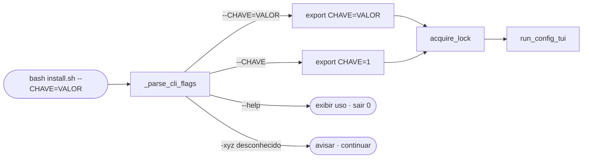
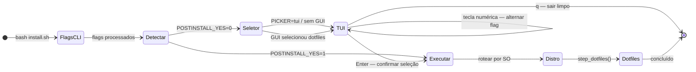
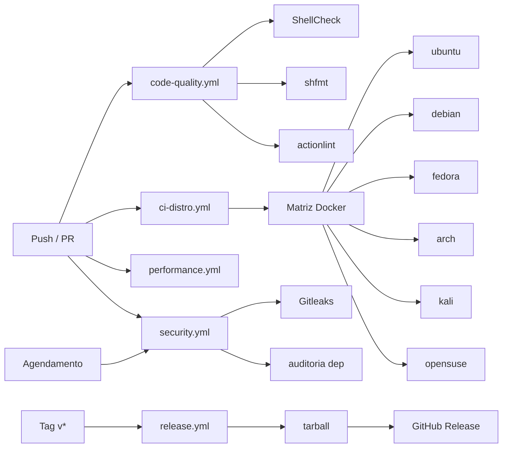
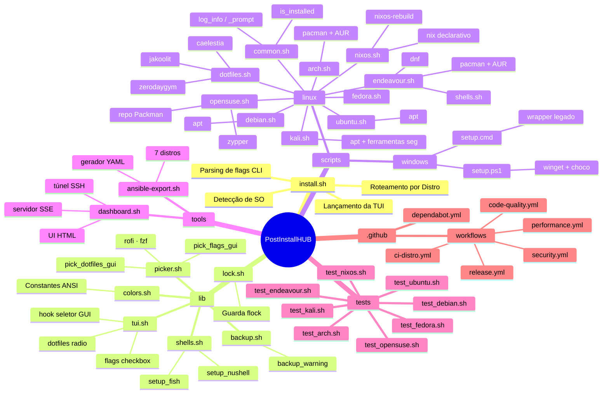
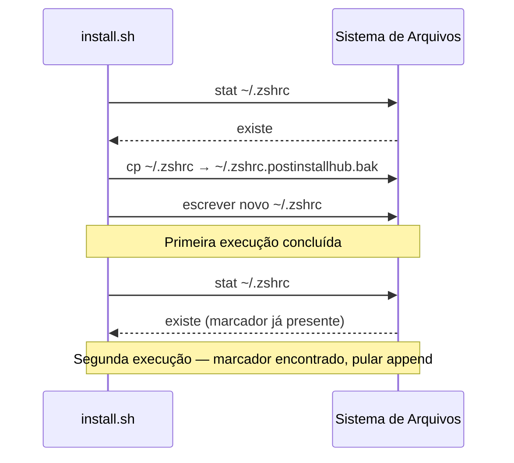

<div align="center">

<h1 align="center">
 PostInstallHUB
</h1>

Um comando configura uma máquina Linux ou Windows do zero. Multi-distro, idempotente, TUI interativa orientada por flags, seletor gráfico, painel web e exportação Ansible. Sem dependências externas.

**[English](README2.md) | Português (BR)**

</div>

---

<h1 align="center">
 
 Demo | TUI de Configuração Interativa
</h1>

```
 PostInstallHUB v0.1.0

 OS: openSUSE Tumbleweed                          user: satu

 ──────────────────────────────────────────────────────
   Opções
 ──────────────────────────────────────────────────────
 1  [x]  POSTINSTALL_YES          Não-interativo — aprovar tudo automaticamente
 2  [ ]  OPENSUSE_NVIDIA          Drivers NVIDIA proprietários (nvidia-glG06 ou nvidia-open)
 3  [ ]  OPENSUSE_GAMING          Steam · Lutris · GameMode via Packman/Flatpak
 4  [ ]  OPENSUSE_PACKMAN         Adicionar repo Packman + trocar codecs multimídia

 ──────────────────────────────────────────────────────
   Dotfiles  (escolha um)
 ──────────────────────────────────────────────────────
 5  [●]  none                     Pular dotfiles
 6  [ ]  jakoolit                 Desktop Hyprland (LinuxBeginnings/Hyprland-Dots)
 7  [ ]  caelestia                Desktop Quickshell + Hyprland (AUR ou via Nix)

 ──────────────────────────────────────────────────────
  [1–7] alternar  ·  [Enter] iniciar  ·  [q] sair
 ──────────────────────────────────────────────────────

 ▶
```

---

<h1 align="center">
  Distros Suportadas
</h1>

| Distro | Gerenciador de Pacotes | Script | Status |
|---|---|---|---|
| **Kali Linux** | `apt` | `scripts/linux/kali.sh` | Estável |
| **Ubuntu** · Zorin · Mint · Pop · Elementary · Neon | `apt` | `scripts/linux/ubuntu.sh` | Estável |
| **Debian** | `apt` | `scripts/linux/debian.sh` | Estável |
| **Arch Linux** · Manjaro | `pacman` | `scripts/linux/arch.sh` | Estável |
| **EndeavourOS** · CachyOS · Garuda | `pacman` + AUR | `scripts/linux/endeavour.sh` | Estável |
| **Fedora** | `dnf` | `scripts/linux/fedora.sh` | Estável |
| **openSUSE** Leap / Tumbleweed | `zypper` | `scripts/linux/opensuse.sh` | Estável |
| **NixOS** | `nix` / `nixos-rebuild` | `scripts/linux/nixos.sh` | Estável |
| **Windows 10/11** | `winget` / `choco` | `scripts/windows/setup.ps1` | Estável |

---

<h1 align="center">Como Funciona</h1>

```mermaid
flowchart TD
    A([bash install.sh]) --> CLI[_parse_cli_flags]
    CLI -->|--CHAVE=VALOR| EXP[exportar variáveis]
    CLI --> B[detect_os]
    B --> C{POSTINSTALL_YES?}
    C -->|"0 — interativo"| PK{POSTINSTALL_PICKER?}
    C -->|"1 — CI / batch"| E[aplicar variáveis de env]
    PK -->|"auto/gui — rofi/fzf"| GUI[pick_dotfiles_gui]
    PK -->|"tui"| D[run_config_tui]
    GUI -->|preset escolhido| D
    GUI -->|sem GUI disponível| D
    D --> F["Alternar flags · teclas numéricas 1–9"]
    F -->|Enter| E
    F -->|q| Z([sair 0])
    EXP --> E
    E --> H{distro}
    H -->|kali|       I[kali.sh]
    H -->|ubuntu|     J[ubuntu.sh]
    H -->|debian|     K[debian.sh]
    H -->|arch|       L[arch.sh]
    H -->|endeavour|  M[endeavour.sh]
    H -->|fedora|     N[fedora.sh]
    H -->|opensuse|   OS[opensuse.sh]
    H -->|nixos|      NX[nixos.sh]
    H -->|windows|    W[setup.ps1]
    I & J & K & L & M & N & OS & NX --> P[step_dotfiles]
    W --> Q([concluído])
    P --> Q
```

---

<h1 align="center">
  Funcionalidades
</h1>

* **TUI de Configuração Interativa**: `[x]` checkbox + `[●]` radio menu em Bash puro. Funciona em qualquer terminal, sem `dialog` ou `tput`
* **Flags via CLI**: argumentos `--CHAVE=VALOR` ignoram a TUI completamente — prontos para pipes e CI
* **Seletor Gráfico de Dotfiles**: rofi dmenu → fzf fuzzy finder → TUI texto como fallback; detecta automaticamente `$DISPLAY`/`$WAYLAND_DISPLAY`
* **Modo Batch/CI**: `POSTINSTALL_YES=1` ignora todas as perguntas
* **Painel Web**: transmite o progresso da instalação para o navegador via SSE — funciona por túnel SSH
* **Exportação Ansible**: gera um playbook idempotente a partir dos flags exatos que você escolheu
* **Lock File**: uma instância por vez via `/tmp/postinstallhub.lock`
* **Avisos de Backup**: alerta antes de modificar qualquer arquivo de configuração existente; cadeia de backups com timestamp
* **Idempotente**: re-execuções ignoram pacotes já instalados em todas as distros
* **Dotfiles**: três presets — jakoolit, caelestia, zerodaygym
* **Configuração de Shell**: `lib/shells.sh` — instalação completa de Fish + Nushell (fisher, plugins, config, shell padrão)
* **Consciente da Distro**: cada distro exibe seus próprios flags na TUI
* **NVIDIA / CUDA**: Ubuntu, Debian, Fedora e openSUSE têm flags dedicados para drivers
* **Stack de Jogos**: Steam · Lutris · MangoHud · GameMode para Debian, Ubuntu, openSUSE, Endeavour
* **Docker**: Arch/Manjaro instala Docker e adiciona o usuário atual ao grupo `docker`
* **Cloudflare DNS over TLS**: um toggle para Fedora
* **NixOS declarativo**: appends idempotentes em `configuration.nix` com cadeia de backup completa
* **openSUSE Packman**: troca de repo de codecs/drivers com um toggle
* **PowerShell 7**: configuração Windows via `setup.ps1`

### Presets de Dotfiles

| Preset | Desktop | Alvo | Observações |
|---|---|---|---|
| `jakoolit` | Hyprland | Todas as distros incl. NixOS | [LinuxBeginnings/Hyprland-Dots](https://github.com/JaKooLit/Hyprland-Dots) |
| `caelestia` | Quickshell + Hyprland | Todas as distros | AUR (Arch/Endeavour) ou `nix run` |
| `zerodaygym` | i3-gaps | **Apenas Kali** | Desktop de segurança, módulos HTB/VPN |
| `none` | — | Padrão | Pular dotfiles completamente |

---

<h1 align="center">
  Stack Tecnológico
</h1>

<p align="center">
 
</p>

* **Shell**: Bash 5.x (`set -euo pipefail` em todo o código)
* **Windows**: PowerShell 7 + fallback `setup.cmd`
* **CI/CD**: GitHub Actions (ubuntu-24.04, actions com SHA fixado)
* **Linting**: ShellCheck v0.11.0 · shfmt v3.10.0 · actionlint v1.7.12
* **Varredura de Secrets**: Gitleaks v8.27.2
* **Contêineres**: Docker (smoke tests por distro)
* **Dotfiles**: repositório bare Git + Nix flake (caelestia) + AUR (jakoolit)
* **Renderizador TUI**: Arrays nameref Bash puro + códigos de escape ANSI
* **Seletor Gráfico**: rofi dmenu · fzf (auto-detectado, fallback gracioso)
* **Painel Web**: servidor SSE Python 3 stdlib (sem pip)
* **Exportação Ansible**: gerador YAML em Bash heredoc, validado com `python3 yaml`
* **Gerenciadores de Pacotes**: apt · pacman · dnf · zypper · nix · winget / choco
* **Mecanismo de Lock**: guarda `flock` de instância única
* **Versionamento**: Semantic Versioning 2.0.0 + Keep a Changelog 1.1.0

---

<h1 align="center">
 
 Instalação & Configuração
</h1>

```bash
git clone https://github.com/SobralCybersec/PostInstallHUB.git
cd PostInstallHUB
```

### Requisitos

- Bash 5.x (pré-instalado em todas as distros suportadas)
- Conexão com a internet (pacotes obtidos em tempo de execução)
- Acesso `sudo` ou root

### One-liner (Linux)

```bash
curl -fsSL https://raw.githubusercontent.com/SobralCybersec/PostInstallHUB/main/install.sh | bash
```

### Execução Manual

```bash
# Interativo — TUI abre automaticamente
bash install.sh

# Não-interativo / modo batch CI (via variável de ambiente)
POSTINSTALL_YES=1 bash install.sh

# Via flag CLI — efeito idêntico, sem necessidade de exportar variável
bash install.sh --POSTINSTALL_YES=1

# Pré-selecionar dotfiles e flags pela linha de comando
bash install.sh --UBUNTU_NVIDIA=1 --POSTINSTALL_DOTFILES=jakoolit

# Forçar TUI texto (ignorar seletor rofi/fzf)
bash install.sh --POSTINSTALL_PICKER=tui

# Exibir ajuda
bash install.sh --help
```

### Windows

```powershell
# PowerShell 7 (executar como Administrador)
Set-ExecutionPolicy Bypass -Scope Process -Force
.\scripts\windows\setup.ps1
```

Ou use o wrapper CMD legado:
```cmd
scripts\windows\setup.cmd
```

### Referência de Variáveis de Ambiente

| Variável | Efeito | Padrão |
|---|---|---|
| `POSTINSTALL_YES=1` | Ignorar todos os prompts interativos | `0` |
| `POSTINSTALL_DOTFILES=<preset>` | Selecionar preset de dotfiles | `none` |
| `POSTINSTALL_PICKER=auto\|tui\|gui` | Modo de seleção TUI/GUI | `auto` |
| `UBUNTU_NVIDIA=1` | Instalar drivers NVIDIA proprietários | `0` |
| `UBUNTU_DEBLOAT=1` | Remover bloatware pré-instalado | `0` |
| `UBUNTU_SNAP=1` | Habilitar daemon Snap + apps | `0` |
| `ARCH_DOCKER=1` | Instalar Docker + adicionar usuário ao grupo | `0` |
| `ARCH_LTS=1` | Instalar kernel LTS (`linux-lts`) | `0` |
| `ENDEAVOUR_GAMING=1` | Steam · Lutris · GameMode · drivers GPU | `0` |
| `ENDEAVOUR_PLYMOUTH=1` | Animação de boot Plymouth | `0` |
| `ENDEAVOUR_WAYDROID=1` | Waydroid (contêiner Android) | `0` |
| `ENDEAVOUR_FISH=1` | Configuração completa do Fish via `lib/shells.sh` | `0` |
| `FEDORA_NVIDIA=1` | Drivers NVIDIA (`akmod-nvidia`) | `0` |
| `FEDORA_CUDA=1` | Suporte CUDA (requer `FEDORA_NVIDIA=1`) | `0` |
| `FEDORA_DNS=1` | Cloudflare DNS over TLS | `0` |
| `DEBIAN_NVIDIA=1` | Driver aberto NVIDIA (`nvidia-open`) | `0` |
| `DEBIAN_NVIDIA_CUDA=1` | Toolkit CUDA (implica `DEBIAN_NVIDIA`) | `0` |
| `DEBIAN_GAMING=1` | Steam · Heroic · MangoHud via Flatpak | `0` |
| `DEBIAN_DEBLOAT=1` | Remover LibreOffice · KMail · Juk · Dragon | `0` |
| `DEBIAN_ZSWAP=1` | Habilitar ZSWAP (systemd-boot) | `0` |
| `OPENSUSE_NVIDIA=1` | Drivers NVIDIA proprietários | `0` |
| `OPENSUSE_GAMING=1` | Steam · Lutris · GameMode via Flatpak | `0` |
| `OPENSUSE_PACKMAN=1` | Adicionar repo Packman + trocar codecs | `0` |
| `NIXOS_FLAKES=1` | Habilitar flakes + recursos nix-command | `0` |
| `NIXOS_UNFREE=1` | Permitir pacotes não-livres | `0` |
| `NIXOS_HOME_MANAGER=1` | Instalar Home Manager como módulo NixOS | `0` |

---

<h1 align="center">
 
 Funcionalidades em Detalhe
</h1>

### Flags via CLI (`install.sh`)

Qualquer variável de ambiente que os scripts da distro leem pode ser passada diretamente como flag `--CHAVE=VALOR`, ignorando a TUI. Isso é processado **antes** de `acquire_lock` e `run_config_tui`:

```bash
# Forma longa — definir um valor
bash install.sh --OPENSUSE_NVIDIA=1 --OPENSUSE_PACKMAN=1

# Forma curta — define como 1
bash install.sh --POSTINSTALL_YES --ARCH_DOCKER

# Misturado com variáveis de ambiente (ambos funcionam, CLI vence se os dois estiverem definidos)
POSTINSTALL_YES=1 bash install.sh --FEDORA_NVIDIA=1

# Ajuda
bash install.sh --help
```



### TUI de Configuração Interativa (`lib/tui.sh`)

A TUI é renderizada antes de qualquer etapa de instalação. Alterne os flags opcionais da sua distro lá em vez de definir variáveis de ambiente manualmente.

```
Fluxo:

  detect_os()
        ↓
  run_config_tui(distro)  ←  bash puro, sem tput/dialog
        ↓
  [x] checkbox — multi-seleção (NVIDIA, Docker, Debloat …)
  [●] radio    — seleção única (preset de dotfiles)
  [Enter] → exportar vars, contagem regressiva de 3 s, iniciar
  [q]     → sair limpo com código 0
        ↓
  case "$distro" in
    kali)     source scripts/linux/kali.sh     ;;
    ubuntu)   source scripts/linux/ubuntu.sh   ;;
    debian)   source scripts/linux/debian.sh   ;;
    arch)     source scripts/linux/arch.sh     ;;
    endeavour)source scripts/linux/endeavour.sh;;
    fedora)   source scripts/linux/fedora.sh   ;;
    opensuse) source scripts/linux/opensuse.sh ;;
    nixos)    source scripts/linux/nixos.sh    ;;
    windows)  → guia para setup.ps1            ;;
  esac
```



### Seletor Gráfico de Dotfiles (`lib/picker.sh`)

Quando uma sessão gráfica é detectada, `pick_dotfiles_gui` é executado **antes** da TUI texto para o usuário selecionar um preset com rofi ou fzf. A TUI texto ainda cuida dos flags booleanos.

| Modo | Ferramenta | Gatilho |
|---|---|---|
| `auto` (padrão) | rofi → fzf → TUI texto | `$DISPLAY` ou `$WAYLAND_DISPLAY` presente |
| `tui` | somente TUI texto | `POSTINSTALL_PICKER=tui` |
| `gui` | rofi / fzf (sai com erro se ausente) | `POSTINSTALL_PICKER=gui` |

```bash
# Forçar modo GUI
POSTINSTALL_PICKER=gui bash install.sh

# Pular GUI, sempre usar TUI texto
bash install.sh --POSTINSTALL_PICKER=tui
```

`pick_flags_gui DISTRO` também está disponível para multi-seleção de flags booleanos (rofi `-multi-select` / `fzf --multi`).

### Biblioteca de Configuração de Shell (`lib/shells.sh`)

Helpers compartilhados chamáveis por qualquer script de distro:

```bash
# Configuração completa do Fish — instalar → /etc/shells → chsh → fisher → plugins → config
setup_fish

# Configuração completa do Nushell — instalar → env.nu + config.nu → chsh opcional
setup_nushell
```

**`setup_fish` instala:**
- `fish` via gerenciador de pacotes detectado (apt / pacman / dnf / zypper)
- Registra em `/etc/shells` e executa `chsh`
- Gerenciador de plugins [fisher](https://github.com/jorgebucaran/fisher)
- Plugins: `nvm.fish` · `fzf.fish` (se fzf presente) · prompt `tide@v6`
- `~/.config/fish/conf.d/postinstallhub.fish` — EDITOR, PATH, aliases

**`setup_nushell` instala:**
- `nushell` via PM detectado
- Appends com marcadores em `env.nu` (EDITOR, PATH) e `config.nu` (aliases)
- Shell padrão opcional via `chsh`

Ambas as funções são totalmente idempotentes e respeitam `POSTINSTALL_YES=1`.

### Painel Web (`tools/dashboard.sh`)

Transmite o progresso da instalação ao vivo para o navegador via [Server-Sent Events](https://developer.mozilla.org/pt-BR/docs/Web/API/Server-sent_events). Requer Python 3 (somente stdlib — sem pip).

```bash
# Terminal 1 — iniciar painel (escolhe automaticamente porta 8080–8099)
bash tools/dashboard.sh
# → Painel: http://localhost:8080/
# → Túnel SSH: ssh -L 8080:localhost:8080 user@servidor

# Terminal 2 — executar instalador, saída vai automaticamente para o log
POSTINSTALL_YES=1 bash install.sh 2>&1 | tee /tmp/postinstallhub.log

# Combinado — painel inicia a instalação automaticamente
bash tools/dashboard.sh --run --FEDORA_NVIDIA=1
```

**Funcionalidades do painel:**
- HTML auto-contido, tema escuro — sem dependências de CDN
- Remoção de cores ANSI, auto-scroll, timer decorrido, badge de status (EXECUTANDO / CONCLUÍDO ✓ / FALHOU ✗)
- Endpoint SSE `/events` monitora `/tmp/postinstallhub.log` em tempo real
- Botão "Copiar Log"
- Funciona transparentemente via port-forward SSH

### Exportação de Playbook Ansible (`tools/ansible-export.sh`)

Lê as mesmas variáveis que a TUI exporta e gera um playbook Ansible idempotente:

```bash
# Auto-detectar distro + ler vars da TUI exportadas
bash tools/ansible-export.sh

# Distro explícita + flags + arquivo de saída
bash tools/ansible-export.sh \
  --distro=fedora \
  --FEDORA_NVIDIA=1 \
  --FEDORA_CUDA=1 \
  --output=workstation.yml

# Executar o playbook
ansible-playbook -i localhost, workstation.yml
```

**Estrutura do playbook gerado:**
```yaml
- name: PostInstallHUB — fedora pós-instalação
  hosts: localhost
  connection: local
  become: yes
  vars:
    postinstall_dotfiles: "jakoolit"
    fedora_nvidia: "1"
  tasks:
    - name: Atualizar pacotes do sistema (dnf)
      dnf: update_cache=yes state=latest
      tags: [update]
    - name: Instalar drivers NVIDIA
      dnf: name=akmod-nvidia state=present
      when: fedora_nvidia == "1"
      tags: [nvidia]
    # … tarefas específicas por distro com tags
```

Cobertura de distros: ubuntu · fedora · arch · opensuse · debian · nixos · kali. A saída YAML é validada com `python3 -c "import yaml; yaml.safe_load(...)"` quando Python 3 está disponível.

### Arquitetura dos Scripts de Distro

Cada script de distro exporta uma única função `run_install()`. Todos os scripts compartilham o mesmo padrão de guarda.

```mermaid
graph LR
    I([install.sh]) --> D[detect_os]
    D -->|kali|      K[kali.sh]
    D -->|ubuntu|    U[ubuntu.sh]
    D -->|debian|    DE[debian.sh]
    D -->|arch|      A[arch.sh]
    D -->|endeavour| E[endeavour.sh]
    D -->|fedora|    F[fedora.sh]
    D -->|opensuse|  OS[opensuse.sh]
    D -->|nixos|     NX[nixos.sh]
    D -->|windows|   W[setup.ps1]

    K  & U & DE & A & E & F & OS & NX --> C[common.sh]
    K  & U & DE & A & E & F & OS & NX --> DF[dotfiles.sh]
    E  --> SH[shells.sh]

    C  --> PKG[gerenciador de pacotes]
    PKG -->|apt|    APT[(apt)]
    PKG -->|pacman| PAC[(pacman)]
    PKG -->|dnf|    DNF[(dnf)]
    PKG -->|zypper| ZYP[(zypper)]
    PKG -->|nix|    NIX[(nix)]
    W  -->|winget|  WIN[(winget/choco)]
```

### openSUSE (`scripts/linux/opensuse.sh`)

```bash
# Tumbleweed — configuração completa com codecs Packman + Jogos
bash install.sh --OPENSUSE_PACKMAN=1 --OPENSUSE_GAMING=1

# Leap — somente NVIDIA
OPENSUSE_NVIDIA=1 POSTINSTALL_YES=1 bash install.sh
```

Etapas: `zypper refresh+update` → repo Packman (opcional) → pacotes essenciais → Flatpak+Flathub → NVIDIA (opcional) → flatpaks de jogos (opcional) → zsh+oh-my-zsh → dotfiles.

### NixOS (`scripts/linux/nixos.sh`)

NixOS usa uma abordagem declarativa — o script nunca sobrescreve `configuration.nix` mas adiciona blocos idempotentes com marcadores:

```bash
# Habilitar flakes + Home Manager, permitir pacotes não-livres
bash install.sh --NIXOS_FLAKES=1 --NIXOS_HOME_MANAGER=1 --NIXOS_UNFREE=1
```

Etapas: `nix-channel --add nixpkgs-unstable` → config de flakes → config de pacotes não-livres → módulo Home Manager → pacotes essenciais (apenas orientação) → `nixos-rebuild switch`.

```bash
# O que é adicionado a /etc/nixos/configuration.nix (idempotente):
# PostInstallHUB — flakes BEGIN
nix.settings.experimental-features = [ "nix-command" "flakes" ];
# PostInstallHUB — flakes END
```

### Padrão de Idempotência

Cada etapa de instalação usa uma guarda "pular se já feito":

```bash
# Instalação de pacote — pacman
if ! pacman -Qq "$pkg" &>/dev/null; then
  sudo pacman -S --needed --noconfirm "$pkg"
fi

# apt
if ! dpkg -l "$pkg" &>/dev/null; then
  sudo apt-get install -y "$pkg"
fi

# zypper
if ! rpm -q "$pkg" &>/dev/null; then
  sudo zypper install -y "$pkg"
fi

# nix (apenas orientação — systemPackages gerenciados declarativamente)
nix_config_has "# PostInstallHUB — flakes BEGIN" || nix_config_append ...
```

```mermaid
flowchart LR
    A([etapa de instalação]) --> B{"pacote já\ninstalado?"}
    B -->|sim| C[log: já concluído]
    B -->|não|  D[executar gerenciador de pacotes]
    D --> E{código de saída 0?}
    E -->|sim| F[log: OK]
    E -->|não|  G([sair 1 — abortar])
    C --> H([próxima etapa])
    F --> H
```

### Integração de Dotfiles (`scripts/linux/dotfiles.sh`)

Todos os scripts de distro chamam `step_dotfiles()` após a instalação base:

```bash
step_dotfiles() {
  local preset="${POSTINSTALL_DOTFILES:-none}"
  case "$preset" in
    jakoolit)
      # Hyprland-Dots via dispatcher curl (Arch · Fedora · Ubuntu · Debian · OpenSUSE · NixOS)
      ;;
    caelestia)
      # Quickshell — AUR (yay) no Arch/Endeavour, nix run em todo o resto
      ;;
    zerodaygym)
      # preset i3-gaps Kali — apt + build do fonte
      ;;
    none | *)
      log_info "Pulando dotfiles (POSTINSTALL_DOTFILES=none)"
      return 0
      ;;
  esac
}
```

```mermaid
flowchart TD
    A([step_dotfiles]) --> B{POSTINSTALL_DOTFILES}
    B -->|jakoolit|   C[curl Distro-Hyprland.sh]
    B -->|caelestia|  D{yay disponível?}
    B -->|zerodaygym| E{distro == kali?}
    B -->|none|       F([pular])

    C --> G[executa instalador por distro] --> Z([concluído])

    D -->|sim| H[yay caelestia-shell-git]
    D -->|não|  I[instalar Nix · nix run]
    H & I --> Z

    E -->|sim| J[apt + i3-gaps + ferramentas HTB] --> Z
    E -->|não|  K([aviso: somente Kali])
```

### Lock File (`lib/lock.sh`)

```bash
acquire_lock() {
  if [[ -f "$LOCK_FILE" ]]; then
    echo -e "${RED}[ERRO]${NC} PostInstallHUB já está em execução (PID $(cat "$LOCK_FILE"))."
    echo -e "       Lock travado? Delete:  rm -f ${LOCK_FILE}"
    exit 3
  fi
  echo "$$" > "$LOCK_FILE"
  trap 'rm -f "$LOCK_FILE"' EXIT INT TERM
}
```

### Aviso de Backup (`lib/backup.sh`)

```bash
backup_warning() {
  local file="${1:-<arquivo desconhecido>}"
  if [[ -f "$file" ]]; then
    local backup="${file}.postinstallhub.bak"
    cp "$file" "$backup"
    echo -e "Backup salvo → ${backup}"
  fi
}
```

---

<h1 align="center">
  CI/CD com GitHub Actions
</h1>

### Matriz de Workflows

| Workflow | Gatilho | Propósito |
|---|---|---|
| `code-quality.yml` | push / PR | ShellCheck · shfmt · actionlint |
| `ci-distro.yml` | push / PR | Smoke tests Docker por distro |
| `performance.yml` | push / PR | Benchmarks de tempo de instalação |
| `security.yml` | push / agendamento | Gitleaks · auditoria de dependências |
| `release.yml` | tag `v*` | Build do tarball, publicação |



### Smoke Test por Distro (Docker)

```yaml
strategy:
  fail-fast: false
  matrix:
    distro: [ubuntu, debian, fedora, arch, kali, opensuse/tumbleweed]
steps:
  - name: Smoke test — ${{ matrix.distro }}
    run: |
      docker run --rm \
        -v "${{ github.workspace }}:/repo:ro" \
        "${{ matrix.distro }}:latest" \
        bash -c "POSTINSTALL_YES=1 bash /repo/install.sh"
```

### Portas de Qualidade de Código

```bash
# ShellCheck (pré-instalado no ubuntu-24.04)
shellcheck --severity=warning install.sh lib/*.sh scripts/linux/*.sh tools/*.sh

# Verificação de formatação shfmt
shfmt -d -i 2 -ci install.sh lib/*.sh scripts/linux/*.sh tools/*.sh

# actionlint
actionlint .github/workflows/*.yml
```

---

<h1 align="center">
  Exemplos de Uso
</h1>

### Detectar distro e abrir TUI

```bash
bash install.sh
```

**Saída:**
```
PostInstallHUB — SO detectado: ubuntu

[TUI abre — alterne flags com teclas numéricas, Enter para iniciar]

Resumo da configuração:
  [x] POSTINSTALL_YES=1
  [x] UBUNTU_NVIDIA=1
  [ ] UBUNTU_DEBLOAT=0
  [ ] UBUNTU_SNAP=0
  [●] POSTINSTALL_DOTFILES=jakoolit

  Iniciando em 3 s … Ctrl+C para cancelar
```

### Flags CLI — sem TUI, sem exportar variáveis

```bash
# Ubuntu NVIDIA + dotfiles em uma linha
bash install.sh --UBUNTU_NVIDIA=1 --POSTINSTALL_DOTFILES=jakoolit

# NixOS flakes + Home Manager
bash install.sh --NIXOS_FLAKES=1 --NIXOS_HOME_MANAGER=1 --NIXOS_UNFREE=1

# openSUSE multimídia completo + jogos
bash install.sh --OPENSUSE_PACKMAN=1 --OPENSUSE_GAMING=1 --POSTINSTALL_YES=1
```

### Não-interativo (ideal para CI / Docker)

```bash
POSTINSTALL_YES=1 bash install.sh
```

### Kali com dotfiles zerodaygym

```bash
POSTINSTALL_DOTFILES=zerodaygym bash install.sh
```

### Fedora com stack completo NVIDIA + CUDA

```bash
POSTINSTALL_YES=1 FEDORA_NVIDIA=1 FEDORA_CUDA=1 FEDORA_DNS=1 bash install.sh
```

### Arch com Docker + kernel LTS

```bash
POSTINSTALL_YES=1 ARCH_DOCKER=1 ARCH_LTS=1 POSTINSTALL_DOTFILES=caelestia bash install.sh
```

### EndeavourOS configuração completa para jogos + Fish

```bash
POSTINSTALL_YES=1 \
  ENDEAVOUR_GAMING=1 \
  ENDEAVOUR_PLYMOUTH=1 \
  ENDEAVOUR_WAYDROID=1 \
  ENDEAVOUR_FISH=1 \
  POSTINSTALL_DOTFILES=jakoolit \
  bash install.sh
```

### openSUSE Tumbleweed

```bash
# TUI interativa
bash install.sh   # detecta opensuse-tumbleweed automaticamente

# Headless com Packman + NVIDIA
bash install.sh --OPENSUSE_PACKMAN=1 --OPENSUSE_NVIDIA=1 --POSTINSTALL_YES=1
```

### NixOS

```bash
# TUI interativa
bash install.sh   # detecta nixos automaticamente

# Totalmente declarativo, amigável para CI
bash install.sh --NIXOS_FLAKES=1 --NIXOS_UNFREE=1 --NIXOS_HOME_MANAGER=1 --POSTINSTALL_YES=1
```

### Painel web + instalação remota

```bash
# No servidor remoto
bash tools/dashboard.sh --run --POSTINSTALL_YES=1

# No seu computador — abrir http://localhost:8080/
ssh -L 8080:localhost:8080 user@servidor
```

### Exportação de playbook Ansible

```bash
# Após a TUI — lê as vars já exportadas
bash tools/ansible-export.sh --output=minha-maquina.yml

# Explícito, sem necessidade de TUI
bash tools/ansible-export.sh --distro=arch --ARCH_DOCKER=1 --ARCH_LTS=1

# Executar
ansible-playbook -i localhost, minha-maquina.yml
```

### Windows PowerShell

```powershell
# Mínimo
.\scripts\windows\setup.ps1

# Pular confirmações
$env:POSTINSTALL_YES = "1"
.\scripts\windows\setup.ps1
```

---

<h1 align="center">
  Estrutura do Projeto
</h1>



---

<h1 align="center">
  Limitações & Notas
</h1>

### Fora do Escopo

- **Ambientes de desenvolvimento**: Node.js, venvs Python, toolchains Rust
- **Temas de GUI**: pacotes de ícones, config do servidor gráfico (dotfiles cobrem apenas o gerenciador de janelas)
- **Hardening de sistema**: regras de firewall, config SSH, perfis AppArmor
- **Versões de pacotes**: instala o mais recente disponível no momento da execução
- **GUI Windows**: `setup.ps1` cobre apenas ferramentas CLI
- **Auto-edição NixOS**: o script nunca gera automaticamente um `configuration.nix` completo — apenas adiciona trechos

### Limitações Conhecidas

- **Helpers AUR**: scripts Arch/Endeavour precisam de `yay` ou `paru` pré-instalados
- **Preset caelestia**: executa instalação Nix single-user se Nix estiver ausente
- **zerodaygym**: apenas Kali
- **TUI**: defina `POSTINSTALL_YES=1` ao fazer piping do stdin
- **Limite de toggles**: TUI exibe itens 1–9 por tela; 9+ flags ficam fora da tela (use `--flag` CLI por enquanto)
- **Painel**: requer Python 3 na máquina alvo

### Garantias de Segurança

- Toda ação destrutiva é protegida por `backup_warning()` 
- `set -euo pipefail` em cada script — aborta em qualquer erro não tratado 
- Lock file previne execuções concorrentes (`/tmp/postinstallhub.lock`) 
- Smoke tests Docker capturam regressões antes do merge 
- NixOS: marcadores de idempotência protegem cada append em `configuration.nix` 

---

<h1 align="center">
  Segurança & Idempotência
</h1>

### Re-execuções

Executar `install.sh` duas vezes é seguro:

```bash
bash install.sh
bash install.sh # ← pula tudo que já foi feito
```

**Exemplo de cadeia de backup:**
```
~/.zshrc                      ← original
~/.zshrc.postinstallhub.bak   ← backup da primeira execução
```



### Aviso Legal

O PostInstallHUB modifica pacotes do sistema e arquivos de configuração. Embora toda operação seja reversível via cadeia de backup, **sempre revise os scripts antes de executar em máquinas de produção.** A cadeia de backup cobre os arquivos tocados durante a instalação; configurações não suportadas não são testadas.

---

<h1 align="center">
  Roadmap
</h1>

* [x] `install.sh` — ponto de entrada com detecção automática de SO
* [x] `lib/colors.sh` — constantes de cores ANSI
* [x] `lib/lock.sh` — guarda flock de instância única
* [x] `lib/backup.sh` — helper backup_warning
* [x] `lib/tui.sh` — TUI interativa `[x]` / `[●]` para configuração de flags
* [x] `lib/picker.sh` — seletor gráfico de dotfiles via rofi/fzf
* [x] `lib/shells.sh` — helpers de configuração Fish + Nushell
* [x] `scripts/linux/common.sh` — helpers compartilhados (apt · pacman · dnf · zypper)
* [x] `scripts/linux/ubuntu.sh` — Ubuntu + derivados (apt)
* [x] `scripts/linux/debian.sh` — Debian (apt)
* [x] `scripts/linux/arch.sh` — Arch + Manjaro (pacman)
* [x] `scripts/linux/endeavour.sh` — EndeavourOS · CachyOS · Garuda (pacman + AUR)
* [x] `scripts/linux/fedora.sh` — Fedora (dnf)
* [x] `scripts/linux/kali.sh` — Kali Linux (apt + ferramentas de segurança)
* [x] `scripts/linux/opensuse.sh` — openSUSE Leap / Tumbleweed (zypper)
* [x] `scripts/linux/nixos.sh` — configuração declarativa NixOS
* [x] `scripts/linux/dotfiles.sh` — jakoolit · caelestia · zerodaygym
* [x] `scripts/windows/setup.ps1` — configuração PowerShell 7
* [x] `tools/dashboard.sh` — painel web, stream SSE de logs, pronto para túnel SSH
* [x] `tools/ansible-export.sh` — exportação de playbook Ansible (7 distros)
* [x] `POSTINSTALL_YES=1` modo CI/batch em todos os scripts
* [x] Flags CLI `--flag` ignoram TUI via linha de comando
* [x] GitHub Actions CI — ShellCheck · shfmt · actionlint · gitleaks · smoke tests Docker
* [x] Arrays de flags da TUI por distro (Ubuntu / Arch / Endeavour / Fedora / Debian / Kali / openSUSE / NixOS)
* [x] Etapas de configuração dos shells Fish / Nushell
* [x] Seletor gráfico de dotfiles (integração rofi / fzf)
* [x] Suporte openSUSE / Zypper
* [x] Módulo NixOS
* [x] Painel web para execuções remotas (SSH + stream de status)
* [x] Exportação de configuração atual como playbook Ansible

---

<h1 align="center"> Referências</h1>


<h2 align="center">

**Jakoolit Hyprland Dots**: [JaKooLit/Hyprland-Dots](https://github.com/JaKooLit/Hyprland-Dots) 

</h2>

<h2 align="center">

**Caelestia Quickshell**: [caelestia-dots/shell](https://github.com/caelestia-dots/shell) 

</h2>

<h2 align="center">

**ZeroDayGym Kali Dots**: [ZeroDayGym/kali-i3gaps](https://github.com/ZeroDayGym/kali-i3gaps) 

</h2>

<h2 align="center">

**ShellCheck**: [koalaman/shellcheck](https://github.com/koalaman/shellcheck) 

</h2>

<h2 align="center">

**shfmt**: [mvdan/sh](https://github.com/mvdan/sh) 

</h2>

<h2 align="center">

**actionlint**: [rhysd/actionlint](https://github.com/rhysd/actionlint) 

</h2>

<h2 align="center">

**Gitleaks**: [gitleaks/gitleaks](https://github.com/gitleaks/gitleaks) 

</h2>

<h2 align="center">

**Ansible**: [ansible.com](https://www.ansible.com/) 

</h2>

<h2 align="center">

**Keep a Changelog**: [keepachangelog.com](https://keepachangelog.com/en/1.1.0/) 

</h2>

<h2 align="center">

**Manual de Referência Bash**: [gnu.org/software/bash](https://www.gnu.org/software/bash/manual/) 

</h2>

<h2 align="center">

**Documentação GitHub Actions**: [docs.github.com/actions](https://docs.github.com/pt/actions) 

</h2>

<h1 align="center">Créditos</h1>

<p align="center">
 Matheus Sobral<br>
 <a href="https://github.com/SobralCybersec">github.com/SobralCybersec</a><br>
 MIT © 2026
</p>
