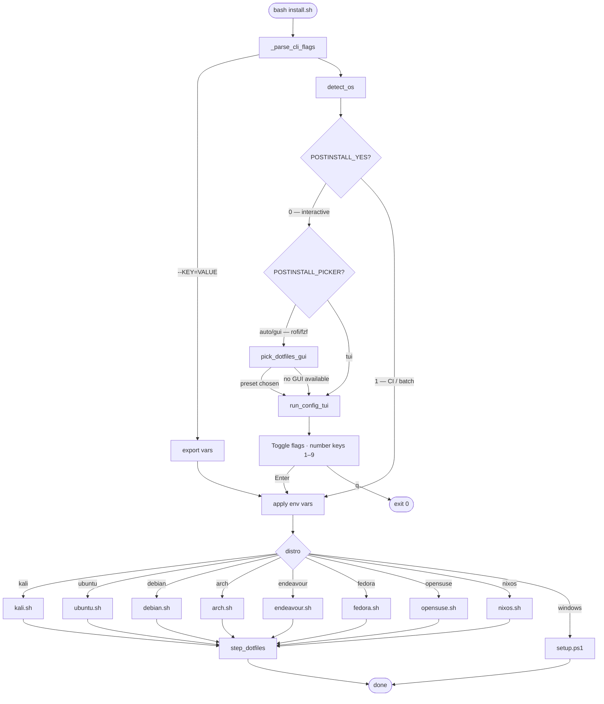
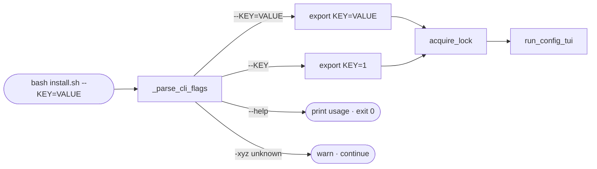
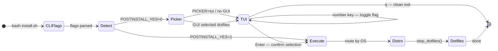
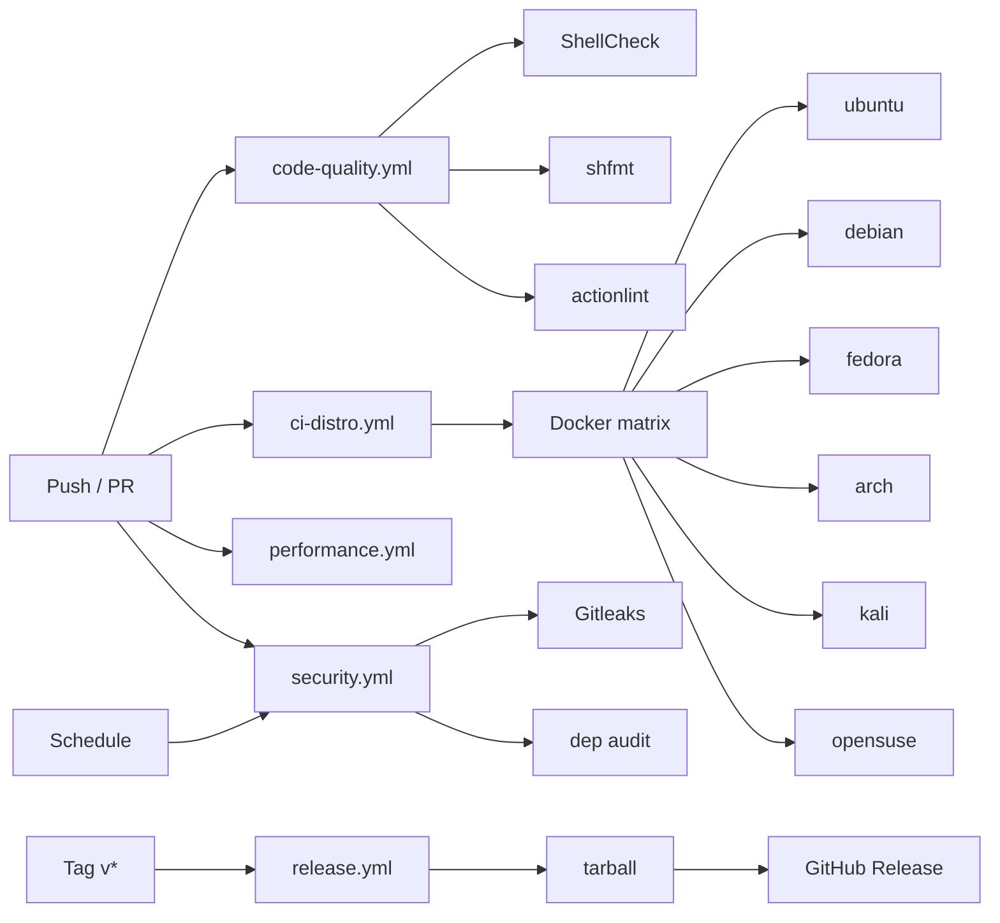
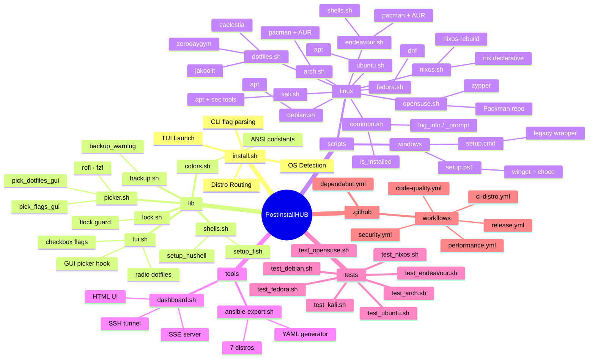
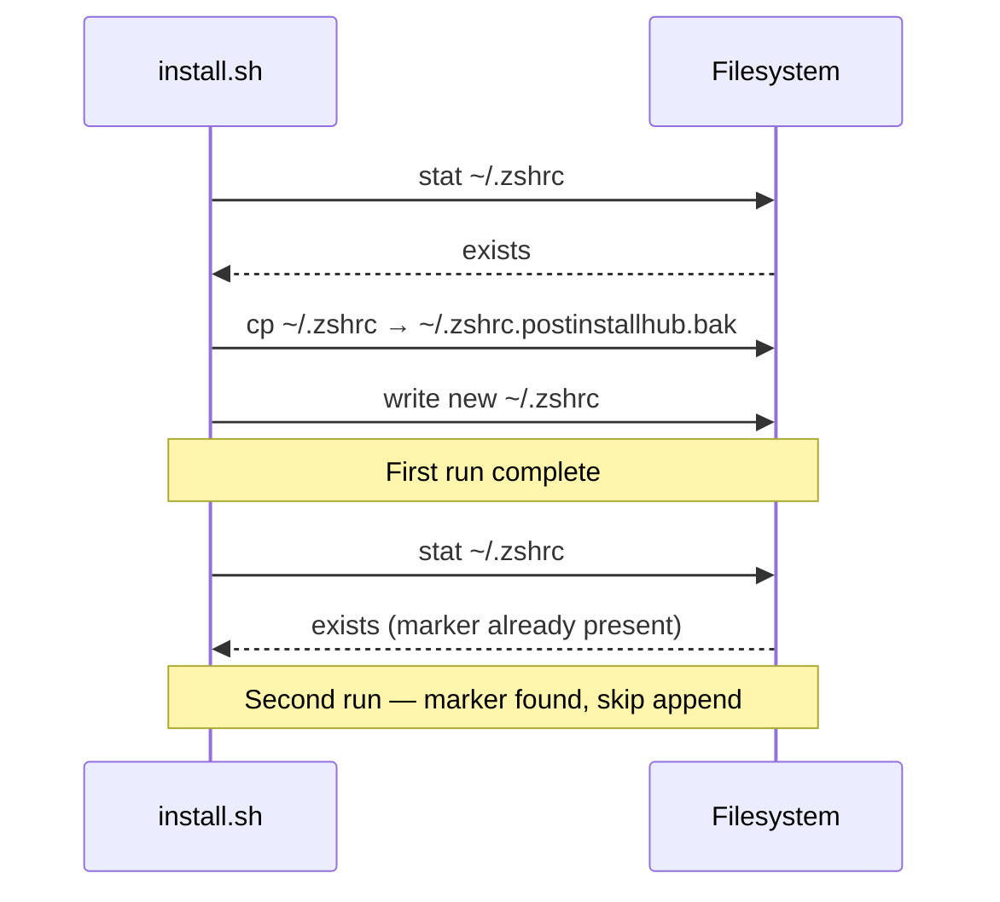

<div align="center">

<h1 align="center">
 PostInstallHUB
</h1>

One command configures a fresh Linux or Windows machine. Multi-distro, idempotent, interactive flag-driven TUI, GUI picker, web dashboard, and Ansible export. No external dependencies.

**English | [Portuguese](README-pt-br.md)**

</div>

---

<h1 align="center">
 
 Demo | Interactive Config TUI
</h1>

```
 PostInstallHUB v0.1.0

 OS: openSUSE Tumbleweed                          user: satu

 ──────────────────────────────────────────────────────
   Options
 ──────────────────────────────────────────────────────
 1  [x]  POSTINSTALL_YES          Non-interactive — auto-approve all prompts
 2  [ ]  OPENSUSE_NVIDIA          NVIDIA proprietary drivers (nvidia-glG06 or nvidia-open)
 3  [ ]  OPENSUSE_GAMING          Steam · Lutris · GameMode via Packman/Flatpak
 4  [ ]  OPENSUSE_PACKMAN         Add Packman repo + switch multimedia codecs

 ──────────────────────────────────────────────────────
   Dotfiles  (pick one)
 ──────────────────────────────────────────────────────
 5  [●]  none                     Skip dotfiles
 6  [ ]  jakoolit                 Hyprland desktop (LinuxBeginnings/Hyprland-Dots)
 7  [ ]  caelestia                Quickshell Hyprland desktop (AUR or via Nix)

 ──────────────────────────────────────────────────────
  [1–7] toggle  ·  [Enter] start  ·  [q] quit
 ──────────────────────────────────────────────────────

 ▶
```

---

<h1 align="center">
  Supported Distros
</h1>

| Distro | Package Manager | Script | Status |
|---|---|---|---|
| **Kali Linux** | `apt` | `scripts/linux/kali.sh` | Stable |
| **Ubuntu** · Zorin · Mint · Pop · Elementary · Neon | `apt` | `scripts/linux/ubuntu.sh` | Stable |
| **Debian** | `apt` | `scripts/linux/debian.sh` | Stable |
| **Arch Linux** · Manjaro | `pacman` | `scripts/linux/arch.sh` | Stable |
| **EndeavourOS** · CachyOS · Garuda | `pacman` + AUR | `scripts/linux/endeavour.sh` | Stable |
| **Fedora** | `dnf` | `scripts/linux/fedora.sh` | Stable |
| **openSUSE** Leap / Tumbleweed | `zypper` | `scripts/linux/opensuse.sh` | Stable |
| **NixOS** | `nix` / `nixos-rebuild` | `scripts/linux/nixos.sh` | Stable |
| **Windows 10/11** | `winget` / `choco` | `scripts/windows/setup.ps1` | Stable |

---

<h1 align="center">How It Works</h1>



---

<h1 align="center">
  Features
</h1>

* **Interactive Config TUI**: Pure-bash `[x]` checkbox + `[●]` radio menu. Works in any terminal, no `dialog` or `tput` needed
* **CLI Flag Overrides**: `--KEY=VALUE` args bypass the TUI entirely — pipe-friendly and CI-ready
* **GUI Dotfiles Picker**: rofi dmenu > fzf fuzzy finder > text TUI fallback; auto-detects `$DISPLAY`/`$WAYLAND_DISPLAY`
* **CI Batch Mode**: `POSTINSTALL_YES=1` skips all prompts
* **Web Dashboard**: streams install progress to your browser via SSE — works over SSH tunnel
* **Ansible Export**: generates an idempotent playbook from the exact flags you chose
* **Lock File**: one instance at a time via `/tmp/postinstallhub.lock`
* **Backup Warnings**: prompts before touching any existing config file; timestamped backup chain
* **Idempotent**: re-running skips already-installed packages on every distro
* **Dotfiles**: three presets — jakoolit, caelestia, zerodaygym
* **Shell Setup**: `lib/shells.sh` — full Fish + Nushell setup (fisher, plugins, config, default shell)
* **Distro-Aware**: each distro surfaces its own flag set in the TUI
* **NVIDIA / CUDA**: Ubuntu, Debian, Fedora, and openSUSE each have dedicated driver flags
* **Gaming Stack**: Steam · Lutris · MangoHud · GameMode for Debian, Ubuntu, openSUSE, Endeavour
* **Docker**: Arch/Manjaro installs Docker and adds the current user to the `docker` group
* **Cloudflare DNS over TLS**: Fedora one-toggle
* **NixOS declarative**: idempotent appends to `configuration.nix` with full backup chain
* **openSUSE Packman**: one-toggle codec/driver repo switch
* **PowerShell 7**: Windows setup via `setup.ps1`

### Dotfiles Presets

| Preset | Desktop | Target | Notes |
|---|---|---|---|
| `jakoolit` | Hyprland | All distros incl. NixOS | [LinuxBeginnings/Hyprland-Dots](https://github.com/JaKooLit/Hyprland-Dots) |
| `caelestia` | Quickshell + Hyprland | All distros | AUR (Arch/Endeavour) or `nix run` |
| `zerodaygym` | i3-gaps | **Kali only** | Security desktop, HTB/VPN modules |
| `none` | — | Default | Skip dotfiles entirely |

---

<h1 align="center">
  Tech Stack
</h1>

<p align="center">
 
</p>

* **Shell**: Bash 5.x (`set -euo pipefail` throughout)
* **Windows**: PowerShell 7 + `setup.cmd` fallback
* **CI/CD**: GitHub Actions (ubuntu-24.04, SHA-pinned actions)
* **Linting**: ShellCheck v0.11.0 · shfmt v3.10.0 · actionlint v1.7.12
* **Secret Scanning**: Gitleaks v8.27.2
* **Containers**: Docker (distro smoke tests)
* **Dotfiles**: Git bare repo + Nix flake (caelestia) + AUR (jakoolit)
* **TUI Renderer**: Pure Bash nameref arrays + ANSI escape codes
* **GUI Picker**: rofi dmenu · fzf (auto-detected, graceful fallback)
* **Web Dashboard**: Python 3 stdlib SSE server (no pip deps)
* **Ansible Export**: Bash heredoc YAML generator, `python3 yaml` validation
* **Package Managers**: apt · pacman · dnf · zypper · nix · winget / choco
* **Lock Mechanism**: `flock`-based single-instance guard
* **Versioning**: Semantic Versioning 2.0.0 + Keep a Changelog 1.1.0

---

<h1 align="center">
 
 Installation & Setup
</h1>

```bash
git clone https://github.com/SobralCybersec/PostInstallHUB.git
cd PostInstallHUB
```

### Requirements

- Bash 5.x (pre-installed on all supported distros)
- Internet connection (packages fetched at runtime)
- `sudo` or root access

### One-liner (Linux)

```bash
curl -fsSL https://raw.githubusercontent.com/SobralCybersec/PostInstallHUB/main/install.sh | bash
```

### Manual Run

```bash
# Interactive — TUI opens automatically
bash install.sh

# Non-interactive / CI batch mode (env var form)
POSTINSTALL_YES=1 bash install.sh

# CLI flag form — identical effect, no env export needed
bash install.sh --POSTINSTALL_YES=1

# Pre-select dotfiles and flags from the command line
bash install.sh --UBUNTU_NVIDIA=1 --POSTINSTALL_DOTFILES=jakoolit

# Force text TUI (skip rofi/fzf GUI picker)
bash install.sh --POSTINSTALL_PICKER=tui

# Show usage
bash install.sh --help
```

### Windows

```powershell
# PowerShell 7 (run as Administrator)
Set-ExecutionPolicy Bypass -Scope Process -Force
.\scripts\windows\setup.ps1
```

Or use the legacy CMD wrapper:
```cmd
scripts\windows\setup.cmd
```

### Environment Variables Reference

| Variable | Effect | Default |
|---|---|---|
| `POSTINSTALL_YES=1` | Skip all interactive prompts | `0` |
| `POSTINSTALL_DOTFILES=<preset>` | Select dotfiles preset | `none` |
| `POSTINSTALL_PICKER=auto\|tui\|gui` | TUI/GUI picker mode | `auto` |
| `UBUNTU_NVIDIA=1` | Install NVIDIA proprietary drivers | `0` |
| `UBUNTU_DEBLOAT=1` | Remove pre-installed bloatware | `0` |
| `UBUNTU_SNAP=1` | Enable Snap daemon + apps | `0` |
| `ARCH_DOCKER=1` | Install Docker + add user to group | `0` |
| `ARCH_LTS=1` | Install LTS kernel (`linux-lts`) | `0` |
| `ENDEAVOUR_GAMING=1` | Steam · Lutris · GameMode · GPU drivers | `0` |
| `ENDEAVOUR_PLYMOUTH=1` | Plymouth boot animation | `0` |
| `ENDEAVOUR_WAYDROID=1` | Waydroid (Android container) | `0` |
| `ENDEAVOUR_FISH=1` | Full Fish setup via `lib/shells.sh` | `0` |
| `FEDORA_NVIDIA=1` | NVIDIA drivers (`akmod-nvidia`) | `0` |
| `FEDORA_CUDA=1` | CUDA support (requires `FEDORA_NVIDIA=1`) | `0` |
| `FEDORA_DNS=1` | Cloudflare DNS over TLS | `0` |
| `DEBIAN_NVIDIA=1` | NVIDIA open driver (`nvidia-open`) | `0` |
| `DEBIAN_NVIDIA_CUDA=1` | CUDA toolkit (implies `DEBIAN_NVIDIA`) | `0` |
| `DEBIAN_GAMING=1` | Steam · Heroic · MangoHud via Flatpak | `0` |
| `DEBIAN_DEBLOAT=1` | Remove LibreOffice · KMail · Juk · Dragon | `0` |
| `DEBIAN_ZSWAP=1` | Enable ZSWAP (systemd-boot) | `0` |
| `OPENSUSE_NVIDIA=1` | NVIDIA proprietary drivers | `0` |
| `OPENSUSE_GAMING=1` | Steam · Lutris · GameMode via Flatpak | `0` |
| `OPENSUSE_PACKMAN=1` | Add Packman repo + switch codecs | `0` |
| `NIXOS_FLAKES=1` | Enable flakes + nix-command features | `0` |
| `NIXOS_UNFREE=1` | Allow unfree packages | `0` |
| `NIXOS_HOME_MANAGER=1` | Install Home Manager as NixOS module | `0` |

---

<h1 align="center">
 
 Key Features
</h1>

### CLI Flag Overrides (`install.sh`)

Any env var the distro scripts read can be passed directly as a `--KEY=VALUE` flag, bypassing the TUI. This is parsed **before** `acquire_lock` and `run_config_tui`:

```bash
# Long form — set a value
bash install.sh --OPENSUSE_NVIDIA=1 --OPENSUSE_PACKMAN=1

# Bare form — sets to 1
bash install.sh --POSTINSTALL_YES --ARCH_DOCKER

# Mixed with env vars (both work, CLI wins if both set)
POSTINSTALL_YES=1 bash install.sh --FEDORA_NVIDIA=1

# Help
bash install.sh --help
```



### Interactive Config TUI (`lib/tui.sh`)

The TUI renders before any install step runs. Toggle your distro's optional flags there instead of setting env vars by hand.

```
Flow:

  detect_os()
        ↓
  run_config_tui(distro)  ←  pure bash, no tput/dialog
        ↓
  [x] checkbox — multi-select (NVIDIA, Docker, Debloat …)
  [●] radio    — single-select (dotfiles preset)
  [Enter] → export vars, 3-second countdown, start
  [q]     → clean exit 0
        ↓
  case "$distro" in
    kali)     source scripts/linux/kali.sh     ;;
    ubuntu)   source scripts/linux/ubuntu.sh   ;;
    debian)   source scripts/linux/debian.sh   ;;
    arch)     source scripts/linux/arch.sh     ;;
    endeavour)source scripts/linux/endeavour.sh;;
    fedora)   source scripts/linux/fedora.sh   ;;
    opensuse) source scripts/linux/opensuse.sh ;;
    nixos)    source scripts/linux/nixos.sh    ;;
    windows)  → guide to setup.ps1             ;;
  esac
```



### GUI Dotfiles Picker (`lib/picker.sh`)

When a graphical session is detected, `pick_dotfiles_gui` runs **before** the text TUI to let the user select a dotfiles preset with rofi or fzf. The text TUI still handles bool flags.

| Mode | Tool | Trigger |
|---|---|---|
| `auto` (default) | rofi → fzf → text TUI | `$DISPLAY` or `$WAYLAND_DISPLAY` present |
| `tui` | text TUI only | `POSTINSTALL_PICKER=tui` |
| `gui` | rofi / fzf (exit 1 if absent) | `POSTINSTALL_PICKER=gui` |

```bash
# Force GUI mode
POSTINSTALL_PICKER=gui bash install.sh

# Skip GUI, always use text TUI
bash install.sh --POSTINSTALL_PICKER=tui
```

`pick_flags_gui DISTRO` is also available for multi-select of bool flags (rofi `-multi-select` / `fzf --multi`).

### Shell Setup Library (`lib/shells.sh`)

Shared helpers callable from any distro script:

```bash
# Full Fish setup — install → /etc/shells → chsh → fisher → plugins → config
setup_fish

# Full Nushell setup — install → env.nu + config.nu → optional chsh
setup_nushell
```

**`setup_fish` installs:**
- `fish` via the detected package manager (apt / pacman / dnf / zypper)
- Registers in `/etc/shells` and runs `chsh`
- [fisher](https://github.com/jorgebucaran/fisher) plugin manager
- Plugins: `nvm.fish` · `fzf.fish` (if fzf present) · `tide@v6` prompt
- `~/.config/fish/conf.d/postinstallhub.fish` — EDITOR, PATH, aliases

**`setup_nushell` installs:**
- `nushell` via detected PM
- Marker-guarded appends to `env.nu` (EDITOR, PATH) and `config.nu` (aliases)
- Optional default-shell via `chsh`

Both functions are fully idempotent and honour `POSTINSTALL_YES=1`.

### Web Dashboard (`tools/dashboard.sh`)

Streams live install progress to your browser via [Server-Sent Events](https://developer.mozilla.org/en-US/docs/Web/API/Server-sent_events). Requires Python 3 (stdlib only — no pip).

```bash
# Terminal 1 — start dashboard (auto-picks port 8080–8099)
bash tools/dashboard.sh
# → Dashboard: http://localhost:8080/
# → SSH tunnel: ssh -L 8080:localhost:8080 user@server

# Terminal 2 — run installer, output goes to the log automatically
POSTINSTALL_YES=1 bash install.sh 2>&1 | tee /tmp/postinstallhub.log

# Combined — dashboard starts the install itself
bash tools/dashboard.sh --run --FEDORA_NVIDIA=1
```

**Dashboard features:**
- Self-contained HTML, dark theme — no CDN dependencies
- ANSI colour stripping, auto-scroll, elapsed timer, status badge (RUNNING / DONE ✓ / FAILED ✗)
- SSE endpoint `/events` tails `/tmp/postinstallhub.log` in real-time
- "Copy Log" button
- Works transparently over an SSH port-forward

### Ansible Playbook Export (`tools/ansible-export.sh`)

Reads the same env vars the TUI exports and generates an idempotent Ansible playbook:

```bash
# Auto-detect distro + read exported TUI vars
bash tools/ansible-export.sh

# Explicit distro + flags + output file
bash tools/ansible-export.sh \
  --distro=fedora \
  --FEDORA_NVIDIA=1 \
  --FEDORA_CUDA=1 \
  --output=workstation.yml

# Run the playbook
ansible-playbook -i localhost, workstation.yml
```

**Generated playbook structure:**
```yaml
- name: PostInstallHUB — fedora post-install
  hosts: localhost
  connection: local
  become: yes
  vars:
    postinstall_dotfiles: "jakoolit"
    fedora_nvidia: "1"
  tasks:
    - name: Update system packages (dnf)
      dnf: update_cache=yes state=latest
      tags: [update]
    - name: Install NVIDIA drivers
      dnf: name=akmod-nvidia state=present
      when: fedora_nvidia == "1"
      tags: [nvidia]
    # … per-distro tasks with tags
```

Distro coverage: ubuntu · fedora · arch · opensuse · debian · nixos · kali. YAML output is validated with `python3 -c "import yaml; yaml.safe_load(...)"` when Python 3 is available.

### Distro Scripts Architecture

Each distro script exports a single `run_install()` function. All scripts share the same guard pattern.

```mermaid
graph LR
    I([install.sh]) --> D[detect_os]
    D -->|kali|      K[kali.sh]
    D -->|ubuntu|    U[ubuntu.sh]
    D -->|debian|    DE[debian.sh]
    D -->|arch|      A[arch.sh]
    D -->|endeavour| E[endeavour.sh]
    D -->|fedora|    F[fedora.sh]
    D -->|opensuse|  OS[opensuse.sh]
    D -->|nixos|     NX[nixos.sh]
    D -->|windows|   W[setup.ps1]

    K  & U & DE & A & E & F & OS & NX --> C[common.sh]
    K  & U & DE & A & E & F & OS & NX --> DF[dotfiles.sh]
    E  --> SH[shells.sh]

    C  --> PKG[package manager]
    PKG -->|apt|    APT[(apt)]
    PKG -->|pacman| PAC[(pacman)]
    PKG -->|dnf|    DNF[(dnf)]
    PKG -->|zypper| ZYP[(zypper)]
    PKG -->|nix|    NIX[(nix)]
    W  -->|winget|  WIN[(winget/choco)]
```

### openSUSE (`scripts/linux/opensuse.sh`)

```bash
# Tumbleweed — full setup with Packman codecs + Gaming
bash install.sh --OPENSUSE_PACKMAN=1 --OPENSUSE_GAMING=1

# Leap — NVIDIA only
OPENSUSE_NVIDIA=1 POSTINSTALL_YES=1 bash install.sh
```

Steps: `zypper refresh+update` → Packman repo (optional) → essential packages → Flatpak+Flathub → NVIDIA (optional) → Gaming flatpaks (optional) → zsh+oh-my-zsh → dotfiles.

### NixOS (`scripts/linux/nixos.sh`)

NixOS uses a declarative approach — the script never overwrites `configuration.nix` but appends idempotent blocks guarded by string markers:

```bash
# Enable flakes + Home Manager, allow unfree
bash install.sh --NIXOS_FLAKES=1 --NIXOS_HOME_MANAGER=1 --NIXOS_UNFREE=1
```

Steps: `nix-channel --add nixpkgs-unstable` → flakes config → unfree config → Home Manager module → essential packages advisory → `nixos-rebuild switch`.

```bash
# What gets appended to /etc/nixos/configuration.nix (idempotent):
# PostInstallHUB — flakes BEGIN
nix.settings.experimental-features = [ "nix-command" "flakes" ];
# PostInstallHUB — flakes END
```

### Idempotency Pattern

Every install step uses a "skip if already done" guard:

```bash
# Package install — pacman
if ! pacman -Qq "$pkg" &>/dev/null; then
  sudo pacman -S --needed --noconfirm "$pkg"
fi

# apt
if ! dpkg -l "$pkg" &>/dev/null; then
  sudo apt-get install -y "$pkg"
fi

# zypper
if ! rpm -q "$pkg" &>/dev/null; then
  sudo zypper install -y "$pkg"
fi

# nix (advisory — systemPackages managed declaratively)
nix_config_has "# PostInstallHUB — flakes BEGIN" || nix_config_append ...
```

```mermaid
flowchart LR
    A([install step]) --> B{"pkg already\ninstalled?"}
    B -->|yes| C[log: already done]
    B -->|no|  D[run package manager]
    D --> E{exit code 0?}
    E -->|yes| F[log: OK]
    E -->|no|  G([exit 1 — abort])
    C --> H([next step])
    F --> H
```

### Dotfiles Integration (`scripts/linux/dotfiles.sh`)

All distro scripts call `step_dotfiles()` after the base install:

```bash
step_dotfiles() {
  local preset="${POSTINSTALL_DOTFILES:-none}"
  case "$preset" in
    jakoolit)
      # Hyprland-Dots via curl dispatcher (Arch · Fedora · Ubuntu · Debian · OpenSUSE · NixOS)
      ;;
    caelestia)
      # Quickshell — AUR (yay) on Arch/Endeavour, nix run on everything else
      ;;
    zerodaygym)
      # i3-gaps Kali preset — apt + source build
      ;;
    none | *)
      log_info "Skipping dotfiles (POSTINSTALL_DOTFILES=none)"
      return 0
      ;;
  esac
}
```

```mermaid
flowchart TD
    A([step_dotfiles]) --> B{POSTINSTALL_DOTFILES}
    B -->|jakoolit|   C[curl Distro-Hyprland.sh]
    B -->|caelestia|  D{yay available?}
    B -->|zerodaygym| E{distro == kali?}
    B -->|none|       F([skip])

    C --> G[runs per-distro installer] --> Z([done])

    D -->|yes| H[yay caelestia-shell-git]
    D -->|no|  I[install Nix · nix run]
    H & I --> Z

    E -->|yes| J[apt + i3-gaps + HTB tools] --> Z
    E -->|no|  K([warn: Kali only])
```

### Lock File (`lib/lock.sh`)

```bash
acquire_lock() {
  if [[ -f "$LOCK_FILE" ]]; then
    echo -e "${RED}[ERROR]${NC} PostInstallHUB is already running (PID $(cat "$LOCK_FILE"))."
    echo -e "        Stale lock? Delete it:  rm -f ${LOCK_FILE}"
    exit 3
  fi
  echo "$$" > "$LOCK_FILE"
  trap 'rm -f "$LOCK_FILE"' EXIT INT TERM
}
```

### Backup Warning (`lib/backup.sh`)

```bash
backup_warning() {
  local file="${1:-<unknown file>}"
  if [[ -f "$file" ]]; then
    local backup="${file}.postinstallhub.bak"
    cp "$file" "$backup"
    echo -e "Backup saved → ${backup}"
  fi
}
```

---

<h1 align="center">
  GitHub Actions CI/CD
</h1>

### Workflow Matrix

| Workflow | Trigger | Purpose |
|---|---|---|
| `code-quality.yml` | push / PR | ShellCheck · shfmt · actionlint |
| `ci-distro.yml` | push / PR | Docker smoke tests per distro |
| `performance.yml` | push / PR | Install timing benchmarks |
| `security.yml` | push / schedule | Gitleaks · dependency audit |
| `release.yml` | tag `v*` | Build release tarball, publish |



### Distro Smoke Test (Docker)

```yaml
strategy:
  fail-fast: false
  matrix:
    distro: [ubuntu, debian, fedora, arch, kali, opensuse/tumbleweed]
steps:
  - name: Smoke test — ${{ matrix.distro }}
    run: |
      docker run --rm \
        -v "${{ github.workspace }}:/repo:ro" \
        "${{ matrix.distro }}:latest" \
        bash -c "POSTINSTALL_YES=1 bash /repo/install.sh"
```

### Code Quality Gates

```bash
# ShellCheck (pre-installed on ubuntu-24.04)
shellcheck --severity=warning install.sh lib/*.sh scripts/linux/*.sh tools/*.sh

# shfmt formatting check
shfmt -d -i 2 -ci install.sh lib/*.sh scripts/linux/*.sh tools/*.sh

# actionlint
actionlint .github/workflows/*.yml
```

---

<h1 align="center">
  Usage Examples
</h1>

### Auto-detect distro and open TUI

```bash
bash install.sh
```

**Output:**
```
PostInstallHUB — OS detected: ubuntu

[TUI opens — toggle flags with number keys, Enter to start]

Configuration summary:
  [x] POSTINSTALL_YES=1
  [x] UBUNTU_NVIDIA=1
  [ ] UBUNTU_DEBLOAT=0
  [ ] UBUNTU_SNAP=0
  [●] POSTINSTALL_DOTFILES=jakoolit

  Starting in 3 s … Ctrl+C to abort
```

### CLI flags — no TUI, no env export

```bash
# Ubuntu NVIDIA + dotfiles in one line
bash install.sh --UBUNTU_NVIDIA=1 --POSTINSTALL_DOTFILES=jakoolit

# NixOS flakes + Home Manager
bash install.sh --NIXOS_FLAKES=1 --NIXOS_HOME_MANAGER=1 --NIXOS_UNFREE=1

# openSUSE full multimedia + gaming
bash install.sh --OPENSUSE_PACKMAN=1 --OPENSUSE_GAMING=1 --POSTINSTALL_YES=1
```

### Non-interactive (perfect for CI / Docker)

```bash
POSTINSTALL_YES=1 bash install.sh
```

### Kali with zerodaygym dotfiles

```bash
POSTINSTALL_DOTFILES=zerodaygym bash install.sh
```

### Fedora with full NVIDIA + CUDA stack

```bash
POSTINSTALL_YES=1 FEDORA_NVIDIA=1 FEDORA_CUDA=1 FEDORA_DNS=1 bash install.sh
```

### Arch with Docker + LTS kernel

```bash
POSTINSTALL_YES=1 ARCH_DOCKER=1 ARCH_LTS=1 POSTINSTALL_DOTFILES=caelestia bash install.sh
```

### EndeavourOS full gaming + Fish shell

```bash
POSTINSTALL_YES=1 \
  ENDEAVOUR_GAMING=1 \
  ENDEAVOUR_PLYMOUTH=1 \
  ENDEAVOUR_WAYDROID=1 \
  ENDEAVOUR_FISH=1 \
  POSTINSTALL_DOTFILES=jakoolit \
  bash install.sh
```

### openSUSE Tumbleweed

```bash
# Interactive TUI
bash install.sh   # detects opensuse-tumbleweed automatically

# Headless with Packman + NVIDIA
bash install.sh --OPENSUSE_PACKMAN=1 --OPENSUSE_NVIDIA=1 --POSTINSTALL_YES=1
```

### NixOS

```bash
# Interactive TUI
bash install.sh   # detects nixos automatically

# Fully declarative, CI-friendly
bash install.sh --NIXOS_FLAKES=1 --NIXOS_UNFREE=1 --NIXOS_HOME_MANAGER=1 --POSTINSTALL_YES=1
```

### Web dashboard + remote install

```bash
# On the remote server
bash tools/dashboard.sh --run --POSTINSTALL_YES=1

# On your laptop — open http://localhost:8080/
ssh -L 8080:localhost:8080 user@server
```

### Ansible playbook export

```bash
# After TUI — reads the vars already exported
bash tools/ansible-export.sh --output=my-machine.yml

# Explicit, no TUI needed
bash tools/ansible-export.sh --distro=arch --ARCH_DOCKER=1 --ARCH_LTS=1

# Run it
ansible-playbook -i localhost, my-machine.yml
```

### Windows PowerShell

```powershell
# Minimal
.\scripts\windows\setup.ps1

# Skip confirmations
$env:POSTINSTALL_YES = "1"
.\scripts\windows\setup.ps1
```

---

<h1 align="center">
  Project Structure
</h1>



---

<h1 align="center">
  Limitations & Notes
</h1>

### Out of Scope

- **Dev environments**: Node.js, Python venvs, Rust toolchains
- **GUI theming**: icon packs, display server config (dotfiles cover the window manager only)
- **System hardening**: firewall rules, SSH config, AppArmor profiles
- **Package versions**: installs the latest available at run time
- **Windows GUI**: `setup.ps1` covers CLI tooling only
- **NixOS auto-edit**: the script never auto-generates full `configuration.nix` — it appends snippets only

### Known Limitations

- **AUR helpers**: Arch/Endeavour scripts need `yay` or `paru` pre-installed
- **caelestia preset**: runs a Nix single-user install if Nix is missing
- **zerodaygym**: Kali only
- **TUI**: set `POSTINSTALL_YES=1` when piping stdin
- **Toggle limit**: TUI shows items 1–9 per screen; 9+ flags wrap (use `--flag` CLI for now)
- **Dashboard**: requires Python 3 on the target machine

### Safety Guarantees

- Every destructive action is guarded by `backup_warning()` 
- `set -euo pipefail` in every script — aborts on any unhandled error 
- Lock file prevents concurrent runs (`/tmp/postinstallhub.lock`) 
- Docker smoke tests catch regressions before merge 
- NixOS: idempotency markers guard every `configuration.nix` append 

---

<h1 align="center">
  Safety & Idempotency
</h1>

### Re-runs

Running `install.sh` twice is safe:

```bash
bash install.sh
bash install.sh # ← skips everything already done
```

**Backup chain example:**
```
~/.zshrc                      ← original
~/.zshrc.postinstallhub.bak   ← first run backup
```



### Disclaimer

PostInstallHUB modifies system packages and configuration files. While every operation is reversible via the backup chain, **always review scripts before running on production machines.** The backup chain covers files touched during install; unsupported configurations are not tested.

---

<h1 align="center">
  Roadmap
</h1>

* [x] `install.sh` — OS auto-detection entry point
* [x] `lib/colors.sh` — ANSI color constants
* [x] `lib/lock.sh` — single-instance flock guard
* [x] `lib/backup.sh` — backup_warning helper
* [x] `lib/tui.sh` — interactive `[x]` / `[●]` flag-config TUI
* [x] `lib/picker.sh` — rofi/fzf GUI dotfiles picker
* [x] `lib/shells.sh` — Fish + Nushell setup helpers
* [x] `scripts/linux/common.sh` — shared helpers (apt · pacman · dnf · zypper)
* [x] `scripts/linux/ubuntu.sh` — Ubuntu + derivatives (apt)
* [x] `scripts/linux/debian.sh` — Debian (apt)
* [x] `scripts/linux/arch.sh` — Arch + Manjaro (pacman)
* [x] `scripts/linux/endeavour.sh` — EndeavourOS · CachyOS · Garuda (pacman + AUR)
* [x] `scripts/linux/fedora.sh` — Fedora (dnf)
* [x] `scripts/linux/kali.sh` — Kali Linux (apt + security tools)
* [x] `scripts/linux/opensuse.sh` — openSUSE Leap / Tumbleweed (zypper)
* [x] `scripts/linux/nixos.sh` — NixOS declarative setup
* [x] `scripts/linux/dotfiles.sh` — jakoolit · caelestia · zerodaygym
* [x] `scripts/windows/setup.ps1` — PowerShell 7 setup
* [x] `tools/dashboard.sh` — web dashboard, SSE log stream, SSH-tunnel ready
* [x] `tools/ansible-export.sh` — Ansible playbook export (7 distros)
* [x] `POSTINSTALL_YES=1` CI/batch mode across all scripts
* [x] `--flag` CLI overrides bypass TUI from command line
* [x] GitHub Actions CI — ShellCheck · shfmt · actionlint · gitleaks · Docker smoke tests
* [x] Distro-aware TUI flag arrays (Ubuntu / Arch / Endeavour / Fedora / Debian / Kali / openSUSE / NixOS)
* [x] Fish / Nushell shell setup steps
* [x] GUI dotfiles picker (rofi / fzf integration)
* [x] OpenSUSE / Zypper support
* [x] NixOS module
* [x] Web dashboard for remote runs (SSH + status stream)
* [x] Ansible playbook export of current configuration

---

<h1 align="center"> References</h1>


<h2 align="center">

**Jakoolit Hyprland Dots**: [JaKooLit/Hyprland-Dots](https://github.com/JaKooLit/Hyprland-Dots) 

</h2>

<h2 align="center">

**Caelestia Quickshell**: [caelestia-dots/shell](https://github.com/caelestia-dots/shell) 

</h2>

<h2 align="center">

**ZeroDayGym Kali Dots**: [ZeroDayGym/kali-i3gaps](https://github.com/ZeroDayGym/kali-i3gaps) 

</h2>

<h2 align="center">

**ShellCheck**: [koalaman/shellcheck](https://github.com/koalaman/shellcheck) 

</h2>

<h2 align="center">

**shfmt**: [mvdan/sh](https://github.com/mvdan/sh) 

</h2>

<h2 align="center">

**actionlint**: [rhysd/actionlint](https://github.com/rhysd/actionlint) 

</h2>

<h2 align="center">

**Gitleaks**: [gitleaks/gitleaks](https://github.com/gitleaks/gitleaks) 

</h2>

<h2 align="center">

**Ansible**: [ansible.com](https://www.ansible.com/) 

</h2>

<h2 align="center">

**Keep a Changelog**: [keepachangelog.com](https://keepachangelog.com/en/1.1.0/) 

</h2>

<h2 align="center">

**Bash Reference Manual**: [gnu.org/software/bash](https://www.gnu.org/software/bash/manual/) 

</h2>

<h2 align="center">

**GitHub Actions Docs**: [docs.github.com/actions](https://docs.github.com/en/actions) 

</h2>

<h1 align="center">Credits</h1>

<p align="center">
 Matheus Sobral<br>
 <a href="https://github.com/SobralCybersec">github.com/SobralCybersec</a><br>
 MIT © 2026
</p>
