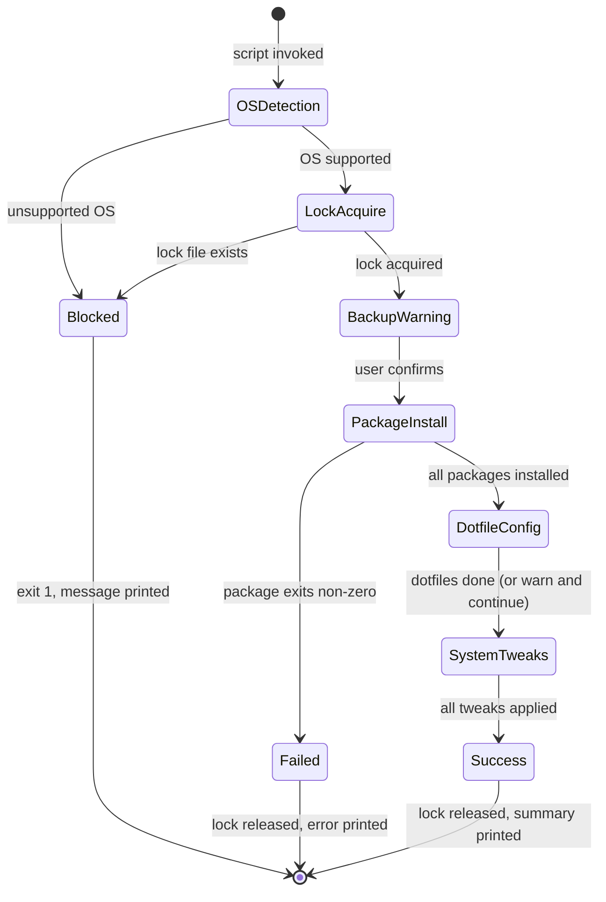

# Behavior specification

## Global behavior rules

- All install operations are idempotent — re-running the script on an already-configured machine is safe; installed packages are skipped, applied tweaks are no-ops.
- Destructive or config-modifying actions require a backup warning displayed to the user before proceeding. The user confirms by pressing Enter or by passing `--yes` to suppress interactive prompts.
- Long-running package installs pass package manager output through directly — nothing is suppressed; the user can see progress in real time.
- Partial failure must not be presented as complete success — exit codes of every critical step are checked; the script fails fast on package installation errors.
- User-facing errors provide: the failing command, the error output from that command, and a plain-English suggestion for how to resolve it.

## Workflow: PostInstall Run

### Preconditions

- Detected OS is one of: `ubuntu`, `debian`, `arch`, `fedora`, `omarchy`, `windows`
- Invoking user has sudo rights (Linux) or Administrator access (Windows)
- Internet connection is available (package manager can reach repositories; companion dotfile URL is reachable)
- No lock file exists at `/tmp/postinstallhub.lock`

### Happy path

1. Script detects OS via `/etc/os-release` (Linux) or `ver` (Windows); maps to a DistroID.
2. Lock file is created at `/tmp/postinstallhub.lock` with the current timestamp.
3. Backup warning is displayed: `"PostInstallHUB will modify shell configuration files. Press Enter to continue or Ctrl-C to abort."` (skipped with `--yes`).
4. Package manager is invoked for the detected distro; packages installed in order: `git`, `curl`, `neovim`, `zsh`. Already-installed packages are skipped by the package manager naturally.
5. Companion dotfile install script is fetched via curl and executed. Success is logged; failure is logged as a warning and execution continues.
6. System tweaks are applied in sequence: each tweak checks its pre-condition, skips if already applied, applies if not.
7. `zsh` is set as the default shell via `chsh -s $(which zsh)` if not already default.
8. Lock file is deleted.
9. Success summary is printed: lists installed packages, dotfile result, tweaks applied, and total elapsed time.

### Error behavior

| Failure | User message | System action | Retry | Final state |
|---|---|---|---|---|
| Lock file exists | `"Another PostInstallHUB run is already active. Delete /tmp/postinstallhub.lock if it's stale."` | Exit immediately without modifying anything | No — user resolves manually | Blocked (exit 1) |
| Unsupported OS | `"OS not supported. Detected: <value>. Supported: ubuntu, arch, fedora, omarchy, windows."` | Release lock if held; exit | No | Aborted (exit 1) |
| Package install fails | `"Failed to install <package>. Command: <cmd>. Error: <output>. Fix the package manager issue and re-run."` | Release lock; exit non-zero | No — user re-runs after fixing | Failed (exit non-zero) |
| Dotfile curl fails | `"Warning: dotfile configuration failed (curl exit <code>). Continuing without dotfiles."` | Log warning; continue to System Tweaks | No automatic retry | Degraded (continues) |
| Tweak apply fails | `"Warning: tweak '<name>' failed. Command: <cmd>. Error: <output>. Skipping."` | Log warning; continue to next tweak | No | Degraded (continues) |
| `chsh` fails | `"Warning: could not set zsh as default shell. Run: chsh -s $(which zsh)"` | Log warning; session still completes | No | Degraded (continues) |

### Loading, empty, and stale states

N/A — PostInstallHUB is a one-shot CLI script. There is no background refresh, no cached state to go stale, no empty-result state, and no offline queue. The script runs live against the OS and either succeeds or fails in that single execution. If the machine has no internet, package manager calls will fail with their own error output, which the script surfaces as a package install failure.

### Concurrency and idempotency

- Conflict unit: the machine itself (one install session at a time, enforced by `/tmp/postinstallhub.lock`)
- Conflict behavior: REJECT — a second invocation while a lock file exists exits immediately with a message; it does not wait, merge, or prompt
- Idempotency key scope: per-machine; the lock file path is fixed
- Duplicate request result: the second run exits with code 1 and instructs the user to delete the stale lock if the first run is no longer active; no partial work is done by the duplicate

### Retry policy

- Retryable failures: none (no automatic retry logic)
- Maximum attempts: 1 (single execution; user re-runs manually)
- Backoff: N/A
- Jitter: NO
- User notification: errors print a plain-English recovery suggestion; the user is expected to fix the underlying issue and re-run the script (which is safe due to idempotency)
