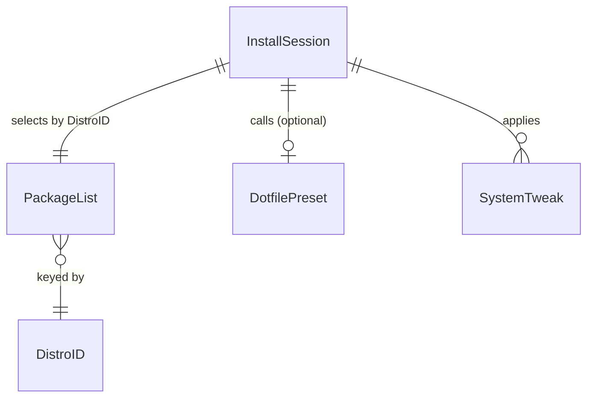
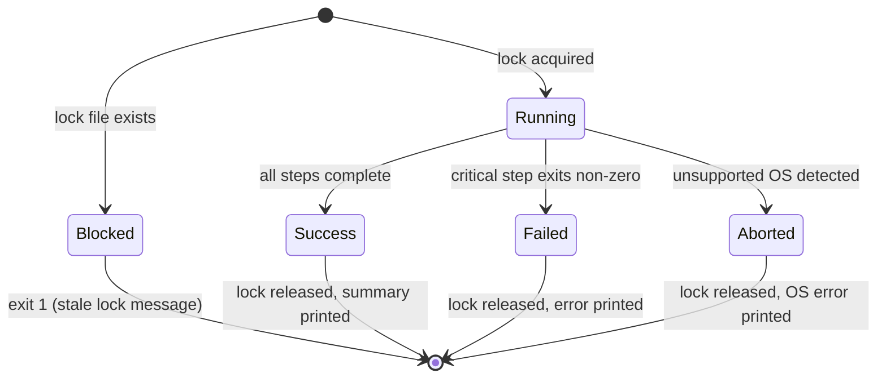

# Domain model

## Domain overview

Post-install configuration is the process of transforming a fresh OS installation into a personalized, productive environment. The domain problem is that a bare OS has no user tooling, no preferred shell, and none of the configuration that makes a machine feel like home. PostInstallHUB models this as a linear sequence of idempotent operations grouped by concern: detecting the OS, installing a fixed set of packages via the native package manager, applying dotfile configuration from a companion repository, and applying system-level tweaks (default shell, aliases, performance/privacy settings). Every operation is designed to be safe to re-run; the system as a whole moves a machine from "fresh" to "configured" without requiring the user to know or remember the individual steps.

## Bounded contexts or modules

| Context | Responsibility | Owns | Does not own |
|---|---|---|---|
| OS Detection | Determines which distro or OS is running; routes execution to the correct script variant | DistroID value object; detection logic | Package lists; tweak definitions |
| Package Installation | Installs the core package list using the OS-native package manager (apt, pacman, dnf, etc.) | PackageList; package manager invocation | Dotfile configuration; shell defaults |
| Dotfile Configuration | Calls the companion dotfile repository's install script via curl; applies personal config files | DotfilePreset | Package installation; system tweaks |
| System Tweaks | Sets zsh as default shell; applies aliases and any performance or privacy settings | SystemTweak entities; chsh invocation | Package installation; dotfile content |
| Safety Layer | Acquires and releases the lock file; displays backup warnings before config-modifying operations | InstallSession lock lifecycle; backup warning display | All install logic |

## Entities

### InstallSession

- Identity: Lock file path (`/tmp/postinstallhub.lock`) plus the timestamp written into it at acquisition
- Purpose: Represents one invocation of the install script from start to finish; prevents concurrent runs from corrupting state
- Owner/context: Safety Layer
- Lifecycle: `Running → Success | Failed | Aborted`; if a lock file already exists at start, the session never begins (`Blocked`)
- Invariants:
  - Only one InstallSession may be in `Running` state at a time per machine
  - The lock file must be released (deleted) on both success and failure paths
- Mutable fields:
  - Status (Running → Success | Failed | Aborted)
- Immutable fields:
  - Start timestamp
  - DistroID detected at session start

### PackageList

- Identity: DistroID it belongs to (one list per supported distro)
- Purpose: The canonical set of packages to install for a given OS variant
- Owner/context: Package Installation
- Lifecycle: Defined statically in the script; does not change at runtime
- Invariants:
  - Must contain at minimum: git, curl, neovim, zsh
  - All entries must be valid PackageName value objects
- Mutable fields: None (immutable at runtime)
- Immutable fields:
  - Package names list
  - Associated DistroID

### DotfilePreset

- Identity: The curl URL of the companion dotfile repository's install script
- Purpose: External configuration target; fetched and executed to apply personal dotfiles
- Owner/context: Dotfile Configuration
- Lifecycle: Fetched once per InstallSession; failure is non-fatal (logged, execution continues)
- Invariants:
  - URL must be a valid HTTPS endpoint
- Mutable fields: None
- Immutable fields:
  - Remote URL

### SystemTweak

- Identity: Tweak name (e.g., `set-default-shell-zsh`)
- Purpose: A single configuration change with a pre-condition check and an idempotency guard — only applied if not already in effect
- Owner/context: System Tweaks
- Lifecycle: Evaluated then applied (or skipped if already applied)
- Invariants:
  - Must check current state before applying (idempotency guard)
  - Must not modify config files without the Safety Layer having shown a backup warning first
- Mutable fields:
  - Applied status (pending → applied | skipped)
- Immutable fields:
  - Target (file path or system setting)
  - Pre-condition check command
  - Apply command

## Value objects

| Value object | Fields | Validation | Equality |
|---|---|---|---|
| PackageName | Single string | Non-empty; no whitespace; valid identifier for the target package manager | Exact string match |
| DistroID | Enum string | One of: `ubuntu`, `arch`, `fedora`, `omarchy`, `windows` | Enum identity |
| ExitCode | Integer | 0 = success; non-zero = failure | Numeric equality |

## Relationships

## Domain events

| Event | Producer | Trigger | Consumers | Version |
|---|---|---|---|---|
| LockAcquired | Safety Layer | Lock file created successfully | InstallSession (proceeds) | 1 |
| BackupWarningShown | Safety Layer | Before any config-modifying operation | User (acknowledges) | 1 |
| PackageInstalled | Package Installation | Package manager exits 0 for a package | InstallSession log | 1 |
| DotfilesConfigured | Dotfile Configuration | Companion curl script exits 0 | InstallSession log | 1 |
| TweakApplied | System Tweaks | A SystemTweak's apply command exits 0 | InstallSession log | 1 |
| InstallCompleted | InstallSession | All steps succeeded | Safety Layer (release lock), terminal output | 1 |
| InstallFailed | InstallSession | Any critical step exits non-zero | Safety Layer (release lock), terminal output | 1 |
| LockReleased | Safety Layer | InstallCompleted or InstallFailed | OS (lock file deleted) | 1 |

## State machines

## Cross-context rules

- OS Detection must complete and produce a valid DistroID before any other context executes; an unknown OS aborts the session immediately.
- The Safety Layer must acquire the lock before Package Installation, Dotfile Configuration, or System Tweaks begin; it must release the lock regardless of outcome.
- A backup warning must be displayed by the Safety Layer before any SystemTweak that modifies an existing config file; no tweak may bypass this.
- Dotfile Configuration failure is non-fatal; the session continues to System Tweaks and reports the failure in the final summary.
- Package Installation failure on any package in the PackageList is fatal; the session aborts and releases the lock.
