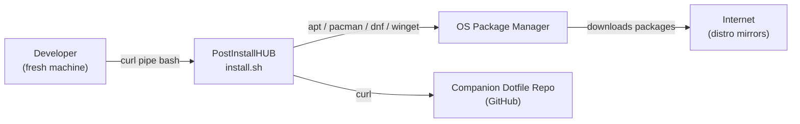
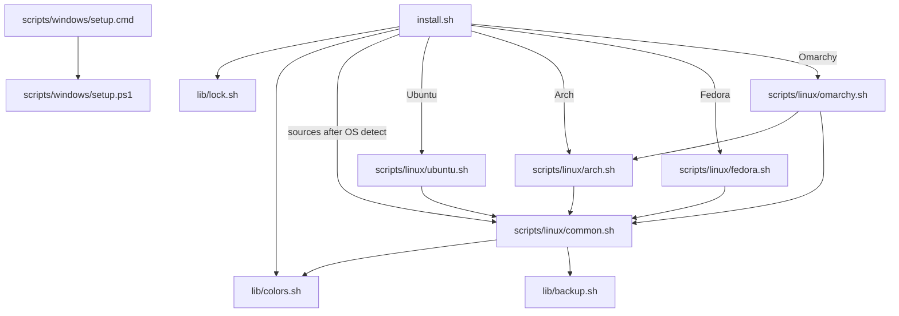
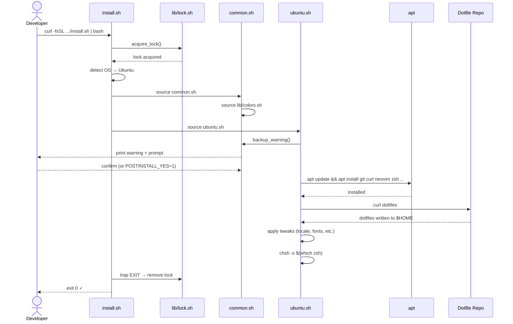

# System design

> PostInstallHUB is a flat collection of shell scripts, not a distributed system. The design concepts below (components, data flow, dependencies) map directly to script files and their sourcing relationships — not to services, containers, or network calls.

## Architectural drivers

- Product goals: give a developer a fresh, fully-configured machine in one `curl | bash` command, with no pre-installed tooling required beyond bash and curl.
- Quality goals:
  1. **Zero-dependency bootstrap** — works on a vanilla OS image with only bash + curl; no pip, npm, or any runtime needed before running.
  2. **Idempotency** — running twice produces the same result; re-runs are safe after partial failure.
  3. **Fast feedback** — every step prints colored status to stdout; user always knows what is happening.
  4. **Distro parity** — Ubuntu, Arch, Fedora, Omarchy, and Windows all reach the same installed package set via their native package managers.
- Constraints: must work on a fresh OS; single-file curl entry point; no runtime dependencies; no internet connectivity beyond the OS package manager and the companion dotfile repo.
- Major risks:
  - Package manager API changes (apt/pacman/dnf flag renames) break install steps silently.
  - Dotfile repo URL changes or goes offline — mitigated by `POSTINSTALL_DOTFILES_URL` override and non-fatal fallback.
  - `chsh` behaviour differs across distros and requires PAM cooperation — mitigated by non-fatal warning and manual fallback instruction.

## C1 — System context

**Actors and external systems:**

| Name | Type | Role |
|---|---|---|
| Developer | Human | Runs the script on a freshly installed machine |
| OS Package Manager | External system | `apt` (Ubuntu/Debian), `pacman` (Arch/Omarchy), `dnf` (Fedora), `winget` (Windows) |
| Companion Dotfile Repo | External system | GitHub repo; curl-fetched during the dotfile step |
| Internet / distro mirrors | Infrastructure | Required for package downloads; not controlled by PostInstallHUB |

## C2 — Components (script files)

There are no containers or services. The "components" are script files and the sourcing relationships between them.

| Component | Responsibility | Technology | Interfaces |
|---|---|---|---|
| `install.sh` | Entry point; OS detection; routing | Bash 5+ | sourced by user via curl; sources `lib/lock.sh`, `lib/colors.sh`; execs distro script |
| `scripts/linux/common.sh` | Shared logging, backup warning, command checks | Bash 5+ | sourced by all distro scripts |
| `scripts/linux/ubuntu.sh` | Ubuntu/Debian package install + config | Bash 5+ + apt | sourced by `install.sh` after OS detection |
| `scripts/linux/arch.sh` | Arch Linux package install + config | Bash 5+ + pacman | sourced by `install.sh`; also sourced by `omarchy.sh` |
| `scripts/linux/fedora.sh` | Fedora package install + config | Bash 5+ + dnf | sourced by `install.sh` after OS detection |
| `scripts/linux/omarchy.sh` | Omarchy-specific tweaks on top of Arch | Bash 5+ + pacman | sourced by `install.sh`; sources `arch.sh` |
| `lib/lock.sh` | Lock file acquire/release | Bash 5+ | sourced by `install.sh` |
| `lib/backup.sh` | Backup warning + user prompt | Bash 5+ | sourced by distro scripts via `common.sh` |
| `lib/colors.sh` | ANSI color constants | Bash 5+ | sourced by `common.sh` |
| `scripts/windows/setup.cmd` | Windows CMD entry; winget installs | CMD/batch | run directly by user on Windows |
| `scripts/windows/setup.ps1` | Advanced Windows config | PowerShell 5+ | called by `setup.cmd` or run directly |

## Runtime scenario: fresh Ubuntu install

## Deployment topology

PostInstallHUB has no server-side deployment. The "topology" is the user's local machine.

| Node | Runs | Scaling | Failure domain |
|---|---|---|---|
| Developer's local machine | `install.sh` and all sourced scripts | 1 (lock enforces single instance) | Entire script run; partial failure leaves machine partially configured |
| GitHub (hosting) | Raw script files served via `curl` | Handled by GitHub CDN | If GitHub is down, the `curl` fetch fails; user can clone the repo instead |
| Companion dotfile repo (GitHub) | Dotfiles fetched at step 6 | Handled by GitHub CDN | Non-fatal; script continues with warning |

## Cross-cutting concerns

- **Authentication/authorization:** none. Script runs as the invoking user; `sudo` prompted inline where required. See [BACKEND.md](BACKEND.md).
- **Validation:** env var values checked at script start; invalid values print a warning and fall back to defaults. Package manager exit codes checked on every install call.
- **Error handling:** `set -e` throughout; critical failures exit non-zero; non-critical steps (dotfiles, `chsh`) warn and continue. See [ERROR-HANDLING.md](ERROR-HANDLING.md).
- **Observability:** all output goes to stdout/stderr in the user's terminal — colored, prefixed with log level. No log files written by default; user can redirect with `2>&1 | tee install.log`.
- **Configuration:** environment variables only; no config file required. See [CONFIGURATION.md](CONFIGURATION.md).
- **Data consistency:** idempotent checks before every install step (`command -v`, `dpkg -l`, etc.); no state written beyond the installed packages and dotfiles themselves.
- **Caching:** none. Package managers have their own cache (`/var/cache/apt`, `/var/cache/pacman/pkg`); PostInstallHUB does not manage it.
- **Background work:** none. All execution is foreground and synchronous.

## Architecture fitness checks

| Quality goal | Check | Threshold |
|---|---|---|
| Zero-dependency bootstrap | Run in a fresh Ubuntu 24.04 Docker container with only bash+curl; script must complete | 100% pass |
| Idempotency | Run script twice in sequence; second run must produce no errors and no duplicate packages | 100% pass |
| Distro parity | Same package list installed on Ubuntu, Arch, Fedora images in CI | All 4 distros pass |
| Fast feedback | Every step emits colored output within 1s of starting | Manual review |
| Lock enforcement | Attempt two concurrent runs; second must exit with E003 immediately | 100% pass |

## Risks and technical debt

| ID | Risk/debt | Impact | Mitigation | Owner |
|---|---|---|---|---|
| ARC-001 | Package manager flag changes (e.g. apt option renames) break install silently | Medium — script exits non-zero, user sees error | Pin tested distro versions in CI; check exit codes | Matheus |
| ARC-002 | Companion dotfile repo URL hardens a single point of failure | Low — non-fatal fallback already in place | `POSTINSTALL_DOTFILES_URL` override; warn user | Matheus |
| ARC-003 | `chsh` behaviour varies (PAM, `/etc/shells` requirements) | Low — non-fatal; user gets manual instruction | Tested on each distro; fallback message is clear | Matheus |
| ARC-004 | Windows CMD/PS1 path diverges from Linux shell over time | Medium — two codepaths, one person maintaining | Shared package list document; CI on both platforms | Matheus |
